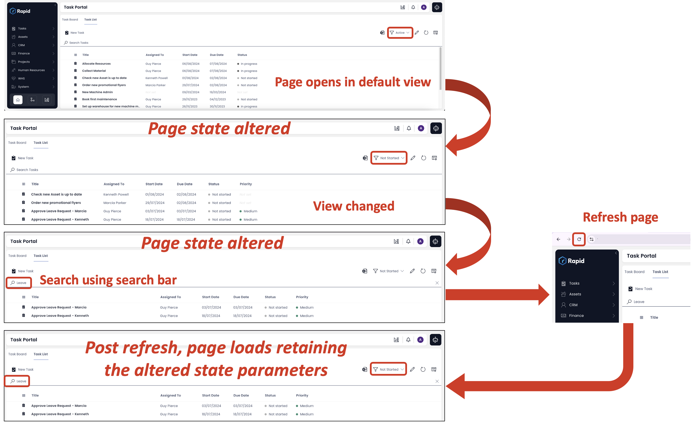

08/08/2024

# 1.43.0 - Rapid Platform

## Feature

**Retain Page State on Refresh**

In version 1.43 of Rapid Platform, we've introduced a powerful new feature that preserves the state of your working page even after refreshing the browser. 

Imagine you're in Explorer, working within the Tasks List:

1. You've switched from the default "Active" view to "Not Started".
2. You then search for a specific group of tasks using the Search bar.
3. You hit the refresh button.

Previously, this would reset your session, forcing you to redo your adjustments. Now, with this update, Rapid Platform will automatically restore the exact state you were in prior to the refresh, including your selected view and search results. This enhancement allows you to seamlessly continue your work without losing your place, minimising disruptions and improving efficiency. This is particularly beneficial for those who manage multiple tabs simultaneously.

With this improvement, accidental refreshes will no longer cause frustration, letting you pick up right where you left off.

## Improvement

- Added support for middle-clicking and control-clicking menu items in Explorer to open them in a new tab of web browser.

## Bug fixes

- Fixed an issue where clicking "Process Diagrams" in the JumboTron after executing a workflow with an embedded form caused the data table to crash.  
- Resolved inconsistency where workflow diagrams displayed a footer in test environments but not in production.
- Restored functionality of the menu buttons with on-click action set as "Raise Workflow Created Signal". The error "Cannot raise signal: Converting circular structure to JSON --> starting at object with constructor..." has been resolved.
- Fixed breadcrumb corruption issue when opening a task from a process run.
- Addressed an issue causing an infinite loop during the initial login after signing up for Rapid Platform.
- Resolved error that occurred when executing a user task, which updated a SharePoint folder name.
- Fixed issue where adding principals via OID would throw an error despite the operation succeeding.
- Fixed the table crash issue that occurred when creating a new process diagram.
- Resolved error encountered when launching a user task with an adaptive document.
- Updated the Edit Diagram button on a process run in Explorer to generate the correct route, preventing page crashes.
- Fixed error encountered when deleting a subtype on sites with disabled row-level security.
- Resolved issue where the delete button was incorrectly disabled on item level on sites with disabled row-level permissions.
- Addressed issue where deleted page components were not removed after saving and refreshing the page.