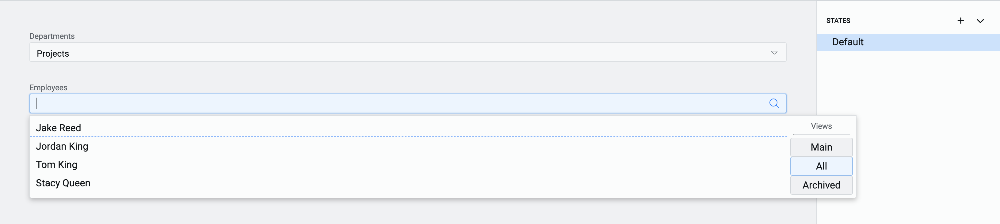

20/08/2024

# 1.44.0 - Rapid Platform

## Feature

### Introduction of Cascading Lookups in Adaptive V3

This new release introduces cascading lookups in Adaptive V3, allowing selections to dynamically filter related options. This ensures a more streamlined and efficient user experience with relevant data choices.

**The concept of Cascading Lookups**  

Cascading fields concept involves setting up a pair of fields - can be called as ***Primary*** and ***Dependent***. The value of the _Primary_ field dictates the possible values for the _Dependent_ field. 

Extend this concept to a pair of lookups ie. both _Primary_ and _Dependent_ fields are a lookup type of control. Therefore, the _Primary lookup_ will have a list of values. Based on what the user selects in the _Primary lookup_, the _Dependent lookup_ will present a filtered list available for selection.

**Scenario**

Imagine  a WHS manager is trying to select a WHS representative from each department. The manager faces difficulty navigating a long, unfiltered employee list. 

The manager now uses cascading lookups and sets up **Departments** as the primary lookup and **Employees** as the dependent lookup. With cascading lookups, selecting the department first filters the employee list, making it easy to choose the correct representative quickly and efficiently.

:::info[Cascading Lookup logic]  
 Step 1 - Show values of Column A from Table P (defined as Primary Lookup).  
 Step 2 - Let the user select an item.  
 Step 3 - For the item selected by user, take the value of Column B of Table P.  
 Step 4 - Equate the value obtained in Step 3 with Column C of Table D (defined as Dependent Lookup). Get all the items which match this criteria.   
 Step 5 - Show values of Column D from Table P for all items from Step 4.  
 
 Therefore, to set up Cascading Lookups we need to define:  
 Table P  
  - Column A and 
  - Column B  

Table D  
  - Column C and 
 - Column D  

:::  

**Setting up the Cascading Lookups in Adaptive V3 Designer**

We shall attempt to configure the above scenario in Adaptive V3 Designer.

To configure the cascading lookups, add two lookup controls to your canvas. For ease of explanation we name them as Primary and Dependent.

Set up the Primary Lookup as normal. Select the Table ***Departments*** as Lookup List and its column - ***Name*** as Lookup field. As per the normal behaviour of the control, this tells the system the table and column from where the values need to be displayed in the dropdown of the lookup. Therefore, in the Primary Lookup, the names of all the Departments will be displayed.

Similarly set up Dependent Lookup to show Full Name from Employees table.

Observe the above image, every lookup control now has a **new section in the Element Configuration Panel - Cascading**.

This section allows you to define the attributes that converts two separate lookup elements into a pair of cascading lookups.

The Cascading section in the Element Configuration Panel should be filled only for the Dependent lookup. 

The Cascading section has the following fields:

1. Select Element - This is a dropdown field which will display titles of all the Lookup type of controls present on the Canvas. Select the Lookup element that you wish to set as Primary Lookup.

2. To Field - Once the Primary Lookup element is selected, this field will display the list of the columns of the table set in Primary lookup. Select the column of the Primary Lookup against which you wish to equate the value.

3. From Field - This field displays the list of all columns for the table set in Dependent lookup. Select the column with which you wish to equate the value of Primary Lookup.

This completes the simple set up of the cascading lookups.

Lets look at the behaviour of our Cascading Lookup as configured above:

1. The Primary lookup shows the names of all the Departments.

2. Based on a Department selection, the Dependent Lookup shows a list of Employee Names that belong to the department selected in Primary.

3. Change the Department in Primary and the list of employees change in Dependent Lookup as well.

**Custom configuration** 

A single lookup field can also be configured to show filtered values. Observe this field in the Cascading section of the Element Configuration Panel.

The discussion so far was oriented towards the configuration with Element

If you select the Custom option, then instead of "Primary element" you can define the table and select an item from it.   

  

The two new fields that appear on selecting Custom configuration are:

1. Linked to List - This is a dropdown field and shall display the list of all the tables in the system. Select the relevant table here.

2. Linked to ID - This is also a dropdown list and displays the values of title column for the table selected. Please note, although you select the title column, the system actually retrieves its record ID value.

:::note[Important]  

The key point to note here is that when in Custom Mode, a single Lookup can also presents a filtered list as the parameters of the Primary Lookup are hard passed to it.

In the above image, although the selected Department is IT, however, the employees of Projects Department are shown as per the Custom configuration.  

:::

:::tip[Important Points to note about Cascading Lookups]

1. Cascading Lookups can function without establishing relationships via Connections.

2. Care must be given while selecting the columns of Primary and Dependent Lookups based on Table definition. Both the columns should return comparable values. For instance, if one of the columns is a Lookup, it returns an ID value. Comparing this to a string will give an error.

3. Cascading lookups work as one pair. You can define the same Primary for multiple Dependents.

4. You can define a Multi-lookup as a Dependent as well. However, a Multi-lookups cannot function as Primary because the value matching is supported for one variable only.

:::

## Improvement

- Users can now tab through page elements without info tooltips being selected, improving navigation flow and accessibility.
- Users can now open title fields or item columns in a new tab by pressing the Ctrl key while clicking, allowing for quicker multitasking.
- Rapid support teams can now track errored process runs across the platform, improving issue resolution and monitoring.
- Users can now copy and paste adaptive elements and conditional expressions, speeding up the design process and reducing repetitive tasks.

## Bug fixes

- Fixed issue where attachment text overflowed its container.
- Corrected the spelling of "Built-In" in the Type column of the Menus list. It is now spelled "Build-In".
- Fixed issue where Explorer would not fetch or return data when a version change was applied.
- Menu panels now close when users click outside the menu area, improving usability.
- Fixed the collapse button functionality in the designer menus
- Currency fields are now right-aligned for easier readability and comparison.
- Fixed toggle visibility issue on attachment bars in tab strips.
- Resolved Gantt view rendering issues to ensure expected visual representation.
- Updated header bar colours on Gantt charts to align with branding.
- Adjusted file explorer preview zoom level to a more suitable default of 100%.
- Fixed issue with conditionally disabled menu items not updating after field value changes.
- Fixed subquery column issue that caused "(no title)" to display instead of the correct title.
- Resolved error that occurred when creating items with empty date or date-time lookups.
- Corrected behaviour for Whole Number inputs to function as expected.
- Fixed issue where not all fields were cleared when saving and adding a new embedded file template.
- Resolved issue causing duplicate file references when replacing embedded files in public forms.
- Fixed presentation of Percentage and Whole Number inputs in workflows, no longer displayed as strings.
- Resolved issue where unrelated principals were populated in the "Assigned To" field when using a Rapid Unique Identifier.
- Bot interaction history is now retained when switching between documentation and support.
- Fixed issue with nested menu actions being incorrectly presented on data tables configured to "Item only."
- Enhanced security by sanitizing HTML content in notification items.
- Restored correct shape and format of user field inputs in Workflow.
- Fixed error when pre-filling date and date-time fields in embedded forms.
- Page now displays an appropriate message when a user without permissions tries to access Explorer, instead of crashing.
- Fixed issue preventing workflows with collaboration buckets around swimlanes from being saved.

**Adaptive fixes**
- Fixed issue preventing all files from saving when using the 'Save all' function in Adaptive V3.
- Number inputs in Adaptive V3 now correctly respect Max, Min, and Step Size values.
- Resolved issue where the parent lookup flyout appeared blank in public forms.
- Adaptive forms are now properly deactivated when a task is aborted in a workflow.
- Fixed crash when loading a public form with parent/child connections set to load nothing.
- V3 documents are no longer visible when using the document picker in V2 Adaptive Designer.
- V3 documents are no longer visible when opening the document picker in V2 Designer.
- Improved validation UI for better user understanding and interaction.
- Applied multiple UI and experience enhancements to Adaptive Designer.