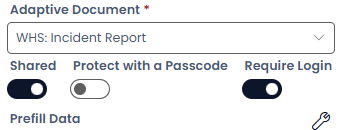

**Release Date:** 13/10/25

# 1.56.3 Rapid Platform

We're excited to announce new features live on Rapid Platform **Monday October 13th**!

---

## Embedded File Access in Public Forms

Users can now seamlessly open embedded files directly from Public Forms. When accessing a form that includes an embedded document, the file opens in SharePoint, allowing users to edit the document in real time. Any changes made are instantly synchronised with SharePoint, ensuring live updates across connected platforms.

## Authenticated Forms

We've introduced support for authenticated Adaptive Documents. You can now configure a User Task in Workflow to require login before accessing an Adaptive Document. This enhancement updates the User Task configuration panel with three new toggles, offering greater control over document access and behaviour.

Only principals will be granted access to authenticated forms, ensuring secure and role-based visibility. Additionally, user fields will now automatically populate when an authenticated form is used, streamlining data entry

# Improvements

- Added Confirmation Dialog to when closing half created items
- Clicking logo in Explorer now navigates to experience dashboard
- Added support BitWarden Chrome extension
- Switching experiences now displays the dashboard

# Bug Fixes

- Fixed searching in Cascading Lookups failing to populate items
- Fixed current experience button failling to appear selected
- Fixed creating items using an API call now respects default configuration
- Opening an item in Explorer with the Title field set to DateTime no longer crashes the page
- Activity Feed now displays the most recent 250 items