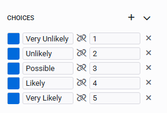

**Release Date:** 10/11/25

# 1.57.0 Rapid Platform

We're excited to announce new features live on the Rapid Platform **Monday November 10th**!

---

## Split values to choice and radio controls in Adaptive

We've introduced the ability to assign split values to adaptive radio buttons and choices, enabling users to define a value that differs from the displayed label. This is particularly useful in scenarios where descriptive labels are used for user input, but numerical values are needed for backend processing or analysis. Users can now click the link icon when editing a choice or radio option to separate the label from its value, allowing them to store meaningful data directly without relying on post-submission conversion.

# Improvements

- Enhanced the adaptive Rich Text Editor for better usability and formatting support.
- Updated permission handling when assigning placeholder permission fields via API or workflow.

# Bug Fixes

- Fixed a crash that occurred when attempting to extend a non-existent list.
- Resolved an error triggered by the timer under certain conditions.
- Addressed styling inconsistencies in adaptive components.