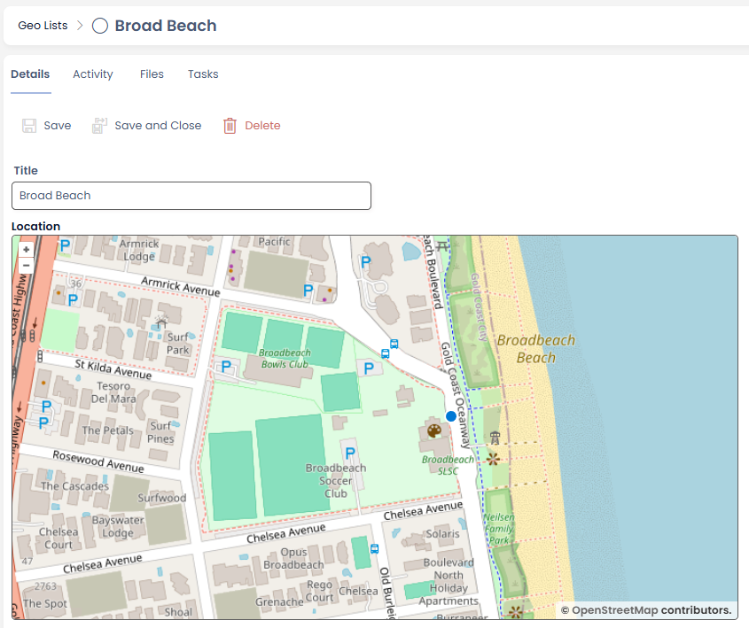

**Release Date:** 05/01/26

# 1.60.0 Rapid Platform

## Features

### Map Location Fields

We would like to introduce a new field type for Rapid lists, Geography. These fields can store the Latitude and Longitude of a location.

Adding the fields to a page will now present the map location stored. Clicking a location will set it as required.



For the report writers out there, these are stored as Geography fields using [WKT POINT](https://learn.microsoft.com/en-us/sql/t-sql/spatial-geometry/stmpointfromwkb-geometry-data-type?view=sql-server-ver17) format.
For those of you interested in getting these points into PowerBI you will need to cast them for the built-in Map visual. For example:

```sql
SELECT id
 ,title
 ,CAST(geo_field.Lat as FLOAT) 'Lat', CAST(geo_field.Long as FLOAT) 'Long'
FROM dbo.geo_list
```


## Improvements
- Creating a new process via upload will now pre-fill the title
- Altering permissions on items now requires at minimum edit permission to perform
- Permissions synced to SharePoint will now expand the groups and create individual permissions where required
- Updated Support chat-bot to new long-term model for better speed

## Bug Fixes
- Execute workflow menu actions that contain inputs with a lookup to the current item will no longer crash on submission
- Recovered Ctrl+Enter shortcut to submit Activity Feeds notes, as it was just adding a new line before
- Support chat bot can answer your queries again