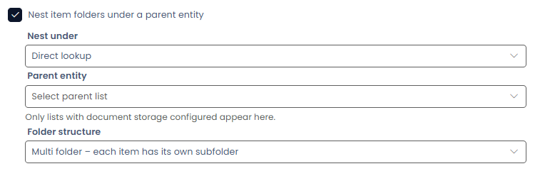

# v1.60.11 — Rapid Platform

We're excited to announce new improvements live on Rapid Platform Thursday March 26th

## Features
### Folder nesting under a parent table

You can now organise item folders under a parent table in document storage. Choose whether items link to the parent using a lookup or universal link, and whether folders are shared or created per item, keeping documents grouped automatically.
[Learn more about Folder Nesting](/docs/folder-nesting)

## Improvements
* You’ll now see a warning if you try to leave a table with unsaved changes

## Bug Fixes
* Fixed an issue where split value choice fields appeared blank on public forms
* Fixed the Vertical Layout component crashing when added to a page
* Fixed an issue where invalid queries could be saved on Computed and Subquery columns
* Fixed an issue where field bindings couldn’t be cleared on the Address component in Designer
* Fixed an issue where deleted notifications still appeared in the notifications list
* Fixed an issue where deleting subtypes of tables with names starting with numbers caused SQL errors
* Fixed an issue where mentions in the Activity Feed didn’t trigger notifications
* Fixed an issue where address fields in submitted forms didn’t populate their mapped fields
* Fixed an issue where copying and pasting a timer event had no effect
* Fixed an issue where using thisElement in a Lodash expression returned no value
* Fixed an issue where signing in with only an OID did not sync user details to the Principal record