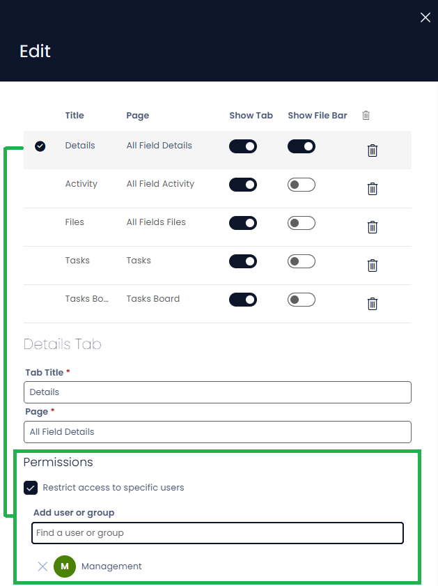

# v1.64.1 — Rapid Platform

We're excited to announce new features live on Rapid Platform **Monday, June 1st**

## Features

### Configure Permissions on Page Tabs
Individual tabs can now have their own permission settings, giving you finer control over who can view and interact with specific sections of a page.

### Merge PDF Service Task
You can now use a Merge PDF service task in Workflow to combine multiple PDF documents into a single file.

## Improvements

* The "Experience" menu item type has been renamed to "Workspace" for clearer navigation. A dedicated Workspace menu item type is now available in the menu builder.
* A new page in Designer lets administrators update the primary group for the site without leaving the configuration interface.
* Views can now be created directly from Designer, streamlining how you configure data display without switching contexts.
* Workflow tasks can now open adaptive documents directly, enabling richer document driven automation processes.
* You can now import and export documents in Adaptive Designer, making it easier to move setups between environments or keep backups.
* Images inserted into multi-line text fields now appear in generated documents. This means content with embedded images will render correctly when a document is produced.

## Bug Fixes

* Fixed an issue where the Open Document Library button was not working
* Fixed an issue where renaming files with invalid characters caused errors
* Fixed an issue where infinite scroll stopped working when a search term was active on data tables
* Fixed an issue where lookup options failed to load when a display field was missing
* Fixed an issue where public form URLs lacked proper horizontal padding
* Fixed an issue where the Get Item service task in Workflow did not handle errors correctly
* Fixed an issue where deleting a condition watcher left a stale expression behind
* Fixed an issue where labels were incorrectly copied in Workflow diagrams
* Fixed an issue where an inclusive gateway would not wait for all active paths to complete before proceeding
* Fixed an issue where data store references used in inclusive gateway conditions failed to populate when the gateway was executed