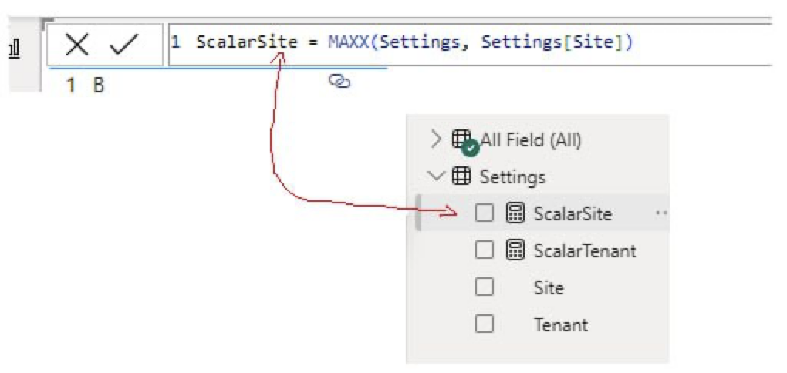
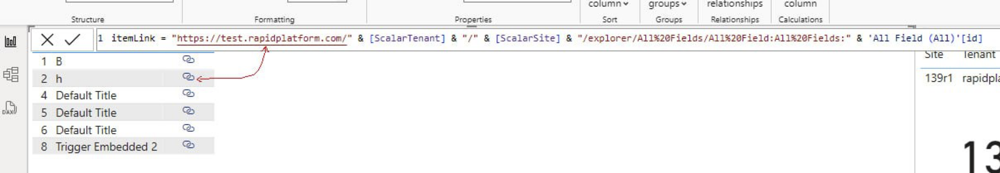

# Setting up reports linked to items of other tenants and sites

Imagine a Power BI consultant creating reports for its clients. The tenants for the consultant and the client would be different. 
OR 
Imagine a marketing head of a group of companies aggregating sales figures from various units. The unit companies may be operating on different Rapid sites.

While creating reports in Rapid Platform, it is not an uncommon requirement to be able to create links to items of tables from various different tenants and sites. The report requires URLs to be set up to items from different sites.

[INSERT IMAGE OF A REPORT WITH LINK TO OTHER SITE ITEM]

## The problem (before release v1.39)

To link an item in a report, a URL is required. This URL to the item has the title of the Tenant and Site (as part of it). 

It was not possible to configure a link to the item (from other site) in the report, as there was no way to access the title of the tenant and site.

Each site has a name and an id. However, this information is not stored anywhere and hence could not be accessed / used by the report.

## The solution - "Settings" Table

In release v1.39, there is a new system list created with the title - "Settings". This Settings table has two columns - Title and Value. 

This table stores the following about the subject site:

1. The Site Title
2. The Site ID
3. The Tenant Title
4. The Tenant ID
5. The environment

Using the Settings Table, the problem is addressed. The title and id of the site is now stored in the system and hence is accessible by the report for creating links.

## The Power BI report configuration

While configuring the Power Bi report, you need to perform the following:

1. Write the query to access the Settings Table and get site and tenant titles.

2. The titles of the Site and Tenant will be stored in the ScalarSite and ScalarTenant respectively.

3. Setup the link URL using the values from ScalarSite and ScalarTenant. 

