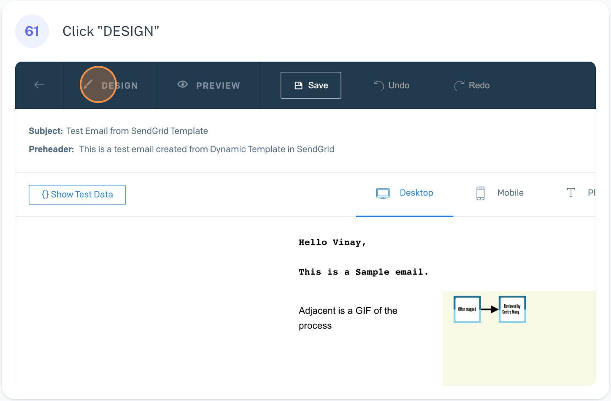
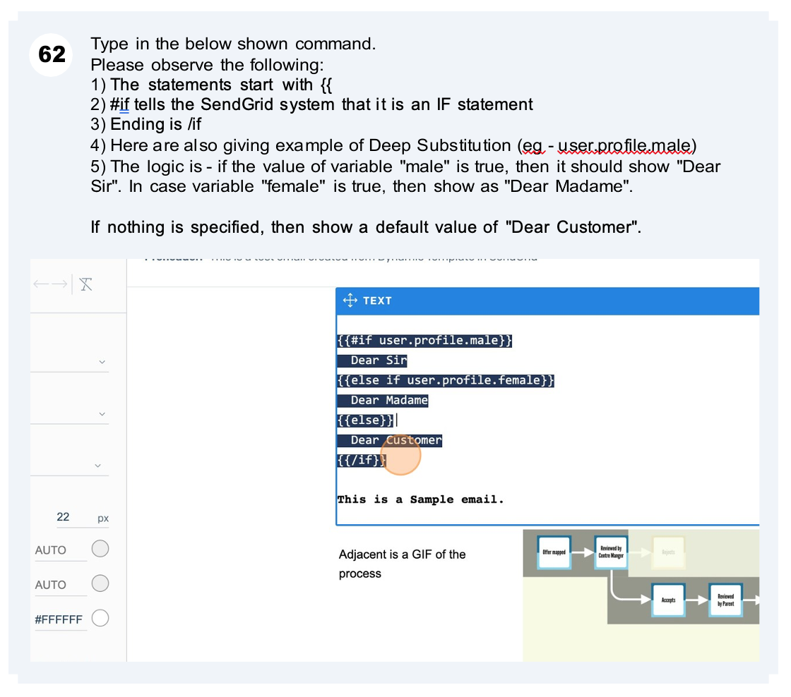
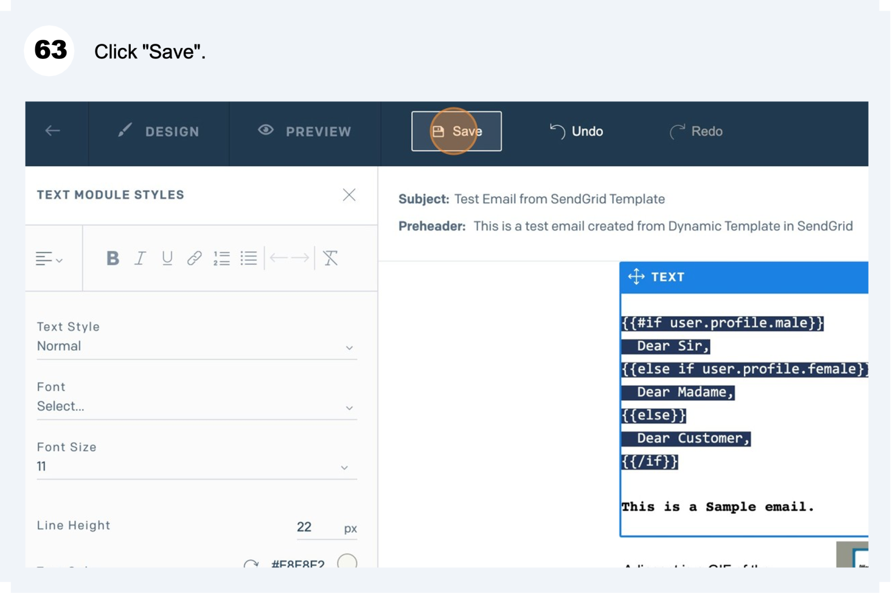
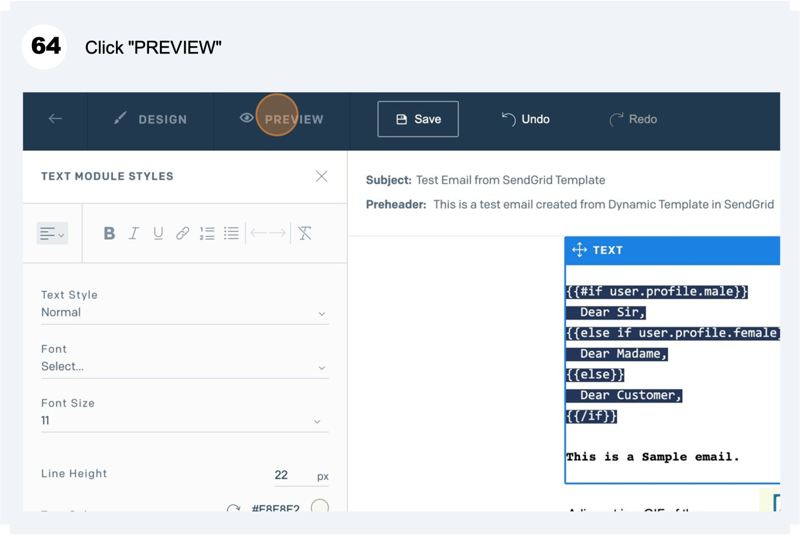
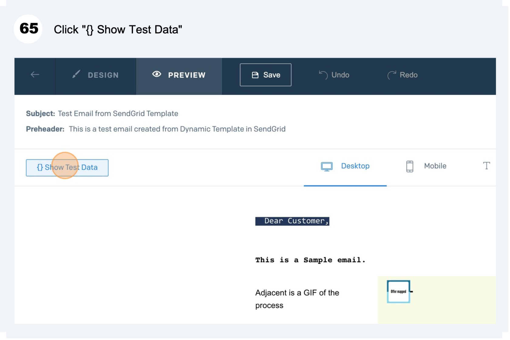
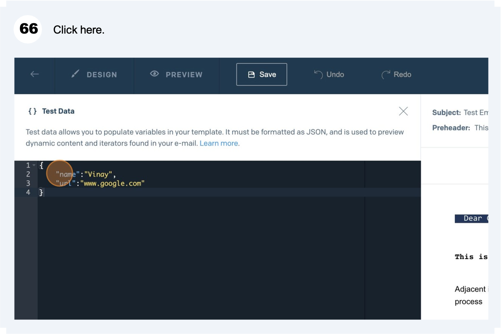
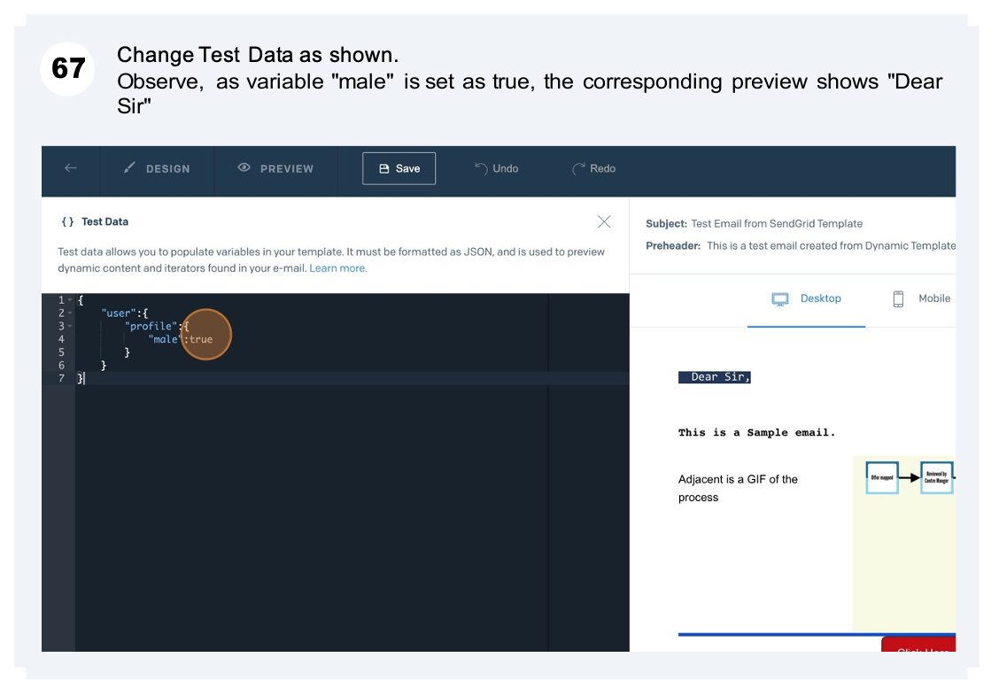
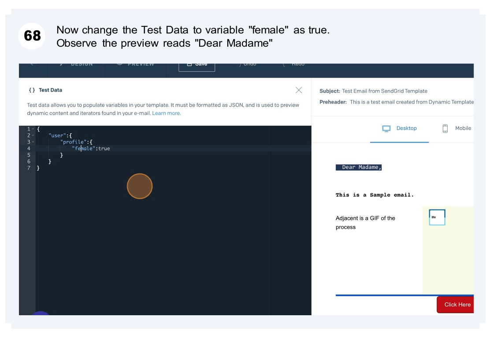
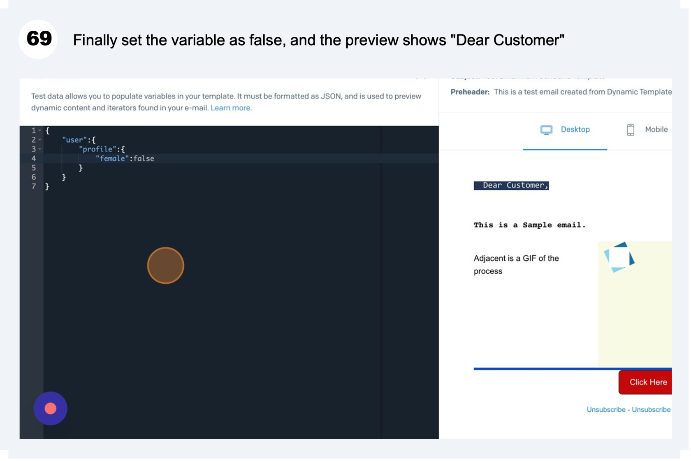
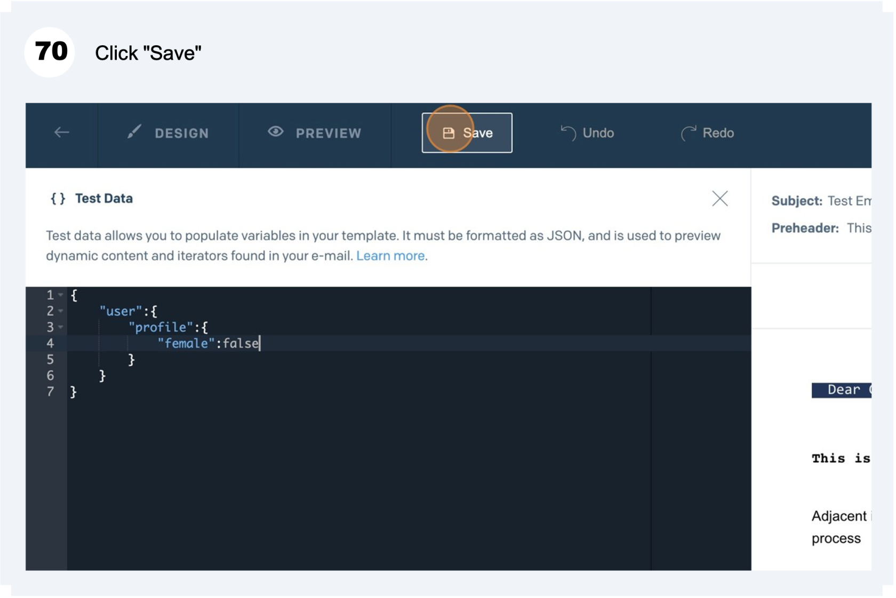

# Basic If, Else, Else if

##### **Let us now look at Conditional Statements in SendGrid email.**  

****

**Tip! - You have now seen an example of how to include Conditional Statement into your Dynamic Template (Basic if, else, else if).**  
**There can be other types of Conditional Statements and applications like :**

- **Unless**
- **greaterThan**
- **lessThan**
- **Equals**
- **notEquals**
- **And**
- **Or**
- **Length etc.**

**To learn more about these, visit - [https://docs.sendgrid.com/for-developers/sending-email/using-handlebars#conditional-statements](https://docs.sendgrid.com/for-developers/sending-email/using-handlebars#conditional-statements)**