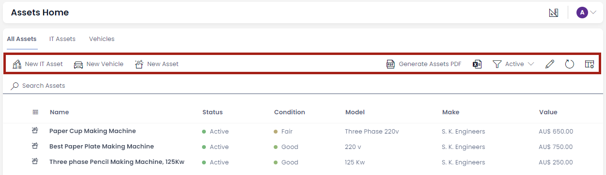

# Command bar

A command bar is the horizontal area containing command buttons like Save, Delete, Add new item etc. Command bars are typically found at the top of a region containing data, such as a table, board, Gantt chart and item profile.

**Command bar in Table view**

**Command bar in Item view**

##### **Related article**

**What is Explorer?**