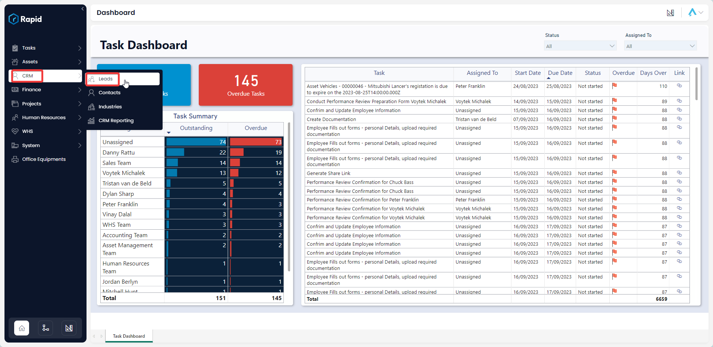
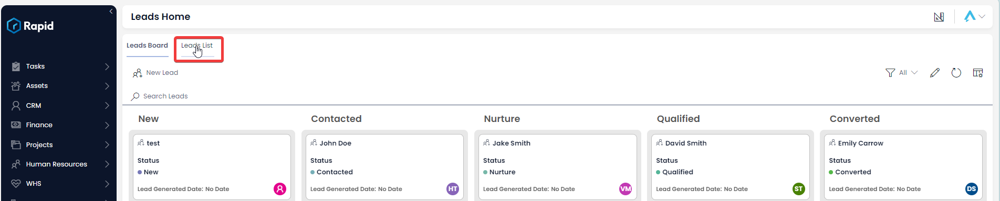
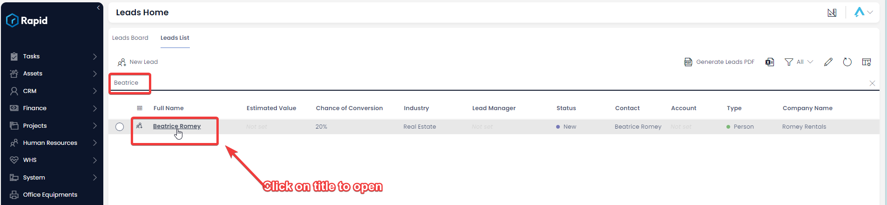
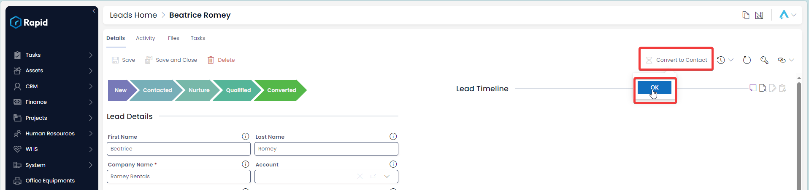
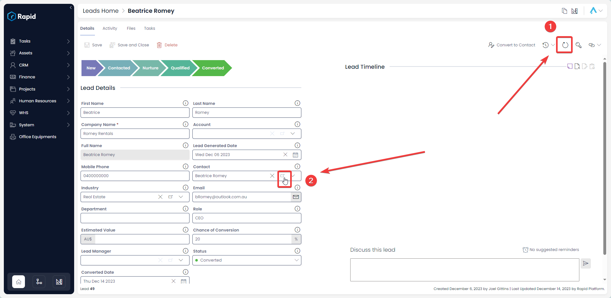
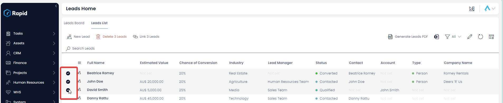
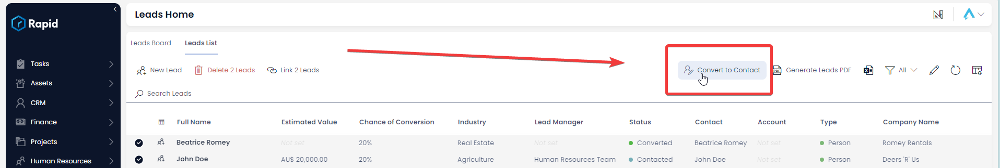

# Converting a Lead

### Overview

When a lead has been **Converted** this will create an Account, Contact, and Opportunity. Generally, this will occur once the client has been qualified and potential work is on the horizon. After conversion you can manage each Opportunity which allows for more granular reporting. For more information on the Sales Dashboard please see the following page.

### How to Convert a Lead from the Leads Item

1. In Explorer select CRM &gt; Leads  
    
2. Click on the **Leads List** tab  
    
3. Open the **Lead** you wish to edit. (Locate the **Lead** either by scrolling through the list or using the search bar).  
    
4. Press the **Convert to Contact** button and then **OK** 
5. To navigate to the newly created contact Press **Refresh** and then the **Contact** Lookup Link  
    

### How to Convert a Lead from the Leads List

1. In Explorer select CRM &gt; Leads  
    
2. Click on the **Leads List** tab  
    
3. Select the **Leads** you wish to convert to a **Contact** 
4. Press the **Convert to Contact** button 