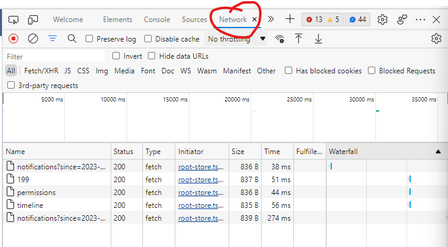
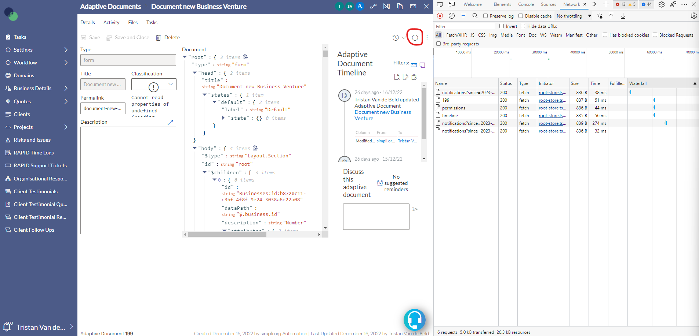
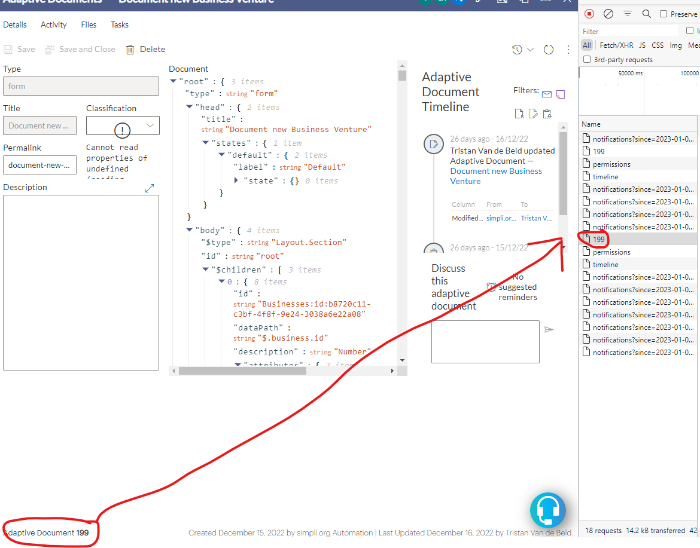
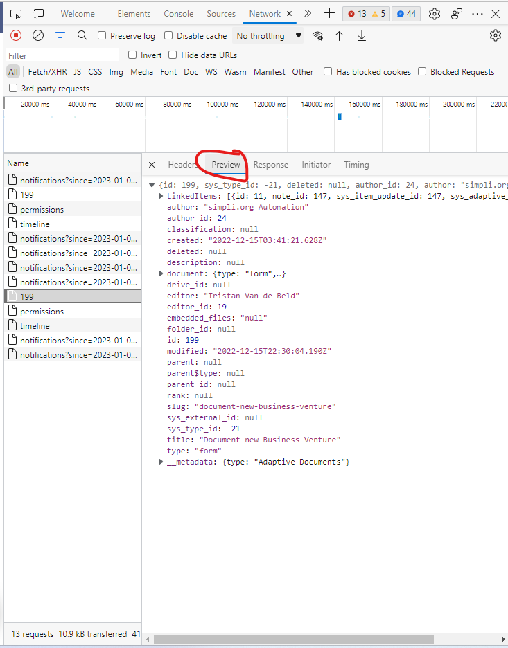
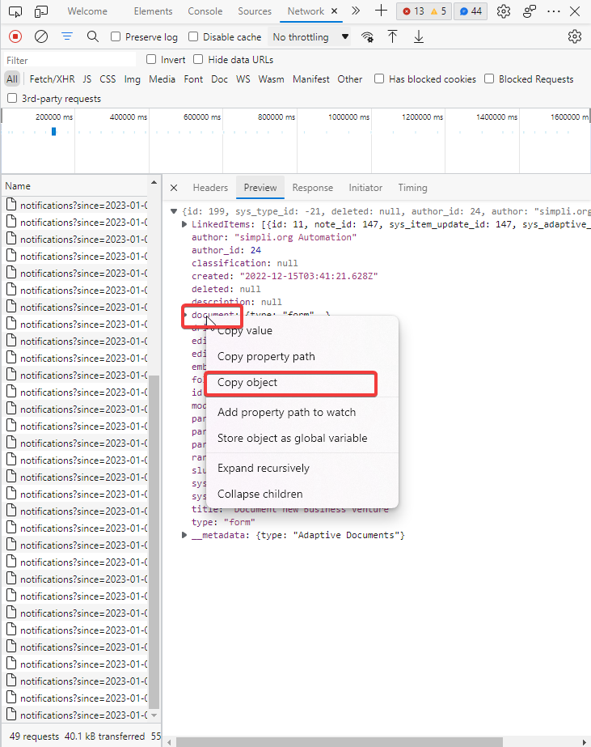
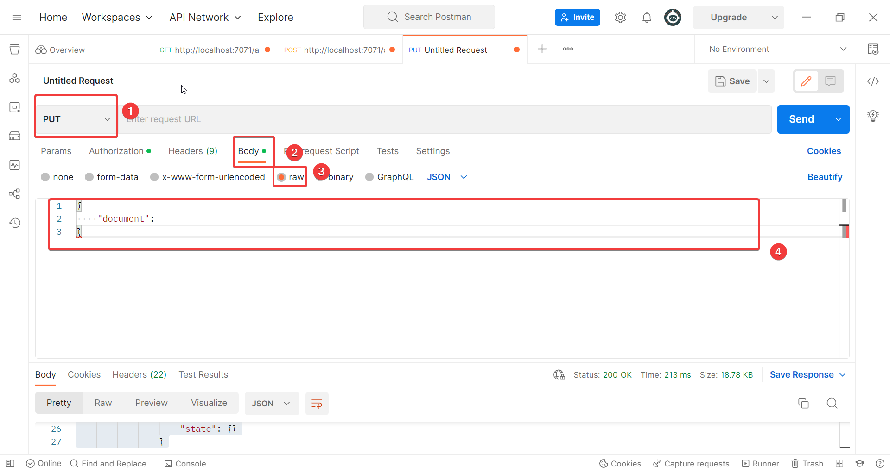
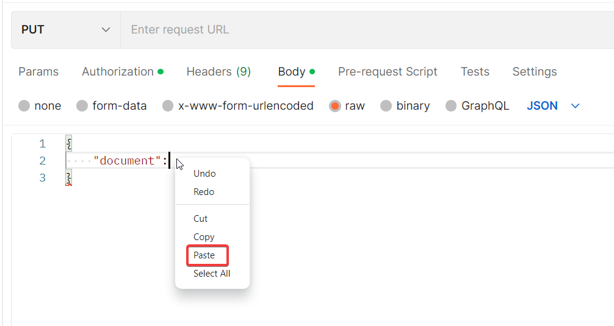
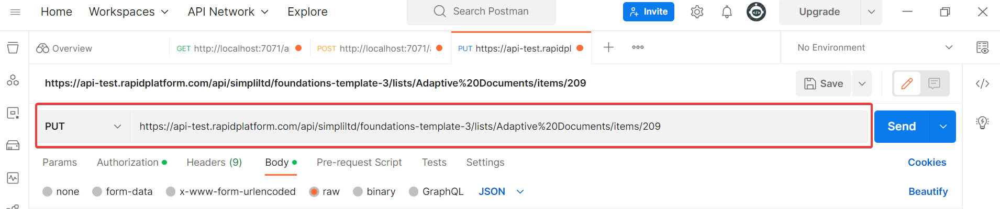
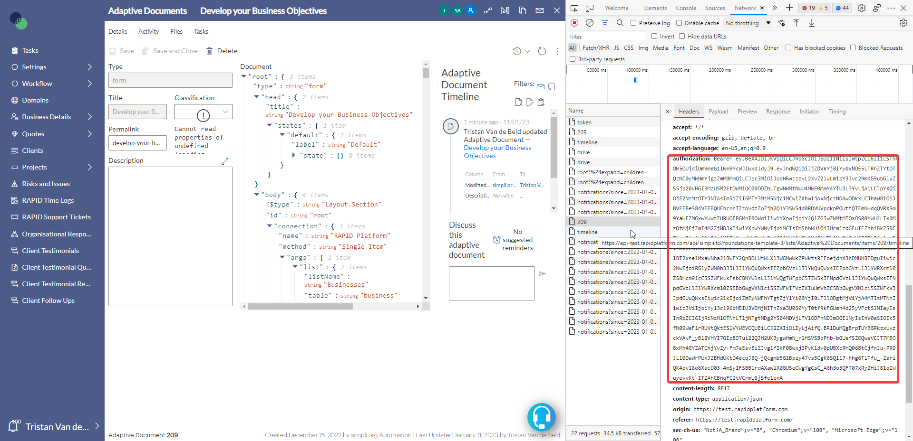
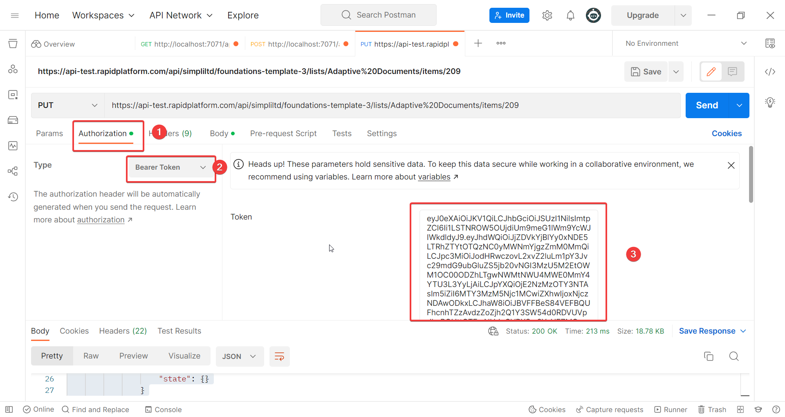

# Copying a Form from one Site to another

Following the steps below will allow you to copy an adaptive form from one rapid site onto another. This will require PostMan which can be downloaded freely from the following site: [Postman API Platform | Sign Up for Free](https://www.postman.com/)

A brief summary of how this will be accomplished is that each form as a form body which is sent each time the form is opened. By copying this body to the new site will fill a blank form with its profile.

Follow the below steps to do this:

1. Create a blank form on the site you are copying the form to with an identical name
2. Navigate to the site you are copying the form from 
    1. Navigate to the forms table in explorer by going through Settings &gt; Adaptive &gt; Adaptive Documents
    2. Open the form you want to copy on this list
3. Open the dev tools in the browser by clicking F12
4. Click the network tab 
5. Click the inline refresh
6. Click on the network call that matches the document number 
7. Click on the preview tab 
8. Right click on the document object and click copy object
    
    
9. Open PostMan change the type of request to put, open the body tab, change the body type to raw, type the screenshot into the space
10. Paste your copied item profile next to document 
11. Open the blank adaptive form you created earlier on the site you are copying to by navigating Explorer&gt; Settings&gt; Adaptive&gt; Adaptive documents
12. Once you have opened the blank item, open the Dev tools &gt; Network
    
    
    1. Enter any character into the description field, delete this character
    2. Press "Save"
    3. Click on the most recent network call that matches the item id
    4. Click on headers and copy the request URL
13. Paste the request URL into the url section on PostMan 
14. On the developer console of the blank form navigate to the authorization section. Copy the bearer token from the first letter after the word "Bearer" 
15. Go to post man, navigate to the authorization tab. Change the type to "Bearer Token". Paste the token into the token field. 
16. Press "send" and check that your previously blank form now contains the form elements.