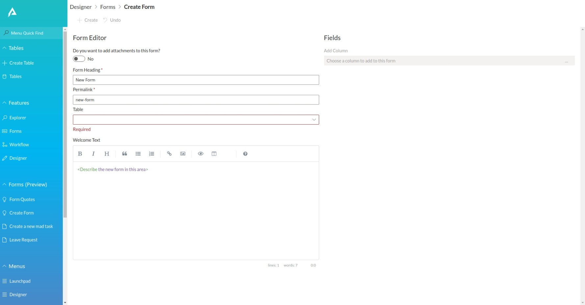

# Create a new Form

Creating a new form is quite easy within the RapidPlatform, first navigate to explorer, once there, you should scroll the side panel down until you see a button that says `Create Form`

Open Explorer and click on the "Create Form" button on the sidebar to create a new form. You will be greeted with a new form page.

