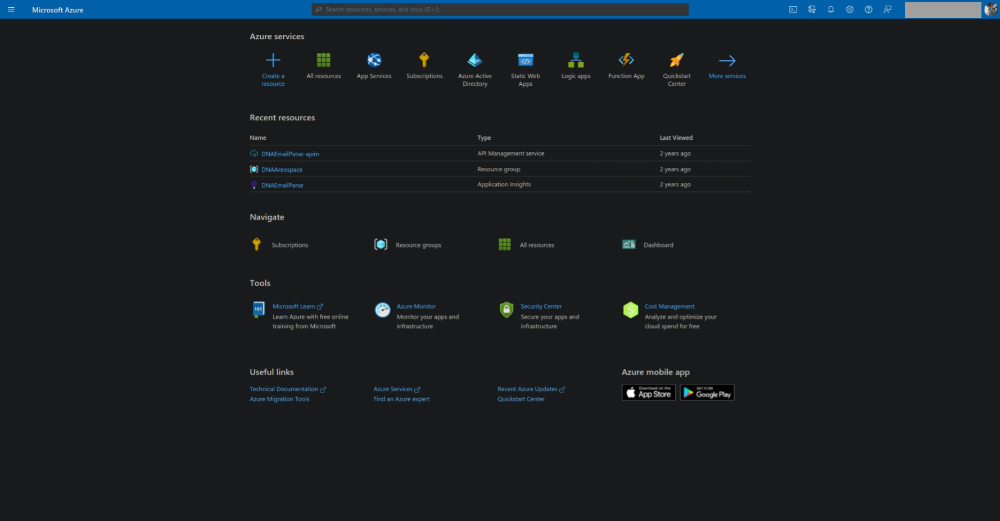
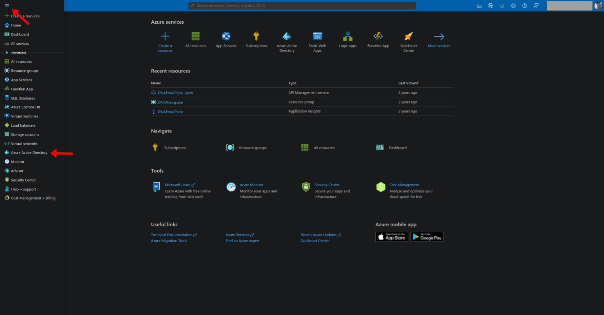
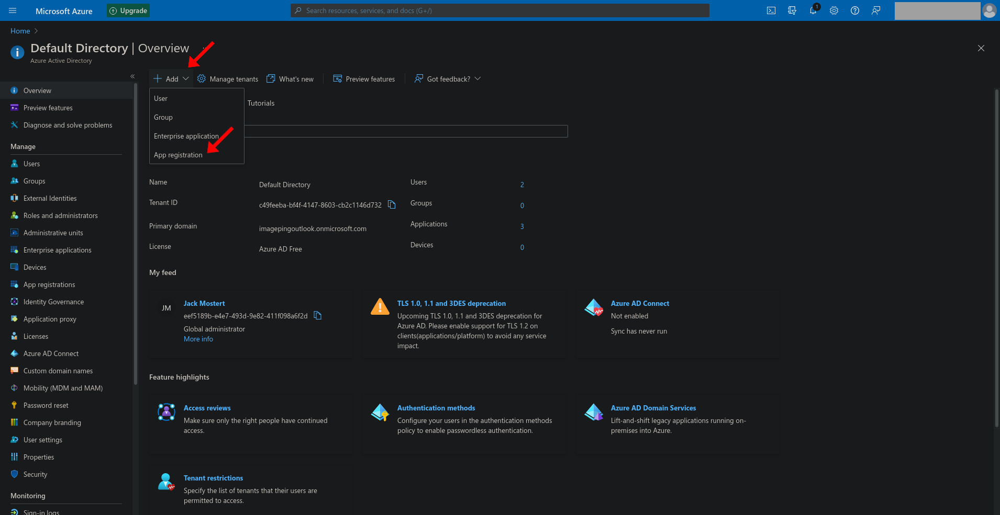

# Create an Azure AD app

The first step in creating a custom App that talks to Rapidplatform are developing an App registration inside Azure AD. If you want to know the precise reason why this is the case, [see here](https://docs.rapidplatform.com/link/8#bkmrk-why-do-i-need-an-azu).

#### Creating your App registration

Navigate to the [Azure Portal](https://portal.azure.com/) and either log in if you already have an account or create a new account following the provided steps by Microsoft.

Once you're inside of the Azure Portal, you should be welcomed with the following screen (As of September 2021):

You will now need to click on the navigation menu in Microsoft Azure located at the top left of the page. Clicking on the menu will provide you with a panel full of options. The one that we are looking for is called "Azure Active Directory", or you can [click here](https://portal.azure.com/#blade/Microsoft_AAD_IAM/ActiveDirectoryMenuBlade/Overview) to navigate to it.

Once you've clicked on the "Azure Active Directory" and are greeted with the "Default Directory | Overview" page, we can begin going through the process of creating your new App registration.

At the top of the page under the title, you will find a button saying "Add", clicking on this will bring up a dropdown; to create your App registration, click on the "App registration" open in the dropdown. You can then follow the steps and customize the App settings to your preference.

Now that you have your app registration take notice of the "Application (client) ID", which will be used later when requesting access to Rapid platform.