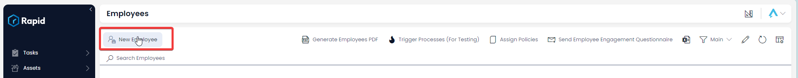
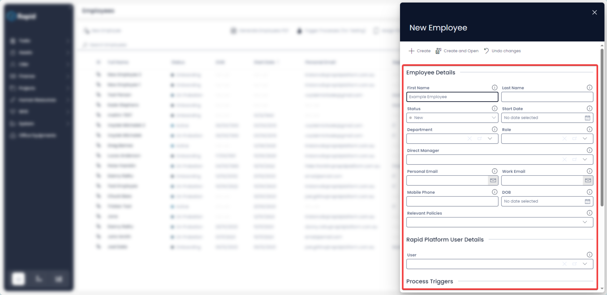
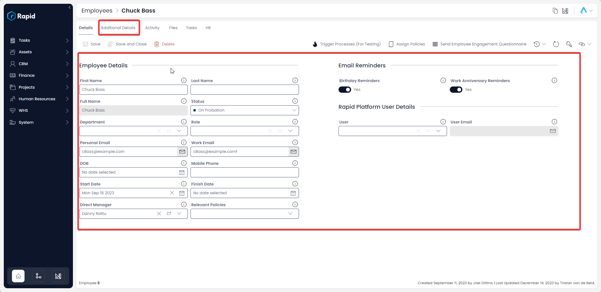
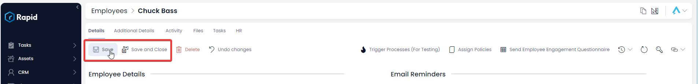
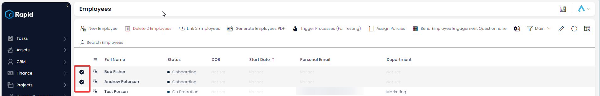
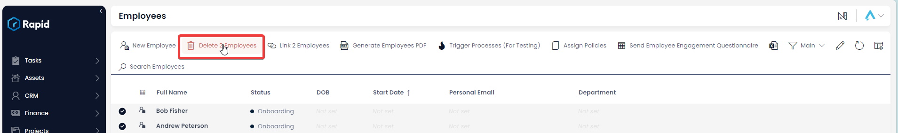
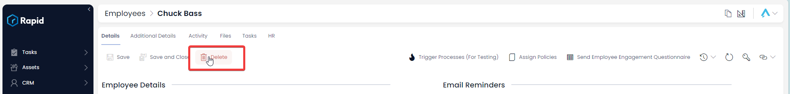

# Creating, Editing, and Deleting Employees

### How to Create a new Employee

1. Navigate to Human Resources &gt; Employees  
    
2. Click on "New Employee".  
    
3. Enter all relevant details 
    1. For correct task assignment across modules **Principal lookup** must be linked
    2. For probation review processes to work the **Email**, **First name**, and **Last name** must be filled
    3. For work anniversary reminders the **Start Date** must be filled
    4. For birthday reminders the **DOB** field must be filled.
    5. The onboarding process, by default, will be triggered upon creation of an employee, however this can be turned off by switching the **Trigger Onboarding Process** toggle to false 
        1. For a policy acknowledgment task to be assigned to the employee through the onboarding process, selected policies must be selected
    6. The probation process, by default, will be will not be triggered on creation of an employee, however this can be turned on by switching the **Trigger Probation Review Process** toggle to true
    7. If the Manager does not want to receive **Birthday** or **Work anniversary reminder** emails they can select these toggles to false  
        
4. Click on **Create** or ****Create and Open**** 

### How to edit an Employee item

1. Navigate to Human Resources &gt; Employees  
    
2. Open the desired employee item. (Find the employee item by either scrolling through the list or using the search bar)  
    
3. Edit fields as required. There are additional fields on the **Additional Details** tab that you can also edit.  
    
4. Press **Save** or ****Save and Close**** 

### Deleting Employee Records

It is not recommended to delete an employee instead, change its status to "Archived." This way you can maintain a record of past and current employees.

However, if you need to delete an employee due to incorrect data entry or a duplicate entry, you can do so in two ways: from the list or from the item page. Deleting from the list allows you to delete multiple employees at once.

#### How to delete multiple employees from the list page

1. Navigate to Human Resources &gt; Employees  
    
2. Select the employees you wish to delete  
    
3. Press the **Delete X Employees** button  
    

#### How to delete a single employee from employee page

1. Navigate to Human Resources &gt; Employees  
    
2. Open the desired employee item. (Find the employee item by either scrolling through the list or using the search bar)  
    
3. Press the **Delete** button  
    