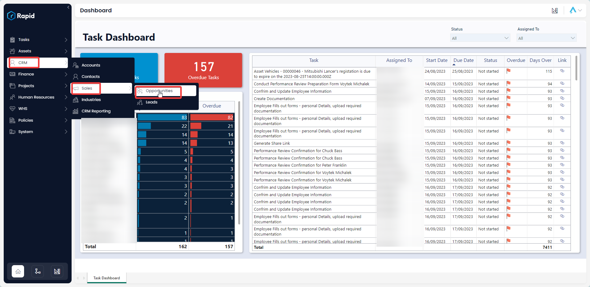
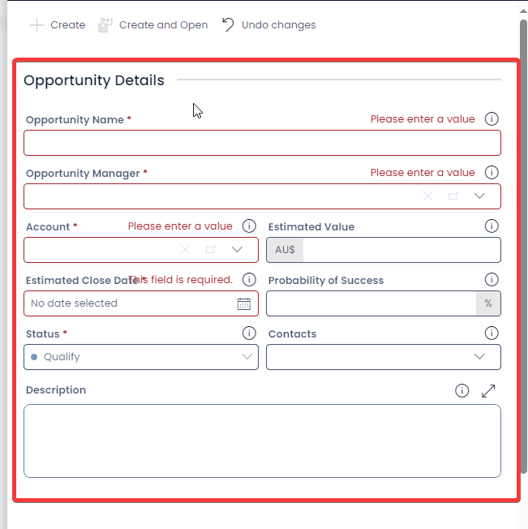
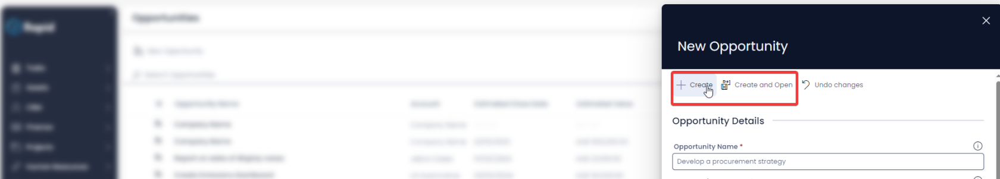
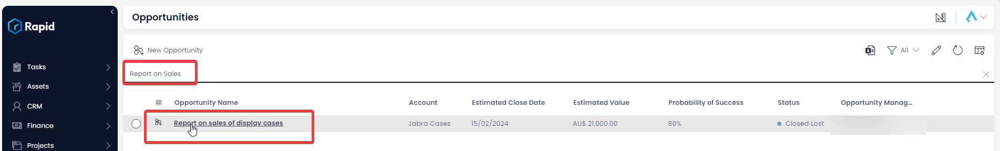
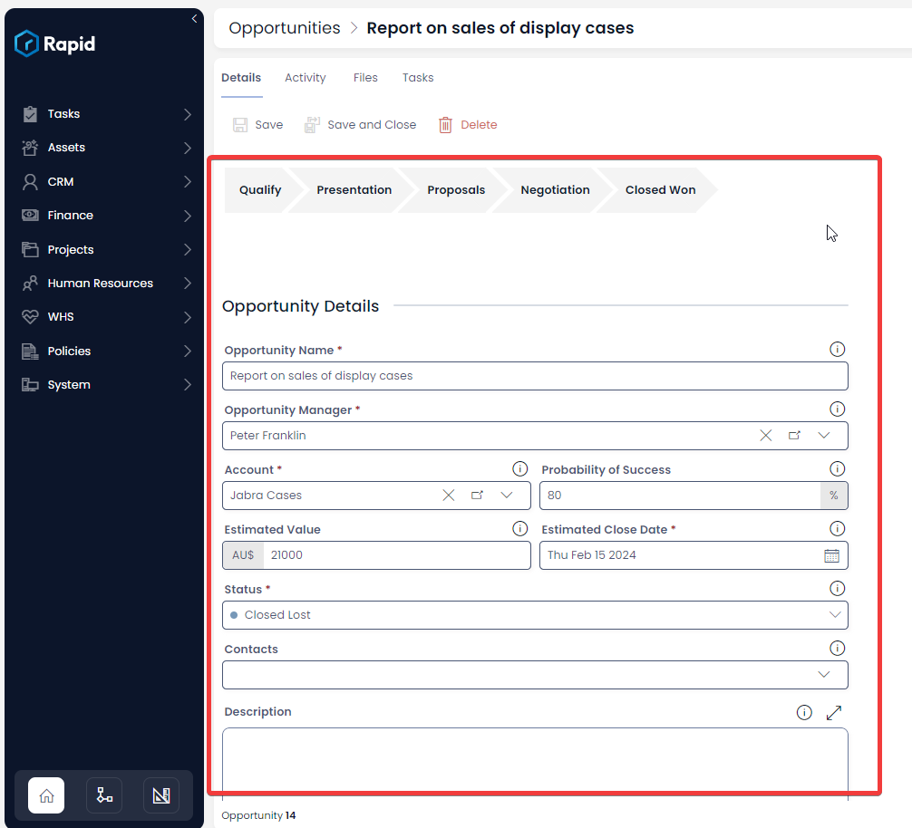
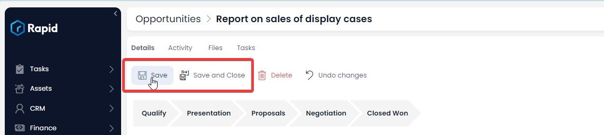
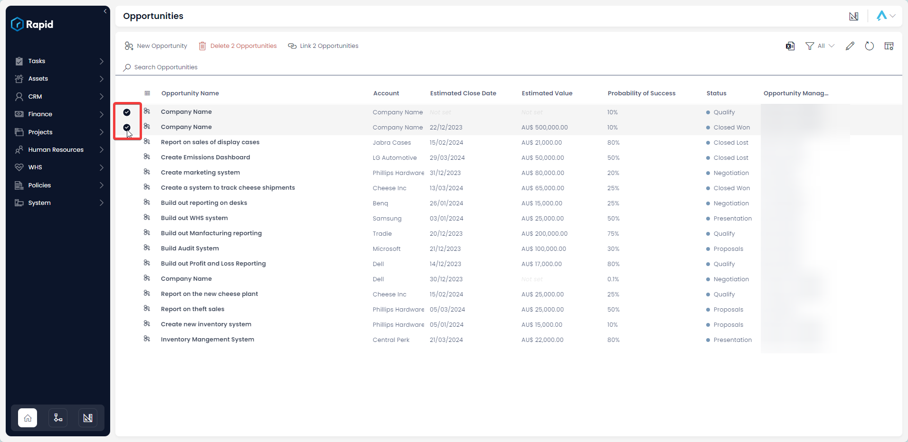
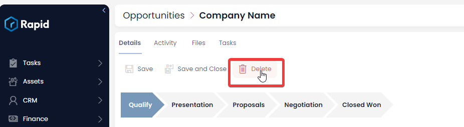

# Creating, Updating, and Deleting Opportunities

### Overview

The opportunities table provides a place for the sales team to store and keep track of any potential projects and sales. The Sales Dashboard (described [here](https://docs.rapidplatform.com/books/crm-client-relations-manager/page/sales-dashboard)) derives the majority of its information from the records on the opportunities table.

### How to Create an Opportunity

Opportunities can be created in two ways. The first is through the Lead conversion button, where it will automatically be created with the relevant lead details (More information on this method can be found here: [Converting a Lead](https://docs.rapidplatform.com/books/crm-client-relations-manager/page/converting-a-lead)). The second way, like many other tables is through the table list page and those steps can be found below.

1. In Explorer select CRM &gt; Sales &gt; Opportunities  
    
2. Select ****New Opportunity**** 
3. Enter the relevant details  
    
4. Press **Create** or **Create and Open**  
    

### How to Edit an Opportunity

1. In Explorer select CRM &gt; Sales &gt; Opportunities  
    
2. Open the **Opportunity** you wish to edit. (Locate the **Opportunity** either by scrolling through the list or using the search bar).  
    
3. Edit any relevant fields on the **Opportunity** as needed.  
    
4. Once you have finished editing, click on Save or Save and Close.  
    

### Deleting Opportunities

It is not recommended to delete an **Opportunity** instead change its status to **Closed Lost**. This way, you can maintain a list of all your opportunities.

However, if you need to delete an **Opportunity** due to incorrect data entry or a duplicate entry, you can do so in two ways: from the list or from the item page. Deleting from the list allows you to delete multiple **Opportunities** at once.

#### How to delete multiple opportunities at once

1. In Explorer select CRM &gt; Sales &gt; Opportunities  
    
2. Select the Opportunities you want to delete  
    
3. Click on **Delete X Opportunities** button  
    

#### How to delete a single lead from the leads page

1. In Explorer select CRM &gt; Sales &gt; Opportunities  
    
2. Open the **Opportunity** you wish to delete. (Locate the **Opportunity** either by scrolling through the list or using the search bar).  
    
3. Press **Delete**  
    