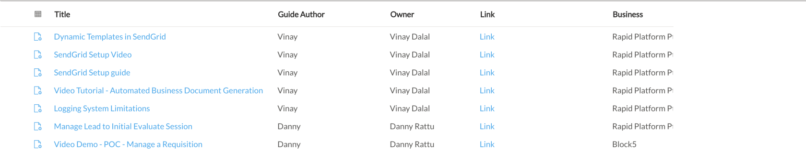

# Data Table

A data table is a collection of data organised across columns.

Here,

- Title
- Guide Author
- Owner
- Link
- Business

are columns that organise the data about various items in the table.

##### **Related article**

[What is a data table structure?](https://docs.rapidplatform.com/books/glossary/page/data-table-structure "Data Table Structure")