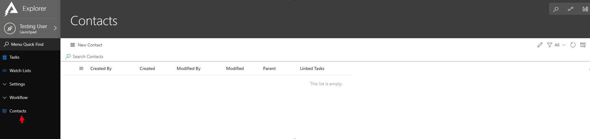

# Default Fields

*A Custom Entity in Explorer*

This is the default view and page for an [Entity](https://docs.rapidplatform.com/Home/User-Documentation/Designer/Entities). Notice there are multiple fields (columns) which are present in the header. These are the system fields which are present on any entity on a Rapid site; custom or system entities (like tasks). In some situations, having one or more of these system fields may be useful, in either adding them to a view or creating a query which includes them. Below is an outline of what each of these system fields do.

- Created By: Outputs the name of the user who created the item
- Created: Outputs a date in which the item was created
- Modified By: If the entity was edited, the name of user who edited will be displayed
- Modified: Outputs the date in which the item was edited
- Parent: Displays the parent of the item (if applicable) Refer to section 10 for more information on parenting
- Linked Tasks: An array of tasks linked to an item

These system lists are added to the schema in the database on entity creation. These fields cannot be deleted and are necessary for Rapid to function correctly. These system fields will automatically be removed from the view if there are custom fields added to an entity.