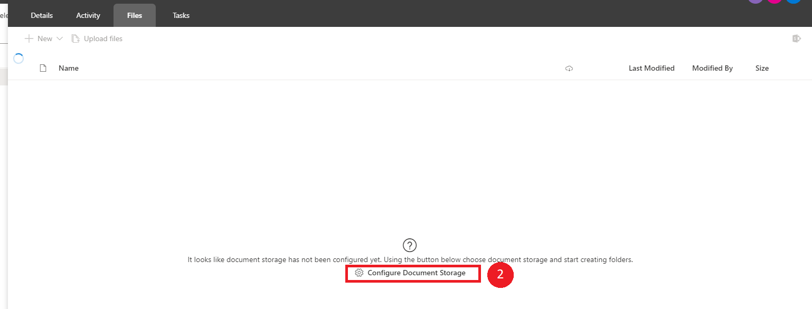
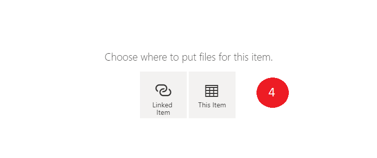

# File Browser

You can configure [document storage](https://docs.rapidplatform.com/Home/User-Documentation/Getting-Started-with-Rapid-Platform) from the [Single Page](https://docs.rapidplatform.com/Home/User-Documentation/Explorer/Pages/Single-Page) of the item, or through the Options of the entity in the Designer experience. More can be read [here](https://support.office.com/en-us/article/what-is-a-document-library-3b5976dd-65cf-4c9e-bf5a-713c10ca2872). NOTE: maybe revisit this

## Configuring Document Storage Through the Single Page

To configure the Document Storage of the item through the single page of an item:

1. In the Explorer experience, in the **File** tab of the item that you'd like to configure the documentation storage.
2. Click **Configure Document Storage**. It will then take you to the Options tab of the entity.

1. Follow the steps to configure the storage [here](https://docs.rapidplatform.com/Home/User-Documentation/Getting-Started-with-Rapid-Platform).
2. Once the Documentation Storage has been configured, users have the option to select where to place the items, either **Linked Item** or **This item**.

1. Select **This Item** to save documents to this specific item.

## Uploading A New File

To upload a new file:

1. In a configured Document Library, click **Upload files**.
2. Select the intended file to upload and click **Open** in the pop-out window.
3. The file will now upload.
4. Double click on the file to view it.

## Deleting A File

To delete a file:

1. In a configured document storage with an uploaded file, check the radio box that you wish to delete.
2. Click **Delete** in the command bar to delete the file.

## Renaming A File

To rename a file:

1. In a configured document storage with an uploaded file, check the radio box that you wish to rename.
2. Click **Rename** to rename the file.
3. Press **Enter** to save the changes.

## Emailing Files

To email a file:

1. In a configured document storage with an uploaded file, check the radio box that you wish to email.
2. Click **E-mail Files** to email the file.
3. The default email app will open allowing you to send an email with the file attached.

## Creating A Task with Attachments