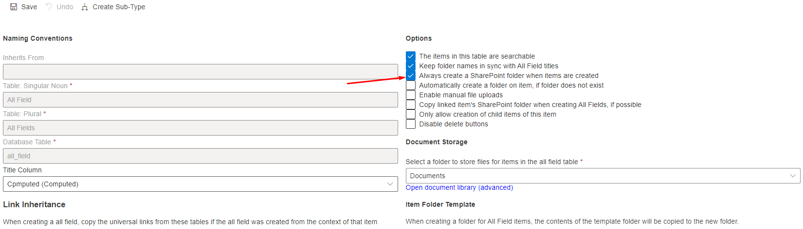
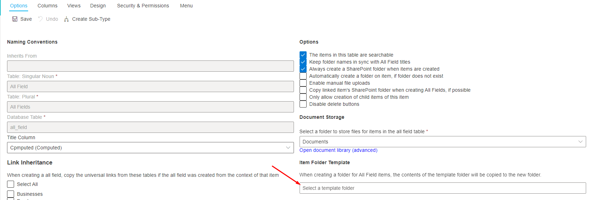

# File Folders

A folder in RAPID represents any folder in Sharepoint. However, in the context of Rapid Platform a folder can exist in the context of an item. An item can have a drive and folder ID which corresponds to a sharepoint location. In the Rapid Interface, these files are displayed.

### Folder Creation

There are a few different ways to create a folder through the Rapid Interface.

#### Create Folder on Item Creation

If configured in Designer, it is possible to have the server automatically create a sharepoint folder for an item upon its creation. To configure this, open the list config in Designer and select the option.  

### Item Folder Templates

When creating a folder for an item, either manually or where the system creates one on creation; it is possible to define a item folder template. If configured, the template will copy the contents of a selected folder and put the files and folders within the new item.  
To configure a item folder template, open the list in Designer and use the folder selector

Then select the folder you would like to use as a template. The contents of this folder selected will be applied to any folder created on any item for the selected list.