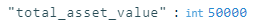

# Formatting Values in a LODASH expression

Sometimes when filling a document, a user may want to fill with a number. However, as default, the rapid system returns numbers unformatted (see img below). Sometimes this can be formatted by adding an additional column using SQL but if the number is only used once or twice it is often not worthwhile creating a whole additional column putting additional load on the database.

As such, if using a LODASH expression that returns a single value (this will not work with an array) you can format by adding the .toLocaleString method.

For example:

`<%= ServiceTask_1ly9smc.properties.item.total_asset_value %>` would return 50000

while

`<%= ServiceTask_1ly9smc.properties.item.total_asset_value.toLocaleString("en-AU") %>` would return "50,000"

The "en-AU" argument tells the method to format the number as per Australian English Standards. If you wish to format your string according to the standards of another locale you can find a list of locale codes here: [https://www.npmjs.com/package/locale-codes](https://www.npmjs.com/package/locale-codes)

<table border="1" id="bkmrk-value-expression-res">
  <tbody>
    <tr>
      <td>**Description**</td>
      <td>**Value**</td>
      <td>**Expression**</td>
      <td>**Result**</td>
    </tr>
    <tr>
      <td>Format number</td>
      <td>int 50000.05</td>
      <td>`VALUE.toLocaleString("en-AU")`</td>
      <td>"50,000.05"</td>
    </tr>
    <tr>
      <td>Format Currency - No decimals</td>
      <td>int 50000.05</td>
      <td>`VALUE.toLocaleString("en-AU", {style: "currency", currency: "AUD", maximumFractionDigits: 0})`</td>
      <td>"$50,000"</td>
    </tr>
    <tr>
      <td>Format ISO to short date</td>
      <td>"2023-04-24T00:00:00.000Z"</td>
      <td>`DateTime.fromISO(VALUE).toFormat('dd/LL/yyyy')`</td>
      <td>"24/04/2023"</td>
    </tr>
    <tr>
      <td>Return Today as ISO</td>
      <td>Today as ISO</td>
      <td>`DateTime.now().toISO()`</td>
      <td>"2023-09-04T00:00:00.000Z"</td>
    </tr>
    <tr>
      <td>Return Today formatted as short date</td>
      <td>Today as ISO formatted</td>
      <td>`DateTime.now().toFormat('dd/LL/yyyy')`</td>
      <td>"04/09/2023"</td>
    </tr>
    <tr>
      <td>Format ISO into 24 hour time</td>
      <td>"2023-04-24T10:40:00.000Z"</td>
      <td>`DateTime.fromISO(VALUE).toFormat('HH:mm')`</td>
      <td>"10:40"</td>
    </tr>
    <tr>
      <td>Now plus 1 hour returned as ISO</td>
      <td>Now</td>
      <td>`DateTime.now().plus({hours: 1}).toISO()` NOTE: you can also add "seconds", "minutes", "hours", "days",
        "weeks", "months", "quarters", and "years"</td>
      <td>NA</td>
    </tr>
    <tr>
      <td>Now minus 1 hour returned as ISO</td>
      <td>Now</td>
      <td>`DateTime.now().minus({hours: 1}).toISO()` NOTE: you can also subtract"seconds", "minutes", "hours", "days",
        "weeks", "months", "quarters", and "years"</td>
      <td>NA</td>
    </tr>
    <tr>
      <td>Return Start of given day</td>
      <td>"2023-09-04T10:10:00.000Z"</td>
      <td>`DateTime.now().minus({hours: 1}).startOf('day').toISO()`</td>
      <td>"2023-09-04T00:00:00.000Z"</td>
    </tr>
  </tbody>
</table>

##### **Related articles**

[**How to filter values in a lodash expression**](https://docs.rapidplatform.com/books/workflow-keyper/page/how-to-filter-values-in-a-lodash-expression)

[**How to format array values in a lodash expression**](https://docs.rapidplatform.com/books/workflow-keyper/page/how-to-format-array-values-in-a-lodash-expression)

[**Fill Document**](https://docs.rapidplatform.com/books/workflow-keyper/page/fill-document)