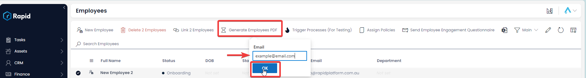

# Generating an Employees List PDF Report

### Overview

On the Employees list there is a feature that allows you to generate a PDF list of employees. This PDF list serves as a printer or email friendly version of your employees list.

### How to generate a PDF list of employees

1. Navigate to Human Resources &gt; Employees  
    
2. Select the employees you want to be included in the repot. If you want to include all of them press the select all Tick icon at the top of the tick column  
    
3. Press **Generate Employees PDF**, enter an email you want the PDF to be sent to and press **OK** 