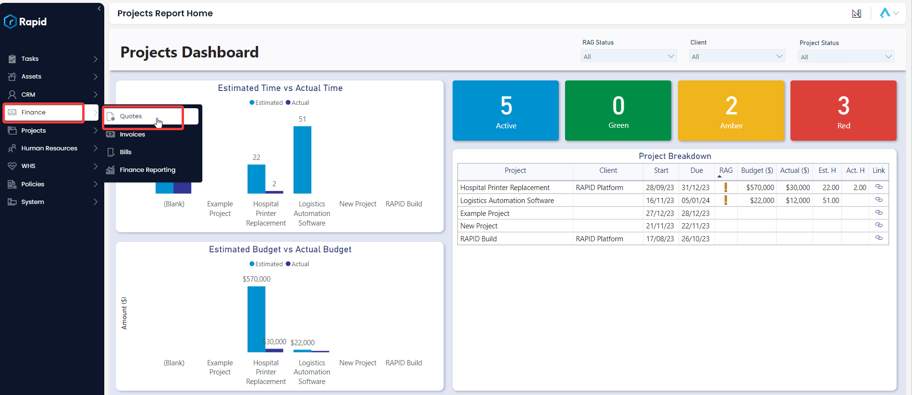
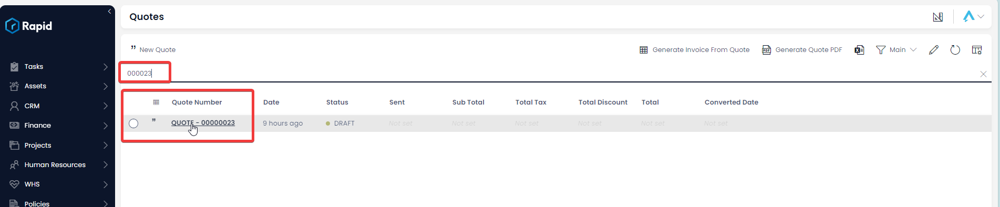
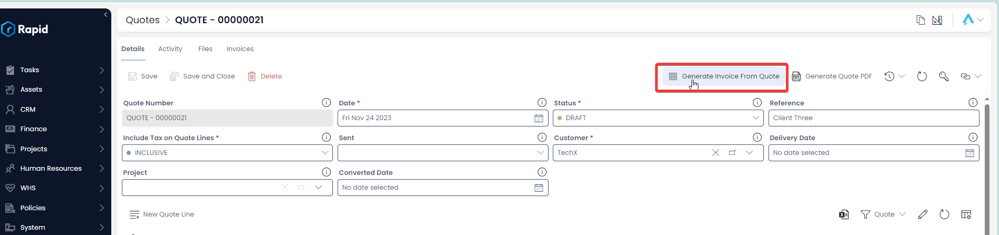
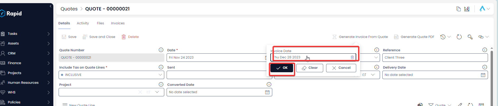
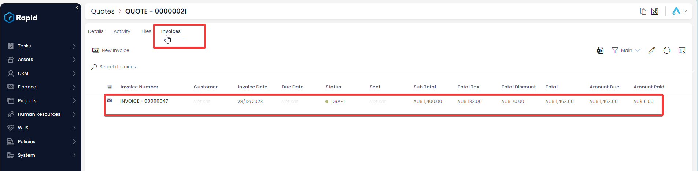
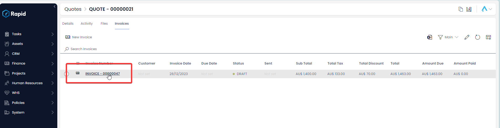

# Generating an Invoice from a Quote

### Overview

As part of the Finance module comes the ability to automatically generate an invoice from a quote item. This saves you time, as it will create the invoices item and line items with the same details as the Quote item and lines item.

### How to Generate an Invoice from a Quote

1. Navigate to the **Finance** &gt; **Quotes**  
    
2. Open the quote you wish to create an Invoice from either by scrolling through the list or using the search bar.  
    
3. Click the **Generate Invoice From Quote** menu button located in the top right of the page.  
    
4. A form will appear, enter the Invoice Date and press **OK** and wait for the green “Work Executed Successfully” notification  
    
5. Click on the Invoices tab – Here you will find any invoices that lookup to the quote item  
    
6. Click on the title to access the newly created invoice item  
    