# How to add a component to a Layout / Page?

##### **Case scenario**

Let us assume you are the Project Manager of your organisation. You access the Projects Table in Rapid Platform. The Projects Table has a list of all the projects in the organisation along with their respective details. Imagine you wish to you wish to see a counter of all Active projects on the Explorer page where the list of all project items appear.

##### **Objective**

To add a counter component on the Plural Design.

##### **Assumption and Scope**

This article only focuses on how to add a component to the Page. It is assumed that the Table View for filtering Active Projects is already present in the system.

##### **Steps to add a component to a Page**

To add a new component to a [**Page layout**](https://docs.rapidplatform.com/books/glossary/page/page-layout-and-component "Page, layout and component"), please follow the below steps:

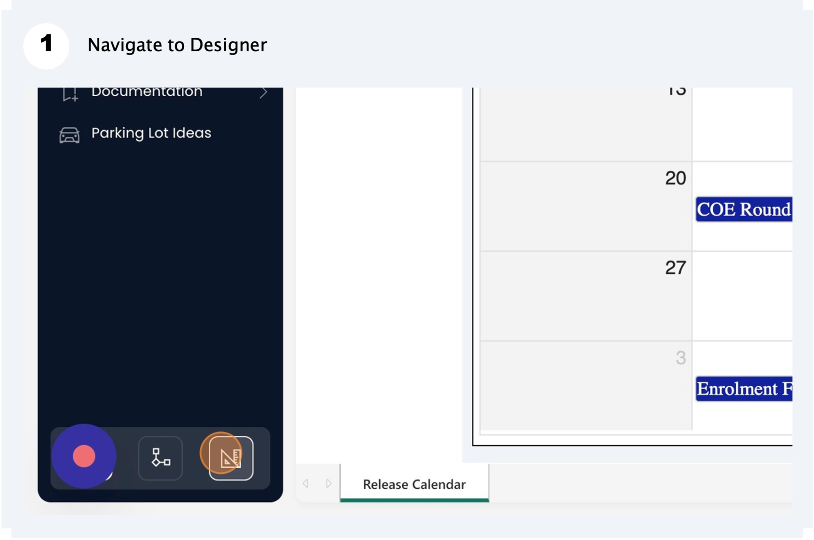

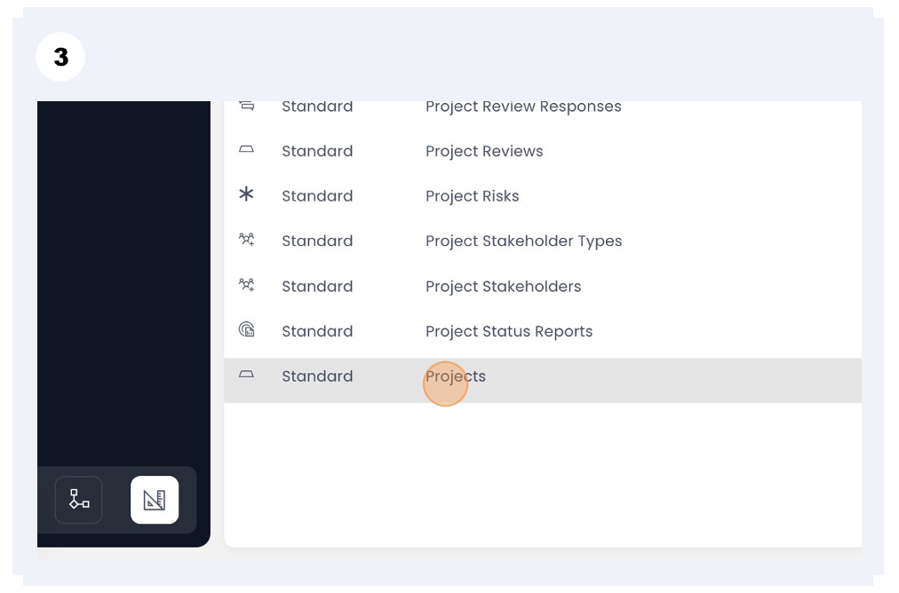

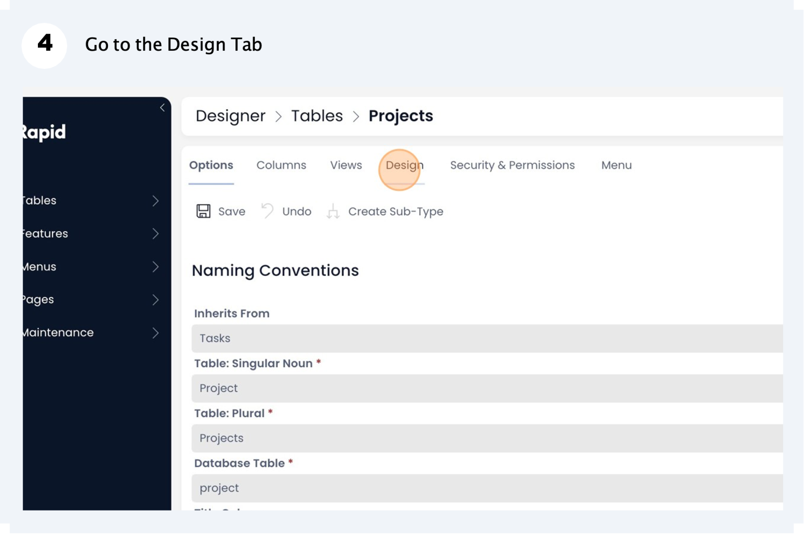

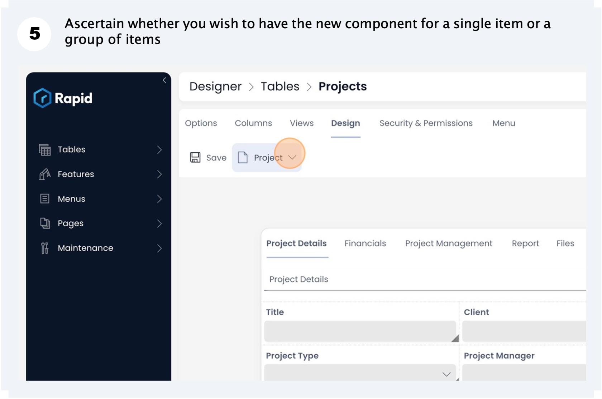

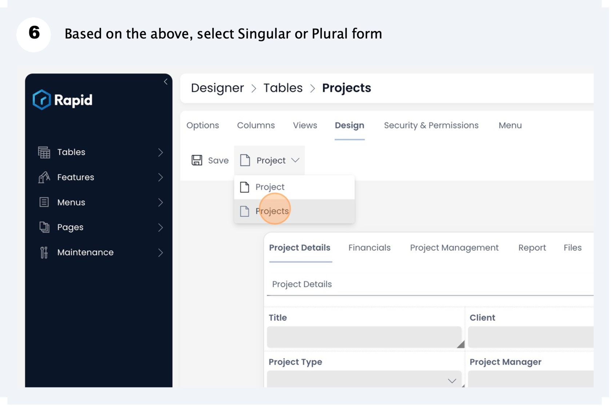

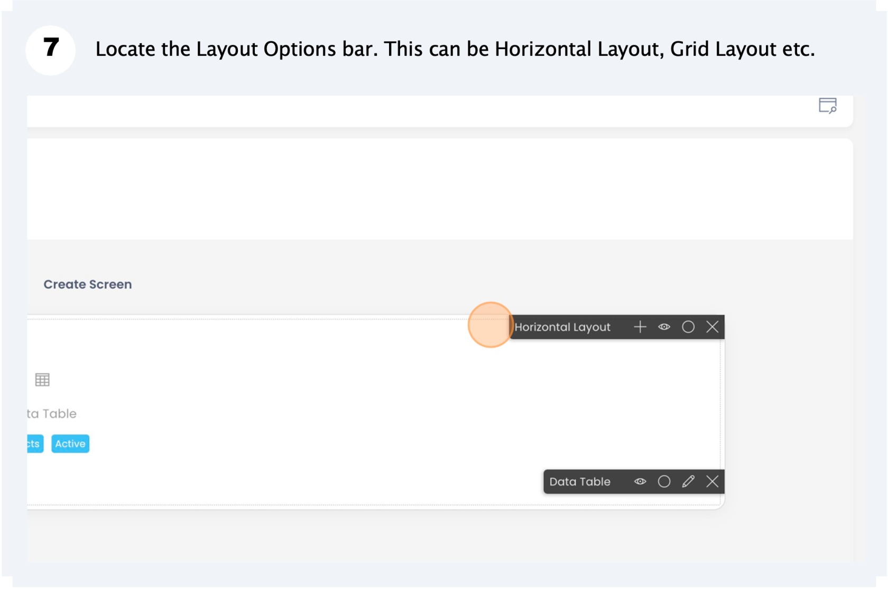

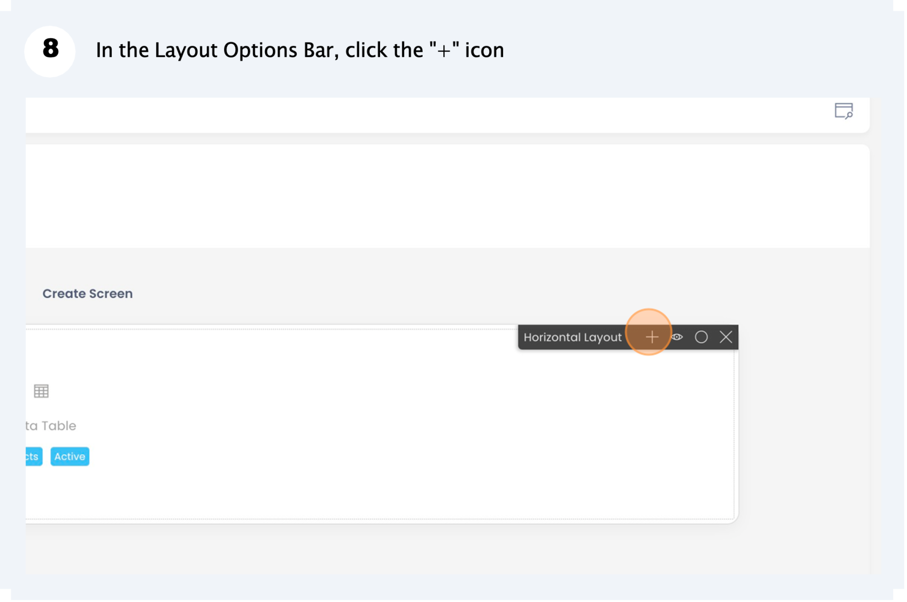

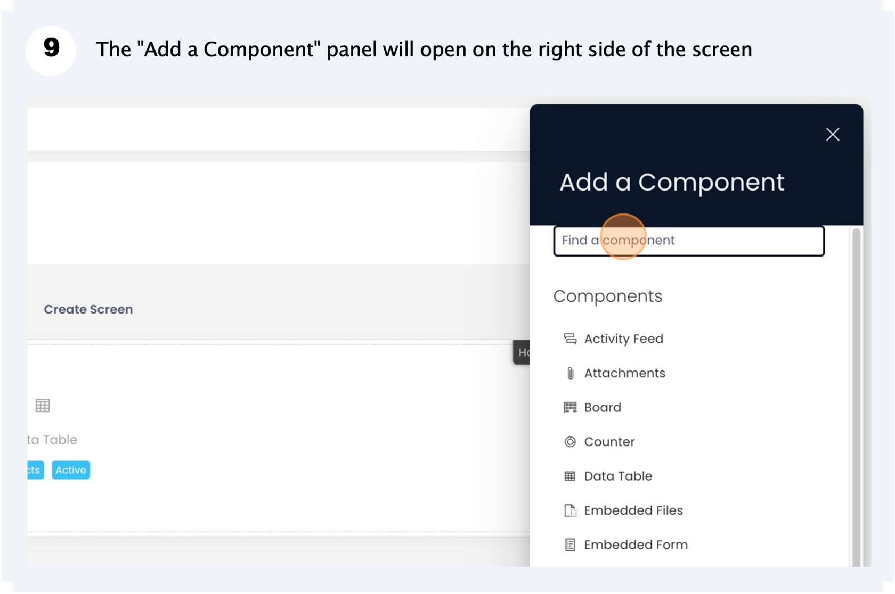

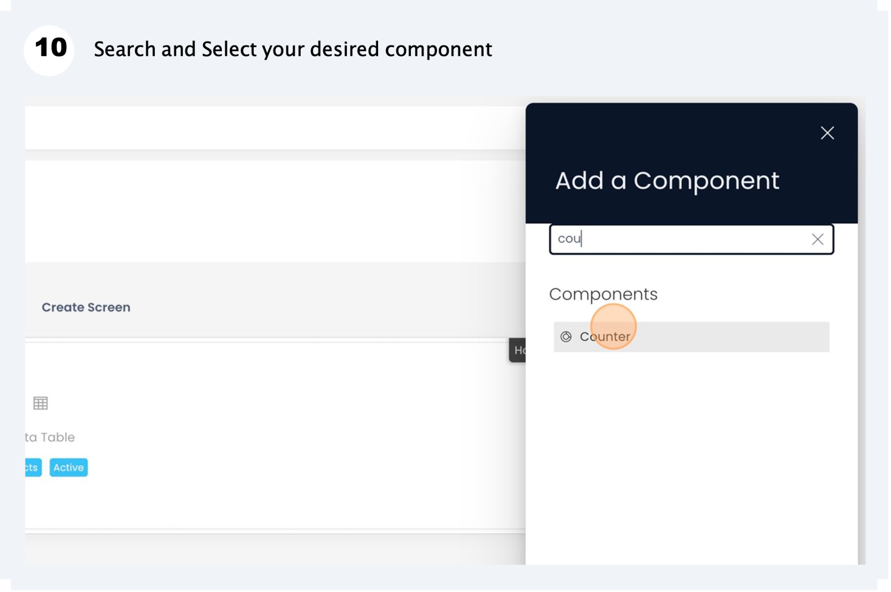

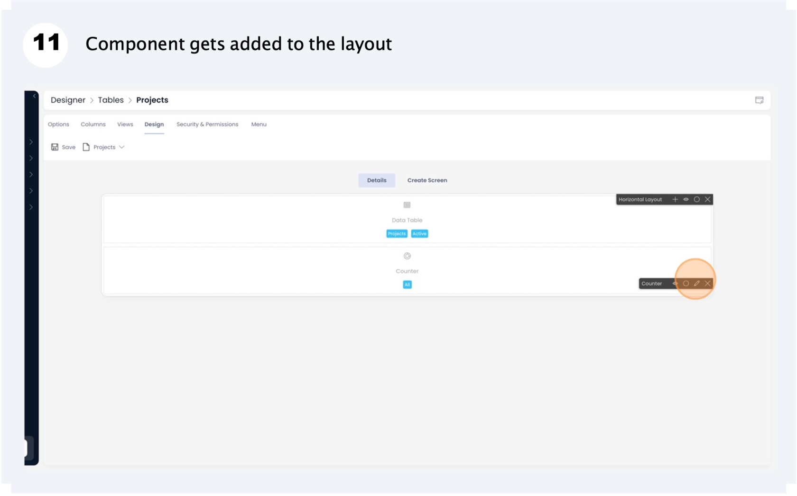

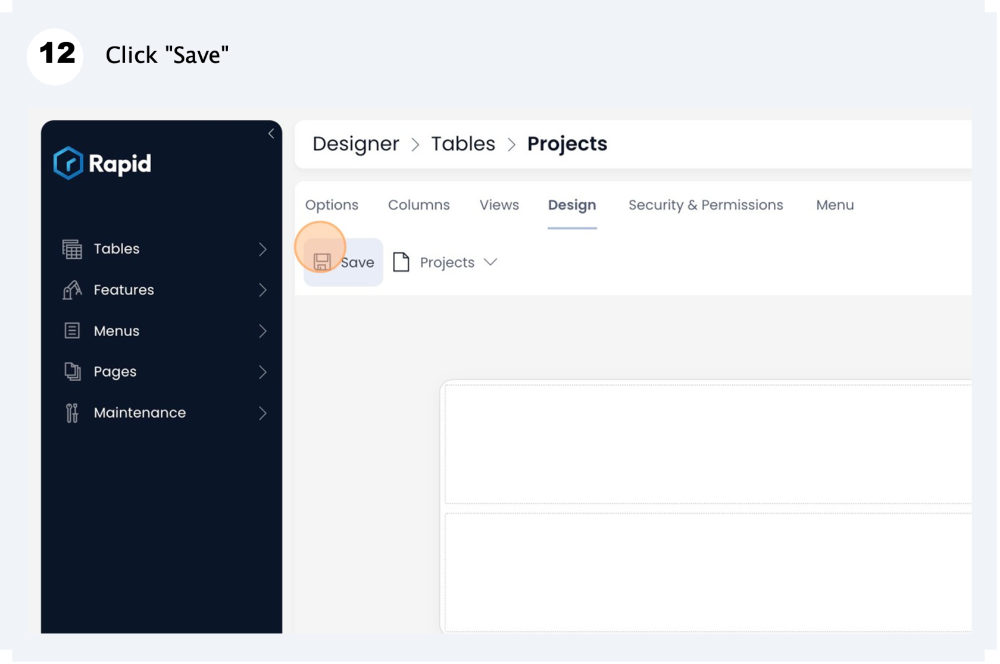

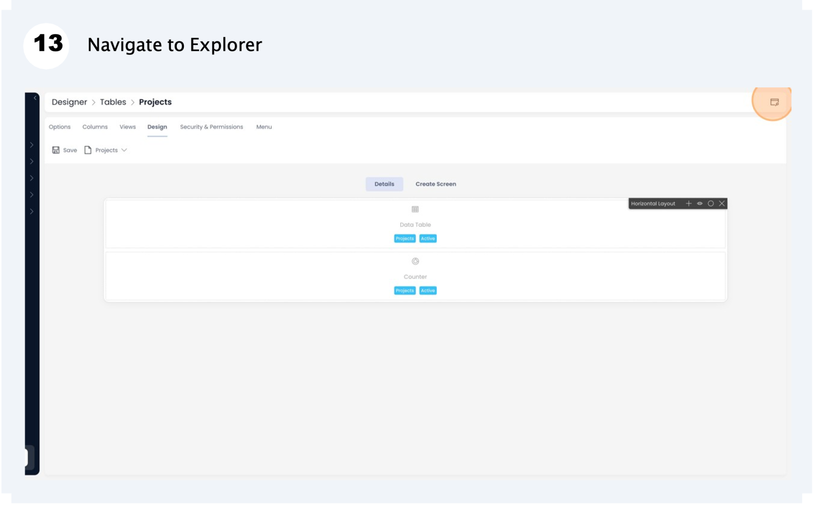

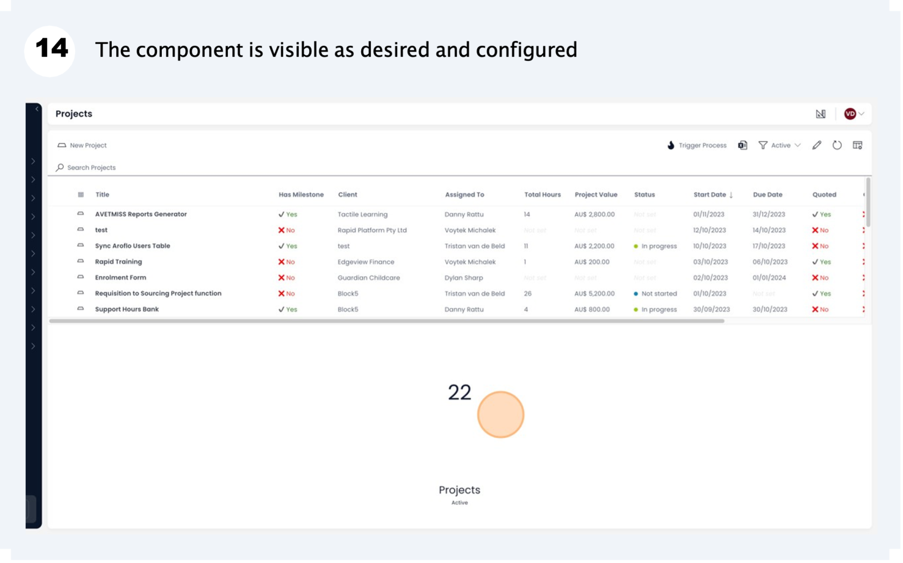

##### **Related articles**

[How to move a component on layout?](https://docs.rapidplatform.com/books/experiences/page/how-to-move-a-component-on-layout "How to move a component on layout?")

[How to configure / update component properties?](https://docs.rapidplatform.com/books/experiences/page/how-to-configure-update-component-properties "How to configure / update component properties?")

[How to set a component to be visible / hidden on "Item Details" and "Create" breakpoints?](https://docs.rapidplatform.com/books/experiences/page/how-to-set-a-component-to-be-visible-hidden-on-item-details-and-create-breakpoints "How to set a component to be visible / hidden on "Item Details" and "Create" breakpoints?")

[How to create a Page in Designer?](https://docs.rapidplatform.com/books/experiences/page/how-to-create-a-page "How to create a Page in Designer?")

[***Go back to Pages Main Resource***](https://docs.rapidplatform.com/books/experiences/page/all-about-pages-in-designer "All about Pages in Designer")