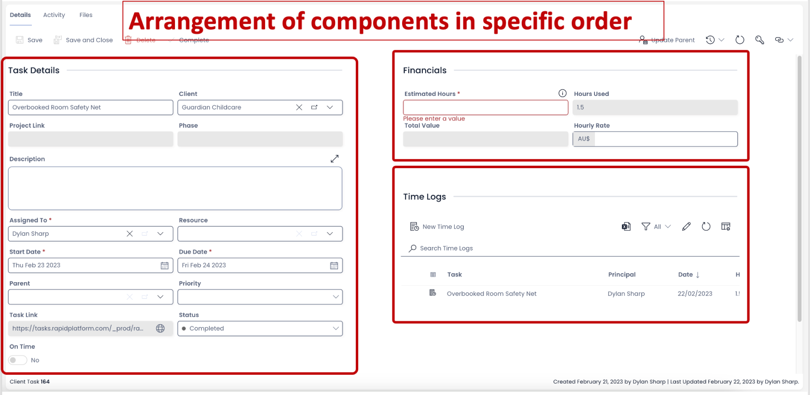
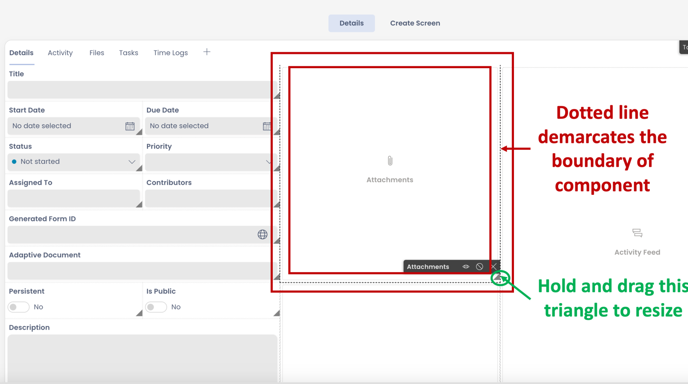

# How to arrange a component on Grid layout?

There may be occasions when you wish to set up components in a specific order.

The position of the component can be an important aspect for improved assimilation.

##### **Moving the component on Grid Layout**

To move a component on a grid layout, simply hold click and drag it to the preferred position. As you drag the component to its new position, the system will automatically try to optimise the blank space by arranging the remaining components.

<iframe allowfullscreen="allowfullscreen" frameborder="0" height="420" src="https://www.youtube.com/embed/J479BhbjLBM?si=lGzEKBDM4d5nsDRy" title="YouTube video player" width="750"></iframe>

##### **Resize a component on Grid Layout**

Just like positioning, the size of the component is also important to display the right amount of information per frame. Based on its type, each component comes with a default size on the layout when added. This size is demarcated by a dotted edge around the component.

To resize a component, just click and drag a dark triangle icon at the bottom right corner of the component boundary.

<iframe allowfullscreen="allowfullscreen" frameborder="0" height="420" src="https://www.youtube.com/embed/bMEWEtVBxAs?si=joH3FRqfaX8565Lj" title="YouTube video player" width="750"></iframe>

**Please note -** The resizing and repositioning of components is only possible in Grid Layout.

##### **Related articles**

[How to configure / update component properties?](https://docs.rapidplatform.com/books/experiences/page/how-to-configure-update-component-properties "How to configure / update component properties?")

[How to set a component to be visible / hidden on "Item Details" and "Create" breakpoints?](https://docs.rapidplatform.com/books/experiences/page/how-to-set-a-component-to-be-visible-hidden-on-item-details-and-create-breakpoints "How to set a component to be visible / hidden on "Item Details" and "Create" breakpoints?")

<svg class="svg-icon" data-icon="link" role="presentation" viewbox="0 0 24 24" xmlns="http://www.w3.org/2000/svg"></svg>
<input id="bkmrk--2" placeholder="url" readonly="readonly" type="text"></input> <button class="button outline icon" data-clipboard-target="#pointer-url" title="Copy Link" type="button"><svg class="svg-icon" data-icon="copy" role="presentation" viewbox="0 0 24 24" xmlns="http://www.w3.org/2000/svg"></svg></button>
<svg class="svg-icon" data-icon="edit" role="presentation" viewbox="0 0 24 24" xmlns="http://www.w3.org/2000/svg"></svg>

[How to create a Page in Designer?](https://docs.rapidplatform.com/books/experiences/page/how-to-create-a-page "How to create a Page in Designer?")

[***Go back to Pages Main Resource***](https://docs.rapidplatform.com/books/experiences/page/all-about-pages-in-designer "All about Pages in Designer")