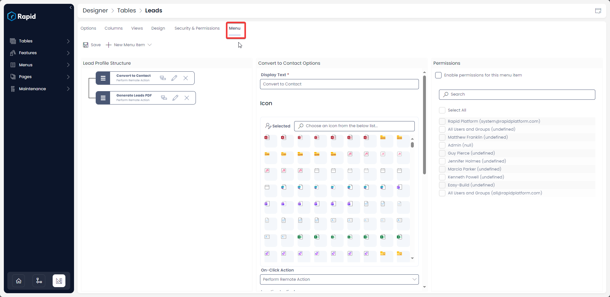
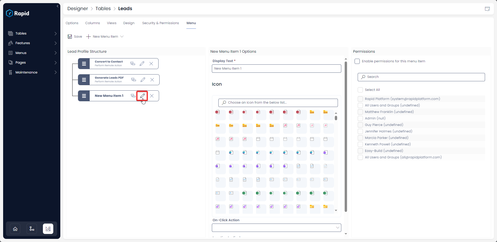
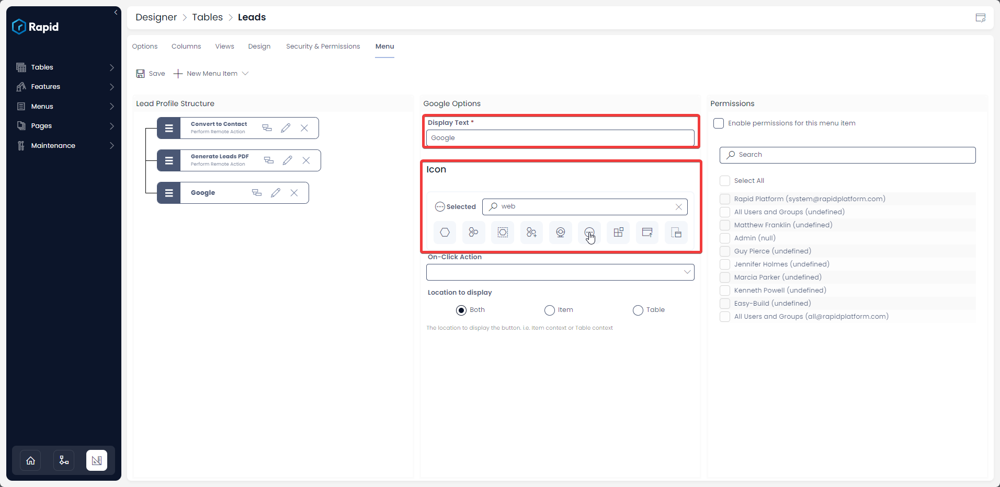
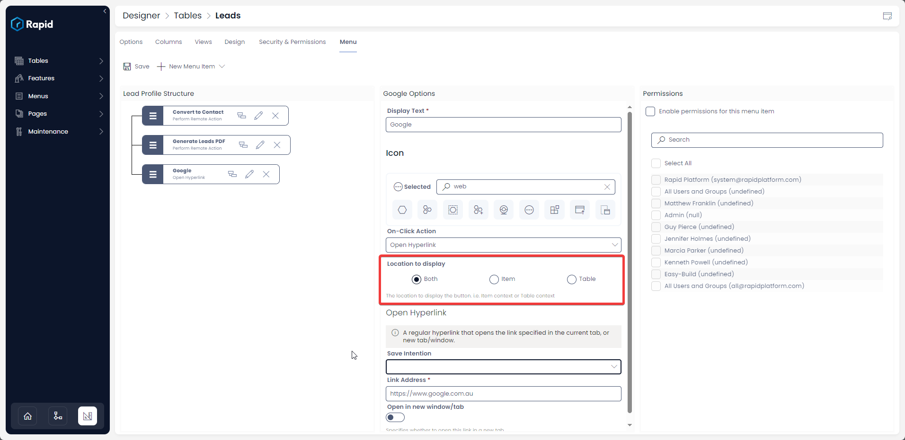
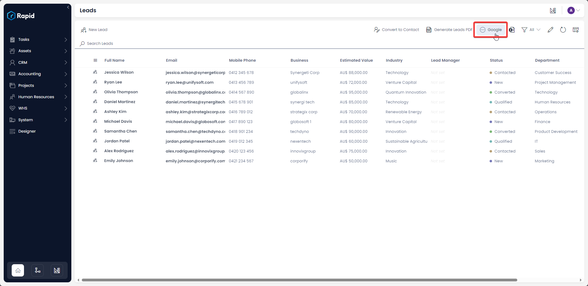

# How to configure a Menu button in a command bar?

Buttons can be very useful in the *[**Command Bar** ](https://docs.rapidplatform.com/books/glossary/page/command-bar)*and can provide contextual actions related to that table or table item.

##### What is a command bar?

A command bar is the horizontal area containing command buttons like Save, Delete, Add new item etc. It is visible in the Explorer view of a data table.

**Command bar in Table view**

**Command bar in Item view**

##### Use case for menu button in command bar

Imagine you are looking at the Quotes table. You may want to perform specific actions based on the selected quotes, such as Generate an Invoice from the Quote Item or Generate a Quote PDF. There are many possible use cases as menu buttons can trigger workflows, perform remote actions and much more. (To see a full list of On-Click Actions see [How to Set On-Click Actions](https://docs.rapidplatform.com/books/experiences/page/how-to-set-on-click-action-for-a-menu-item))

##### Steps for adding a Menu button to a command bar

1. Navigate to Designer &gt; Tables  
    
2. Open the table you wish to add the menu button to from the tables list
3. Select the Menu Tab  
    
4. Select New Menu Item &gt; New Blank Item  
    
5. Press the edit button on the newly created menu item  
    
6. Provide appropriate display text and icon  
    
7. Configure your desired On-Click Action (See [How to Set On-Click Actions](https://docs.rapidplatform.com/books/experiences/page/how-to-set-on-click-action-for-a-menu-item) for more details on how to configure these for your use case  
    
8. Set the **Location to Display** (See [What is Location to Display option in a Menu setup?](https://docs.rapidplatform.com/books/experiences/page/what-is-location-to-display-option-in-a-menu-setup) for more details)  
    
9. Press Save  
    
10. Navigate to the table and test the button  
    

##### **Related article**

[How to see all the menu buttons created in Command Bar of all Tables?](https://docs.rapidplatform.com/books/experiences/page/where-to-find-a-list-of-all-menu-buttons-created-for-command-bars-across-data-tables "Where to find a list of all Menu buttons created for Command Bars across data tables?")

[All about Tables in Designer](https://docs.rapidplatform.com/books/experiences/page/all-about-tables-in-designer "All about Tables in Designer")

[***Go back to Menus main page***](https://docs.rapidplatform.com/books/experiences/page/all-about-menus-in-dezigna "All about Menus in Dezigna")