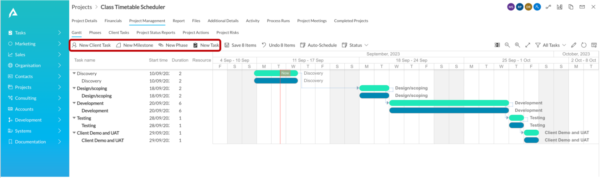
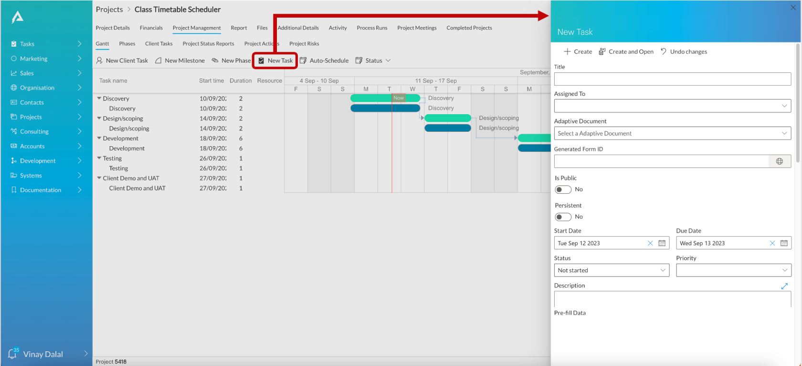
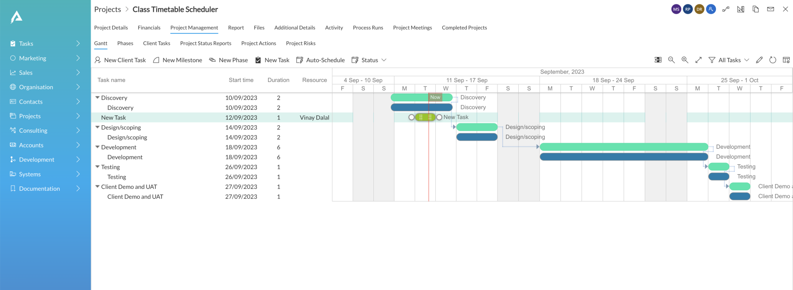
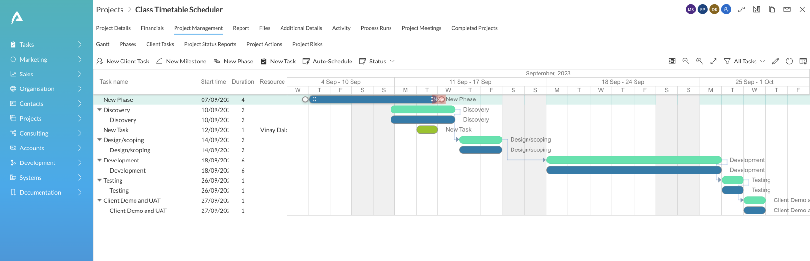

# How to create a new task and sub-types of task from Gantt Chart?

A Gantt chart visually depicts the organisation of tasks across time.

However, while analysing the sequence of tasks, there can be a need to create new tasks or sub-types of tasks (like phases or milestones). This can be easily achieved in Gantt Chart in RAPID Platform.

The above image displays the set of buttons which allows you to create new Tasks and new Sub-types of Tasks from within the Gantt chart.

**New Task** - This a part of the permanent buttons set; always present on the Gantt Chart. When you click on this button, the panel to enter new Task Details will open on the right side of the screen.

As you fill out the required details, and press Create, the new Task will appear on the Gantt Chart. The new Task is sequenced in the list of tasks based on its Start Date.

**New Sub-types of Task** - These are the configured elements on the command bar. Therefore, they are not part of the permanent buttons, rather appear based on the [configuration done in the Designer Page](https://docs.rapidplatform.com/books/experiences/page/how-to-configure-the-page-gantt-chart-component "How to configure the Page - Gantt Chart Component?").

To create a new sub-type of task of your choice, just click on the relevant button. This will open the corresponding panel at the right side of the page. Just like New Task, once you fill in the details and create, the new sub-type of task will appear on the Gantt Chart. Its position in the chart is based on the Start Date.

##### ****

In the above image, a "New Phase" is added with Start Date as 7th September and End Date as 13th September.

##### **Important points about new elements (task / sub-type)**

1. The new element (task / sub-type) will be added to the chart as soon as it is "created" from the right panel. You do not need to Save the chart.
2. The element once added, cannot be deleted from within the Gantt Chart directly.
3. The new element is placed in the sequence of tasks based on its Start Date. 
    - If the new element is under a parent, then the sorting happens based on Start Date of all elements under the subject parent.
    - If the new element does not have a parent, then the sorting happens based on Start Date of all Tasks in the Chart.
4. The fields that appear in the details form (the right panel) for adding a new element are configured in Designer.
5. The duration of the newly created elements respect the working days in the calendar. Therefore, the duration of an element starting on a Friday and ending on subsequent Monday will be shown as 2 days.
6. To add a new Task or Sub-type of Task under a Parent, appropriate Parent needs to be selected while creating the element. (shown in GIF below)

Please refer to the below GIF for illustration.

**Adding a new task from Gantt Chart**

**Adding a new sub-type of task from Gantt Chart  

##### **Related articles**

**[How to view and order tasks based on *Table Views*?](https://docs.rapidplatform.com/books/experiences-oxn/page/how-to-view-and-order-tasks-based-on-table-views-in-a-gantt-chart "How to view and order tasks based on Table views in a Gantt Chart?")**

**[How to open Task Details page from Gantt Chart?](https://docs.rapidplatform.com/books/experiences-oxn/page/how-to-open-task-item-profiles-from-gantt-chart "How to open task item profiles from Gantt Chart?")**

**[How to Auto-schedule tasks in Gantt Chart?](https://docs.rapidplatform.com/books/experiences-oxn/page/how-to-auto-schedule-tasks-in-gantt-chart "How to Auto-schedule tasks in Gantt Chart?")**

**[How to interact with Gantt Chart component in Explorer with data?](https://docs.rapidplatform.com/books/experiences-oxn/page/how-to-interact-with-a-gantt-chart "How to interact with a Gantt Chart?")**