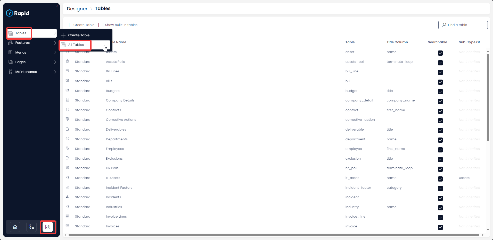

# How to create items for a table from a linked table?

#### Overview

Many business scenario require us to create multiple tables that are linked to each other. For example - Customers table and Purchase Orders table etc.

Rapid Platform provides you with the ability to create an item for a table (say Purchase Order) from within another linked table (say Customers table). Therefore, while creating / viewing a customer data in Customers table, you can directly create a purchase order item from there that is automatically linked to the customer item.

**Illustration**

Imagine you are accounts manager. You are inspecting the list of various invoices received and entering details of payments made against each corresponding invoice.

You have two tables - **Invoices** and **Payments.**

**Objective: You want to a record Payment item from within the Invoice item.**

Follow the steps below for how to add a table in the context of another table:

1. Navigate to Designer &gt; Tables &gt; All Tables  
    
2. Open your desired table. (In this case the desired table is invoices as we want to add Payments to this)  
    
3. Click on the **Design** tab  
    
4. Click on the + button on the tab strip to add a tab for you linked table (In this case we are adding a payments tab to the invoices table)  
    
5. Select the **Table** dropdown and select the table you want nested in this table (In this illustration it is the Payments table)  
    NOTE: After selecting the table this should automatically fill in the Page Name and the Tab name. If not fill in the page name with exact table name and fill in the tab name with what you want to appear on the tab when viewing the item in Explorer  
    
6. Press Save  
    
7. Click ****Launch in Explorer**** 
8. Open an item &gt; Press on the newly created tab &gt; and create a linked item  
    

NOTE: If there is a lookup from the nested table to the table you created the tab, the items will be linked through the lookup. If there is no lookup between the tables a universal link will be created.

Please refer the below video for illustration.

<iframe allowfullscreen="allowfullscreen" frameborder="0" height="420" src="https://www.youtube.com/embed/7H9LDBt9UvI?si=s1RBkFDKkpvwdrKy" title="YouTube video player" width="750"></iframe>

##### **Related articles**

[How to link existing items of two different tables? (Use of Link Inheritance)](https://docs.rapidplatform.com/books/experiences/page/how-to-setup-link-inheritance "How to setup Link Inheritance?")