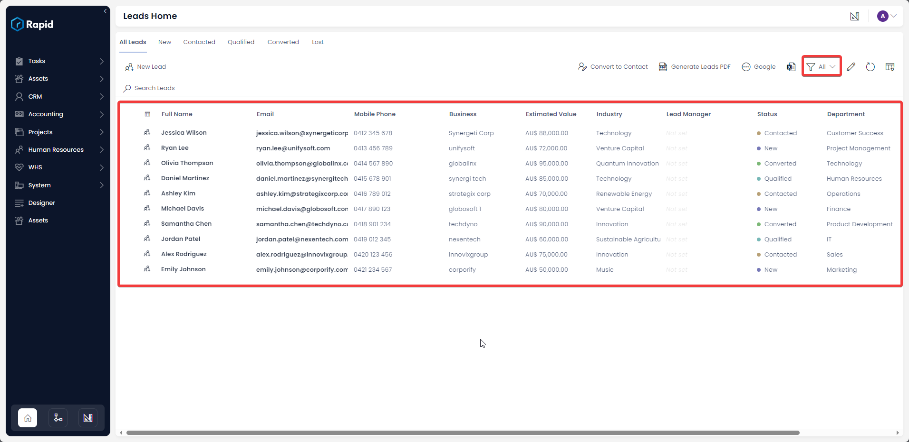
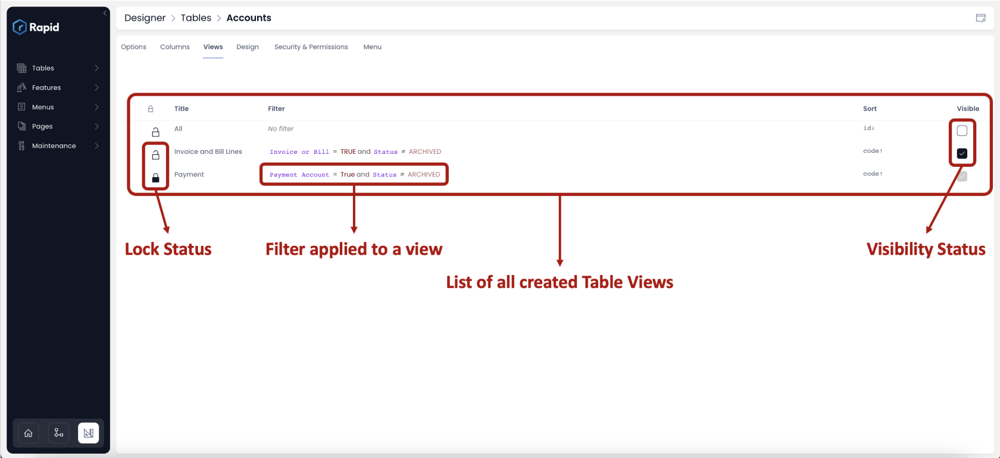

# How to edit / delete table views in Designer?

#### Overview

When viewing a table, by default all of the items will appear on the list. It is possible however to construct **Views** to filter the items as needed. A basic example would be on the hypothetical **Leads** list. If you view it, by default all leads will appear. However, you may only want to view **Leads** that with a status of **New**. As such you can construct a view and call it **New** and when selected the list will only show leads with a status of new. Once constructed views can be used by anyone in the system and are easily accessible through the view selector on that table.

The image below shows the **All** view.

The image below shows the **New** view.

#### Accessing the Views Tab of a table in designer

Every table in your Rapid System has a views tab in its configuration. Here you can manage how users interact with the views on that table. It is possible to lock the view, so that users cannot edit it and make it invisible to users so that they cannot use it.

Follow the steps below the access the views tab for a table:

1. Navigate to Designer &gt; Tables &gt; All Tables  
    
2. Open your desired table. (Find your desired table by using the search bar or scrolling through the list)  
    
3. Click on the Views Tab  
    

#### Overview of the Views Tab

The points and image below provide a breakdown of the User Interface for the Views tab.

- You can view the list of all the Table Views created for the table.
- You can see the filters applied to each Table View.
- Can see if the Table View is locked or not.
- Can see if the Table View is visible in Explorer or not.

#### How to Lock a view for a table so that Users cannot edit it

When a Table View is locked, it is not editable by a user in explorer. You cannot alter the filters or its visibility until it is unlocked. A Table View is said to be locked when the leftmost icon shows a closed lock.

To lock a table view follow the steps below:

1. Navigate to Designer &gt; Tables &gt; All Tables  
    
2. Open your desired table. (Find your desired table by using the search bar or scrolling through the list)  
    
3. Click on the Views Tab  
    
4. Locate the view you want to lock and press the lock icon  
    

#### How to Unlock a view for a table so that Users can edit it

When a Table View is unlocked, it is editable by a user in explorer. You can alter the filters or its visibility

To unlock a table view follow the steps below:

1. Navigate to Designer &gt; Tables &gt; All Tables  
    
2. Open your desired table. (Find your desired table by using the search bar or scrolling through the list)  
    
3. Click on the Views Tab  
    
4. Locate the view you want to lock and press the lock icon  
    

See the Video below for more details

<iframe allowfullscreen="allowfullscreen" frameborder="0" height="420" src="https://www.youtube.com/embed/o7BTqiBEcA4?si=TAtScLyYVriC2eof" title="YouTube video player" width="750"></iframe>

####  

#### Open Table View Configuration Panel

You can open Table View Configuration Panel by double clicking on the view.

Please note -

- If the Table View is in Unlocked State, you can make edits to the Configuration Panel. The edits will be effective upon "Save".
- If the Table View is in Locked State, the Configuration Panel will open but it would not be editable.

Please refer to the below video for illustration

<iframe allowfullscreen="allowfullscreen" frameborder="0" height="420" src="https://www.youtube.com/embed/uEC231-7t0U?si=ZSVHM-1fOgOPv22i" title="YouTube video player" width="750"></iframe>

#### How to make a table view not visible / visible to users in explorer?

Visibility refers to whether the subject Table View is visible in Explorer for application or not. If a Visibility of a Table View is set ON (checked), it means that the subject View will be present in the list of Views in Explorer.

**Please note -** If the view is in a Locked State, then you cannot alter its visibility.

Follow the steps below to make a table view visible / not visible to users in explorer:

1. Navigate to Designer &gt; Tables &gt; All Tables  
    
2. Open your desired table. (Find your desired table by using the search bar or scrolling through the list)  
    
3. Click on the Views Tab  
    
4. Locate the view you want to make visible / not visible and press the toggle button  
    

Please refer to the video below for additional information.

<iframe allowfullscreen="allowfullscreen" frameborder="0" height="420" src="https://www.youtube.com/embed/4YsbofiTa9E?si=zkTgK8xBRapUl6L9" title="YouTube video player" width="750"></iframe>

#### How to delete a table view/s

If a view is no longer in use and you want to remove it from the table you have the ability to delete it. To do so follow the steps below:

1. Navigate to Designer &gt; Tables &gt; All Tables  
    
2. Open your desired table. (Find your desired table by using the search bar or scrolling through the list)  
    
3. Click on the Views Tab  
    
4. Select the view / views you want to delete  
    
5. Select the **Delete x items** button (note if the view is locked you will not be able to delete it. See above for how to unlock a view)  
    

##### **Related articles**

[How to edit / delete a column from a table?](https://docs.rapidplatform.com/books/experiences/page/how-to-edit-delete-a-column-from-a-table "How to edit / delete a column from a table?")

[How to configure Menu from table in Designer?](https://docs.rapidplatform.com/books/experiences/page/how-to-configure-a-menu-button-in-a-command-bar "How to configure a Menu button in a command bar?")

*[**Go back to Tables in Designer Main Page**](https://docs.rapidplatform.com/books/experiences/page/all-about-tables-in-designer "All about Tables in Designer")*