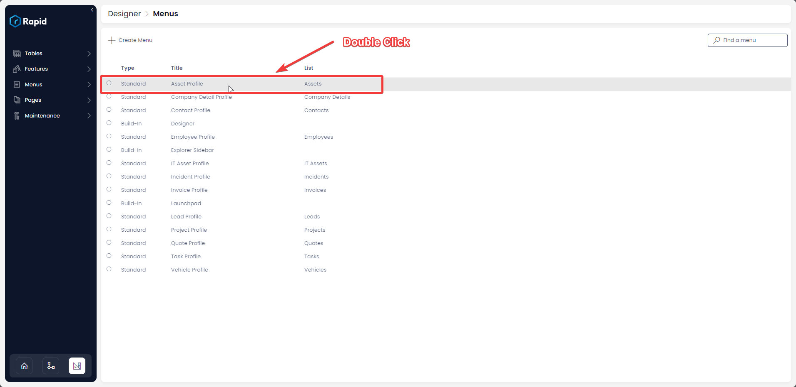
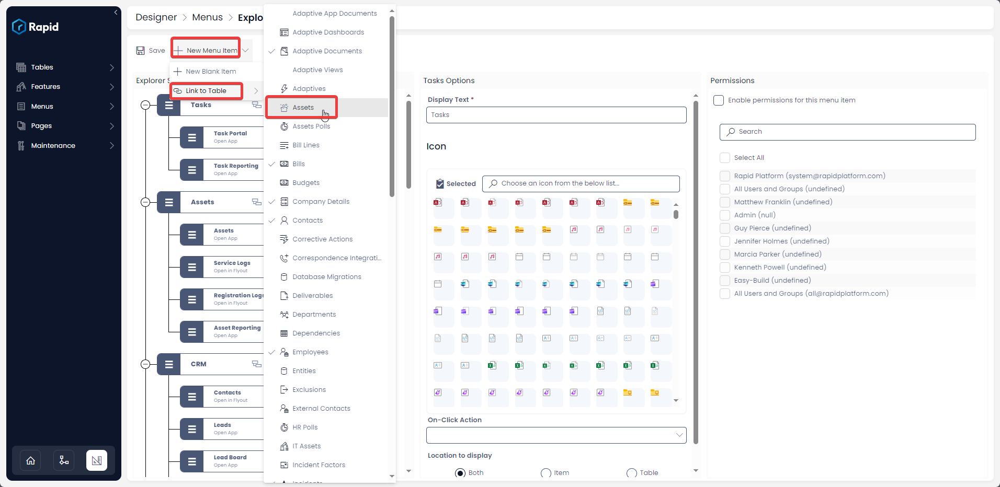
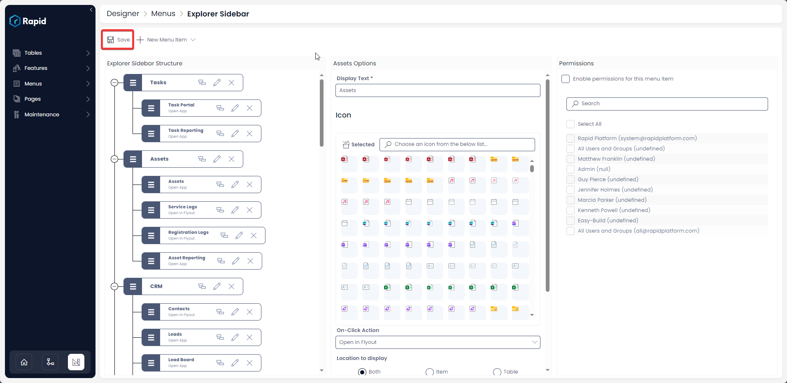

# How to link a menu item to a table?

***This is configurable on both the [Side Bar](https://docs.rapidplatform.com/books/glossary/page/sidebar) and [Command Bar](https://docs.rapidplatform.com/books/glossary/page/command-bar) menu types.***

#### Overview

[***Menu buttons***](https://docs.rapidplatform.com/books/glossary/page/menu "Menu item") can be used for effective navigation.

Imagine you wish to view all the leads in the system or all the invoices at the click of a button. This can be easily configured using the Menu Button.

Such Menu button when clicked will open the defined table in Explorer.

#### Creating a Menu Button Linked to a Table:

To link a menu button to a table:

1. Navigate to Designer &gt; Menus &gt; All Menus  
    
2. Open the menu you wish to add the Menu button to  
    
3. Press New Menu Item &gt; Link to Table &gt; Select the Table you want to the menu button to direct towards  
    
4. Press Save  
    
5. Note that the Assets Table is now visible on the Explorer Sidebar  
    

#### Additional Details

Essentially, setting up a link to table like this configures the menu button with On-Click Action as "***[Open in Flyout](https://docs.rapidplatform.com/books/experiences/page/how-to-open-a-specific-page-in-flyout-with-a-click-of-a-menu-button "How to open a specific page in Flyout with a click of a Menu button?")***" with Page ID as the &lt;table name&gt;.

The [***display text***](https://docs.rapidplatform.com/books/experiences/page/how-to-create-a-new-menu-item-set-display-text-and-icon "How to create a new menu item, set display text and icon?") is by default set as the Table name and [***icon***](https://docs.rapidplatform.com/books/experiences/page/how-to-create-a-new-menu-item-set-display-text-and-icon "How to create a new menu item, set display text and icon?") is set as Table icon.

##### **Related articles**

**[Add a new menu item, display text and icon on a menu button ](https://docs.rapidplatform.com/books/experiences/page/how-to-set-display-text-and-icon-for-a-menu-item "How to set display text and icon for a menu item?")**

**[Various types of On-Click Action](https://docs.rapidplatform.com/books/experiences/page/how-to-set-on-click-action-for-a-menu-item "How to set On-Click Action for a menu item?")**

<svg class="svg-icon" data-icon="link" role="presentation" viewbox="0 0 24 24" xmlns="http://www.w3.org/2000/svg"></svg>
<input id="bkmrk--1" placeholder="url" readonly="readonly" type="text"></input> <button class="button outline icon" data-clipboard-target="#pointer-url" title="Copy Link" type="button"><svg class="svg-icon" data-icon="copy" role="presentation" viewbox="0 0 24 24" xmlns="http://www.w3.org/2000/svg"></svg></button>
<svg class="svg-icon" data-icon="edit" role="presentation" viewbox="0 0 24 24" xmlns="http://www.w3.org/2000/svg"></svg>

*[**Back to Menu main page**](https://docs.rapidplatform.com/books/experiences/page/all-about-menus-in-dezigna "All about Menus in Dezigna")*