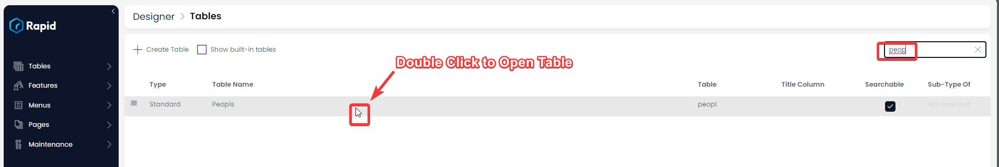
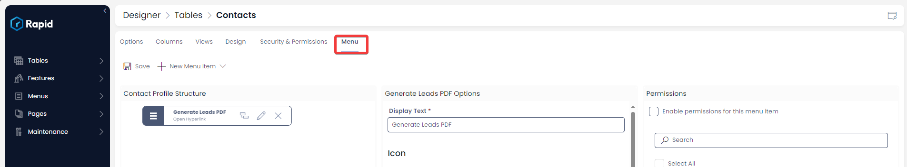
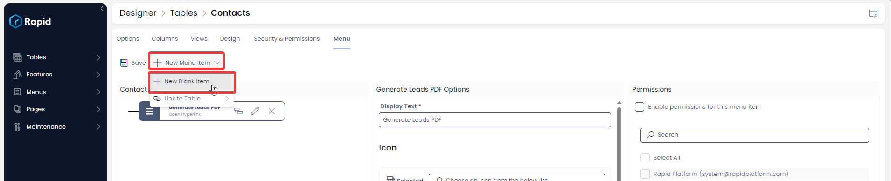
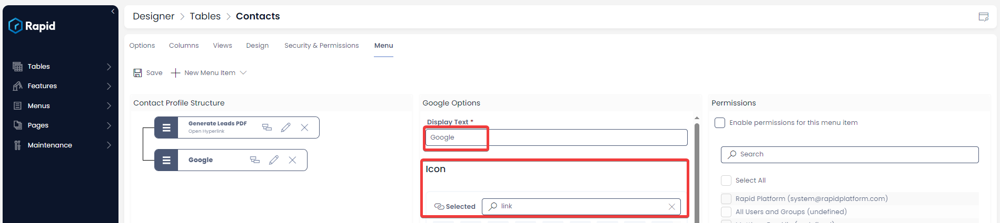
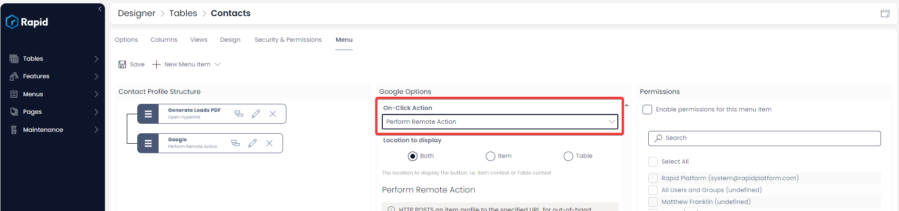
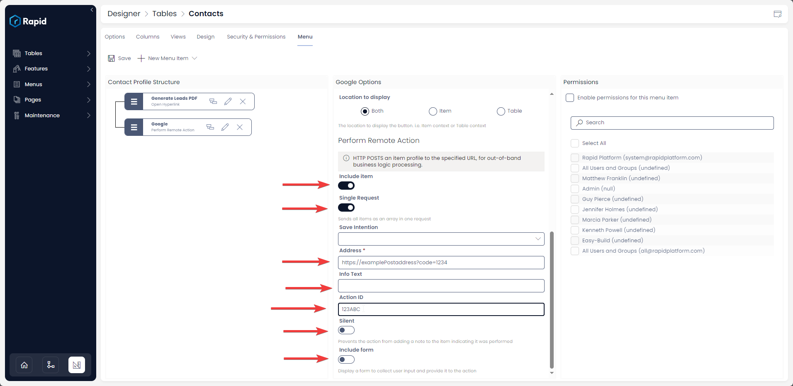
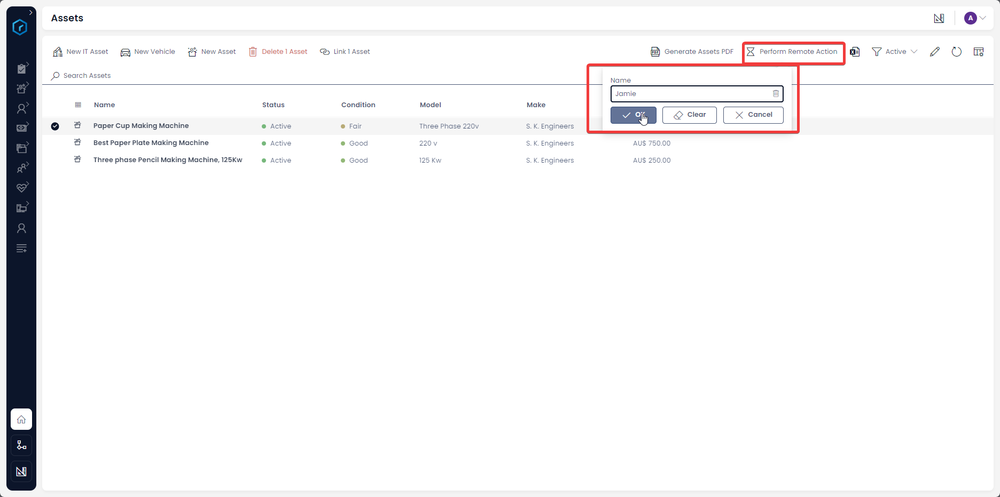

<!-- # How to perform a Remote Action from click of a Menu button?

This is configurable on both the ***[Side Bar](https://docs.rapidplatform.com/books/glossary/page/sidebar)*** and ***[Command Bar](https://docs.rapidplatform.com/books/glossary/page/command-bar)*** menu types.

#### Overview

Rapid Platform nicely blends with Microsoft 365 applications.

There may be a need to trigger Power Automate Flows or some Azure Function apps. Typically, this requires sending input information along with network requests for action.

These external to Rapid actions (like trigger to an external APIs) can be easily performed using **Perform Remote Action** as a On-Click Action for a Menu button.

The Perform Remote Action makes a post request to the specified address.

#### How to configure a menu button to Perform a remote action

1. Navigate to Designer &gt; Tables &gt; All Tables  
    
2. Open your desired table. (Find your desired table by using the search bar or scrolling through the list)  
    
3. Click on Menu  
    
4. Click on the **New Blank Item Drop down** then on **New Blank Item** 
5. Choose a name and Icon  
    
6. Select Perform Remote Action as the On-Click Action  
    
7. Configure the Include Item toggle (Configure to true if you want to include the current item context in the network request)
8. Configure the Single Request toggle (Configure to true, if you have multiple items selected and you want a single network request with these sent as an array of items as opposed to many network requests with one item each)
9. Paste in your post address
10. OPTIONAL Enter info text for reference in Rapid as to what this post request does
11. OPTIONAL Enter an Action ID (This is a hard coded string that can be used for reference in the post address)
12. Configure the "Include Form" toggle (Set this to true if you want to have a drop-down form appear when the menu button is pressed to add in additional information to the request)  
    

#### Remote Action Options Further Details

Please note when configuring on the ***[Side Bar](https://docs.rapidplatform.com/books/glossary/page/sidebar)*** menu the **Include Item**, **Single Request**, **Silent**, **Include Form**, and **Select Forms** options although visible will not do anything in this context but are used in ***[Command Bar](https://docs.rapidplatform.com/books/glossary/page/command-bar)*** menu type.

As we can observe, the following fields are prompted by the system upon selection of Perform Remote Action as On-Click Action.

- **Include item -** This is a toggle field. A toggle ON would mean the current item context is included in the network request.
- **Single Request -** This is a toggle field. By default if multiple items are selected on a list view and the "Perform Remote Action" menu button is clicked it will send on request per item. If this is toggled ON it will send one request containing all the items as an array.
- **Save Intention** - This is a choice field. This will only take effect for a menu buttons triggered off an item page. The purpose of this is that Users may change the fields of the item they are on and then press the menu button to perform a remote action, expecting their changes on the item to be sent. If they have not saved the item, the most recent changes will not be sent. As such flexibility it given to the keyper where they can designate the Save Intention when the menu button is pressed. These options are: 
    - Save on Action - When the menu button is pressed, the item will be saved then the request sent.
    - Prompt for Save - A prompt will appear asking the user to save or discard changes. Following their selection, the request will be sent.
    - Do not save - The request will be sent regardless of whether the user has saved or not saved the most recent changes on the item.
    - For more information see - [What is the Save Intention Option in a Menu Setup?](https://docs.rapidplatform.com/books/experiences/page/what-is-save-intention-option-in-a-menu-setup)
- **Address -** This is a mandatory field. It allows you to set the URL address of the network request. For instance, if you wish to request a Power Automate Flow, pass the appropriate Flow URL here.
- **Info text -** This optional field allows you to set the Metadata or additional Information Text about the action.
- **Action ID -** This optional field is useful when you wish to send an Action ID along with the network request to the remote end when the action is performed. This is a hardcoded string.
- **Silent -** This toggle field when in OFF state, prevents the action from adding a note to the item indicating it was performed. In other words, this field allows you to define if the action behaves in silent mode.
- **Include form -** Sometimes there is a need for a form to collect user input and provide it to the action. The inputs needs to accompany the network request. In such a case, you can toggle this field to ON state. As it goes to ON state, a new field will appear below it.
- **Select form -** This field is enabled only if the "Include form" field is toggled ON. This is a dropdown field and allows you to select the relevant Adaptive Form from a list of all existing forms created in RAPID's Adaptive Designer. You can select the relevant form by clicking on the form title. 
    - Note: The form must only be configured to fields that the menu button is on. Submission of the form will NOT create a new item but include the form data in the network request. See the image below showing what a menu button looks like when a form is included. 

#### Post Body:

The body of the post request will change based on the configuration of the menu button.

##### Minimum Configuration:

A "Perform Remote Action" Menu button with the minimum configuration where only the address is filled will send the following post body

```JSON
{<br></br>  "site": "example",<br></br>  "tenant": "rapidplatform",<br></br>  "environment": "production",<br></br>  "requestor": 13,<br></br>  "item": {},<br></br>  "formData": {}<br></br>}
```

##### Action ID Configuration:

A "Perform Remote Action" Menu button with the Action ID Configured will return the following body:

```JSON
{<br></br>  "site": "tristantesting",<br></br>  "tenant": "rapidplatform",<br></br>  "environment": "production",<br></br>  "requestor": 13,<br></br>  "actionId": "123abc",<br></br>  "item": {},<br></br>  "formData": {}<br></br>}
```

<div id="bkmrk-%7B-%C2%A0-%22site%22%3A-%22tristan"><div>Include Item ON and Send as Single Request OFF:  
</div></div>As seen the item key returns an object with the selected item. If more than one item was selected from the list view, it will send one network request per item.

<div id="bkmrk--0"><div><div>````</div></div></div>```JSON
{<br></br>  "site": "home",<br></br>  "tenant": "stationaryinc",<br></br>  "environment": "test",<br></br>  "requestor": 4,<br></br>  "item": {<br></br>    "id": 3,<br></br>    "Attachments": [],<br></br>    "Dependencies": [],<br></br>    "LinkedItemsToAdd": [],<br></br>    "ScopedLinkedItemsToAdd": [],<br></br>    "author": "Admin",<br></br>    "author_id": 4,<br></br>    "created": "2023-11-21T02:04:42.176Z",<br></br>    "editor": "Admin",<br></br>    "editor_id": 4,<br></br>    "modified": "2023-12-07T01:19:53.213Z",<br></br>    "parent_id": null,<br></br>    "drive_id": null,<br></br>    "folder_id": null,<br></br>    "rank": null,<br></br>    "embedded_files": [],<br></br>    "sys_external_id": null,<br></br>    "purchased_new": true,<br></br>    "status": "Active",<br></br>    "name": "Paper Cup Making Machine ",<br></br>    "value": 650,<br></br>    "condition": "Fair",<br></br>    "asset_name": null,<br></br>    "manufactured_date": "2005-06-15T14:00:00.000Z",<br></br>    "make": "S. K. Engineers",<br></br>    "_model": "Three Phase 220v",<br></br>    "registration_number": null,<br></br>    "pseudo_email": null,<br></br>    "purchase_price": 650,<br></br>    "seller_link": "https://www.skengineer.org/wax-coated-paper-cup-and-glass-making-machine.html#paper-glass-or-cup-making-machine",<br></br>    "Permissions": [<br></br>      {<br></br>        "principal_id": 2,<br></br>        "mode_flags": 7,<br></br>        "type": "SecurityGroup"<br></br>      },<br></br>      {<br></br>        "principal_id": 4,<br></br>        "mode_flags": 7,<br></br>        "type": "User"<br></br>      }<br></br>    ],<br></br>    "__metadata": {<br></br>      "type": "Assets"<br></br>    }<br></br>  },<br></br>  "formData": {}<br></br>}
```

##### Include Item ON and Send as Single Request ON:

As seen the item key returns an array with the item profiles of the selected items.

```JSON
{<br></br>  "site": "home",<br></br>  "tenant": "stationaryinc",<br></br>  "environment": "test",<br></br>  "requestor": 4,<br></br>  "item": [<br></br>    {<br></br>      "id": 3,<br></br>      "Attachments": [],<br></br>      "Dependencies": [],<br></br>      "LinkedItemsToAdd": [],<br></br>      "ScopedLinkedItemsToAdd": [],<br></br>      "author": "Admin",<br></br>      "author_id": 4,<br></br>      "created": "2023-11-21T02:04:42.176Z",<br></br>      "editor": "Admin",<br></br>      "editor_id": 4,<br></br>      "modified": "2023-12-07T01:19:53.213Z",<br></br>      "parent_id": null,<br></br>      "drive_id": null,<br></br>      "folder_id": null,<br></br>      "rank": null,<br></br>      "embedded_files": [],<br></br>      "sys_external_id": null,<br></br>      "purchased_new": true,<br></br>      "status": "Active",<br></br>      "name": "Paper Cup Making Machine ",<br></br>      "value": 650,<br></br>      "condition": "Fair",<br></br>      "asset_name": null,<br></br>      "manufactured_date": "2005-06-15T14:00:00.000Z",<br></br>      "make": "S. K. Engineers",<br></br>      "_model": "Three Phase 220v",<br></br>      "registration_number": null,<br></br>      "pseudo_email": null,<br></br>      "purchase_price": 650,<br></br>      "seller_link": "https://www.skengineer.org/wax-coated-paper-cup-and-glass-making-machine.html#paper-glass-or-cup-making-machine",<br></br>      "Permissions": [<br></br>        {<br></br>          "principal_id": 2,<br></br>          "mode_flags": 7,<br></br>          "type": "SecurityGroup"<br></br>        },<br></br>        {<br></br>          "principal_id": 4,<br></br>          "mode_flags": 7,<br></br>          "type": "User"<br></br>        }<br></br>      ],<br></br>      "__metadata": {<br></br>        "type": "Assets"<br></br>      }<br></br>    },<br></br>    {<br></br>      "id": 2,<br></br>      "Attachments": [],<br></br>      "Dependencies": [],<br></br>      "LinkedItemsToAdd": [],<br></br>      "ScopedLinkedItemsToAdd": [],<br></br>      "author": "Admin",<br></br>      "author_id": 4,<br></br>      "created": "2023-11-21T02:02:37.938Z",<br></br>      "editor": "Admin",<br></br>      "editor_id": 4,<br></br>      "modified": "2023-12-07T01:19:53.473Z",<br></br>      "parent_id": null,<br></br>      "drive_id": null,<br></br>      "folder_id": null,<br></br>      "rank": null,<br></br>      "embedded_files": [],<br></br>      "sys_external_id": null,<br></br>      "purchased_new": true,<br></br>      "status": "Active",<br></br>      "name": "Best Paper Plate Making Machine",<br></br>      "value": 750,<br></br>      "condition": "Good",<br></br>      "asset_name": null,<br></br>      "manufactured_date": "2016-08-17T14:00:00.000Z",<br></br>      "make": "S. K. Engineers",<br></br>      "_model": "220 v",<br></br>      "registration_number": null,<br></br>      "next_service_date": "2023-11-29T14:00:00.000Z",<br></br>      "pseudo_email": null,<br></br>      "purchase_price": 940,<br></br>      "seller_link": "https://www.skengineer.org/dies-silver-dona-plate-making-machine-immediately-selling-24x7-08081308899.html#best-paper-plate-making-machine",<br></br>      "__metadata": {<br></br>        "type": "Assets"<br></br>      }<br></br>    }<br></br>  ],<br></br>  "formData": {}<br></br>}
```

<div id="bkmrk--1"></div>##### Include Form ON:

As seen the formDate key returns an object with the form information entered.

```JSON
{<br></br>  "site": "home",<br></br>  "tenant": "stationaryinc",<br></br>  "environment": "test",<br></br>  "requestor": 4,<br></br>  "item": {},<br></br>  "formData": {<br></br>    "name": "Jamie"<br></br>  }<br></br>}
```

<div id="bkmrk--2"></div><div id="bkmrk--3"></div><div id="bkmrk--4"></div><div id="bkmrk--5"></div><div id="bkmrk--6"></div>[Go back to ***On-Click Actions*** learning resource](https://docs.rapidplatform.com/books/experiences/page/how-to-set-on-click-action-for-a-menu-item "How to set On-Click Action for a menu item?") -->