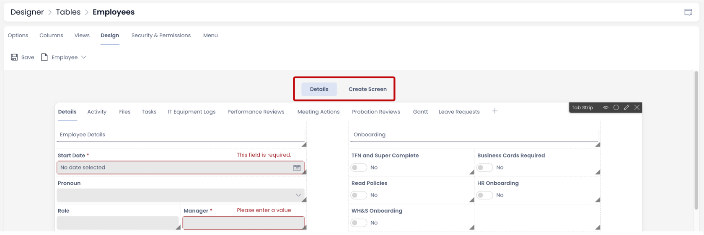
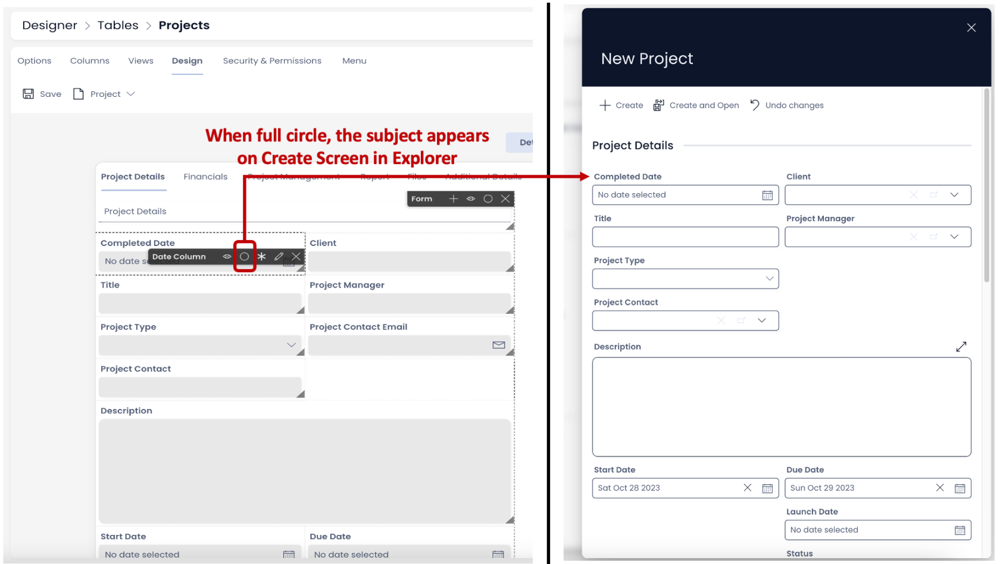
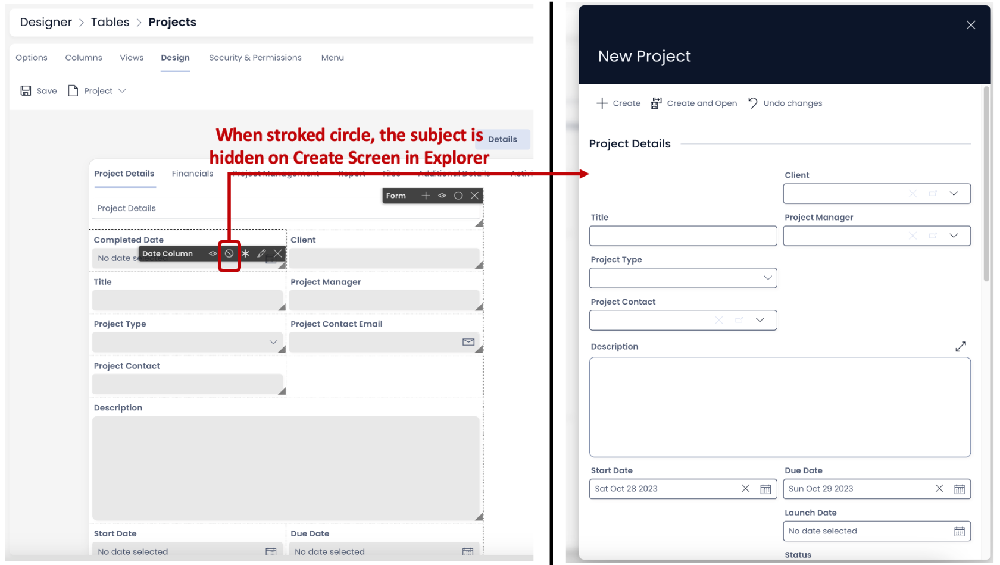
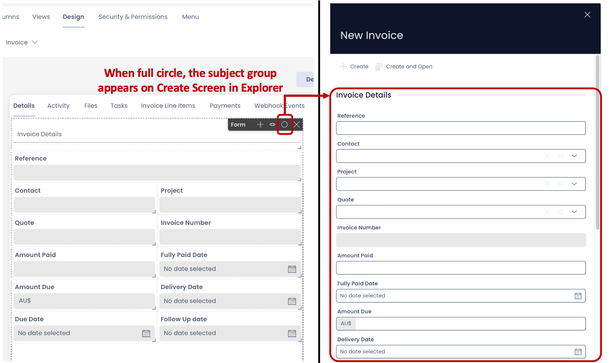
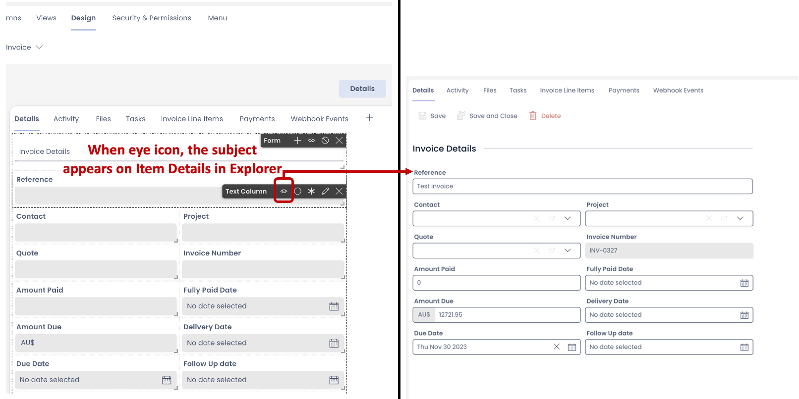
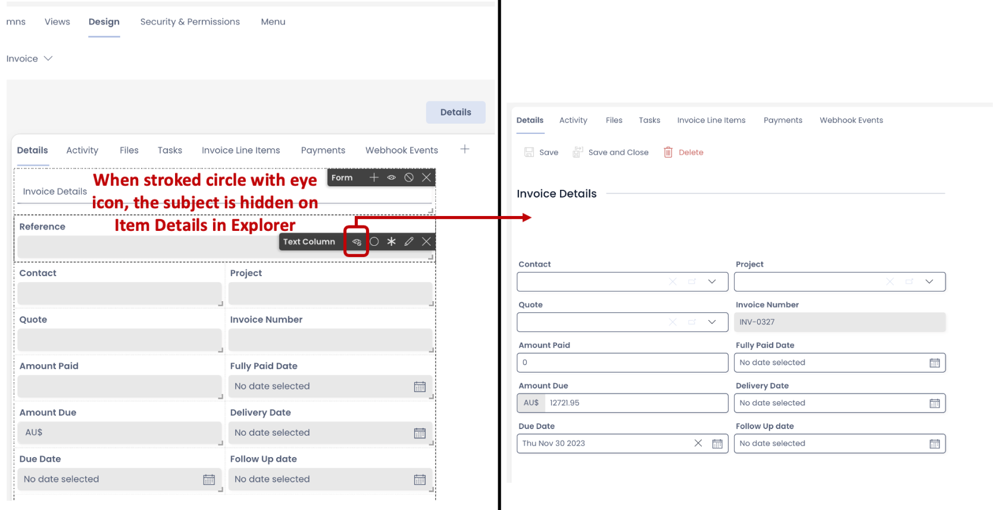

# How to set a component to be visible / hidden on "Item Details" and "Create" breakpoints?

This article has reference to the "Details" and "Create Screen" breakpoints as visible on the Design Tab of a Table in Designer.

##### **The Premise - Details and Create Screen are always in sync**

It is important to note that the "Details" and "Create Screen" are always in sync. This means whatever is configured to be displayed in "Details" is automatically reflected in corresponding "Create Screen" and vice versa.

<iframe allowfullscreen="allowfullscreen" frameborder="0" height="420" src="https://www.youtube.com/embed/XaRxlbbaxPc?si=MIWXhhv7DdYLgtmJ" title="YouTube video player" width="750"></iframe>

Case: Add a component to Details and corresponding Create Screen will have it automatically.

<iframe allowfullscreen="allowfullscreen" frameborder="0" height="420" src="https://www.youtube.com/embed/Tmb0RcMNpYo?si=Jm0OoTvjw0AHI5kS" title="YouTube video player" width="750"></iframe>

Case: Add a component to Create Screen and corresponding Details breakpoint will have it automatically.

<iframe allowfullscreen="allowfullscreen" frameborder="0" height="420" src="https://www.youtube.com/embed/py_wjm6syIs?si=ES6QBZS79Ts7E9Hc" title="YouTube video player" width="750"></iframe>

##### **Need to Hide a component from a breakpoint**

While the components on "Details" and "Create Screen" breakpoints are always in sync, the information presented is for different purposes.

The "Details" breakpoint defines how information will be presented for individual items and collection of items. While "Create Screen" breakpoint provides the form that can be filled up with information to create a new item.

Hence, there may be a need for a user to hide something from "Details" breakpoint which shows up on "Create Screen" or vice versa.

##### **Hide field / component from Create Screen breakpoint**

**Scenario -** Imagine you have a Projects Table. Here the information about each project is stored. Here an Item Details should show "Project Completion Date". However, this may not be a piece of information that can be filled at the time of creation of the Project Item.

Therefore, you would want to have this displayed on "Details" breakpoint but hide it from "Create Screen" breakpoint.

You can hide any **[field](https://docs.rapidplatform.com/books/experiences/page/what-is-a-form-component-on-a-layout-page "What is a Form Component on a Layout / Page?")**, **[component or layout](https://docs.rapidplatform.com/books/glossary/page/page-layout-and-component "Page, layout and component")** from Create Screen by using the circle icon in the horizontal options bar. This is highlighted below:

- When the circle appears full, this means the subject is visible on the "Create Screen" breakpoint. 
- When the circle appears with a diagonal strike, this means the subject is hidden from the "Create Screen" breakpoint.

##### **Hiding a group of components / fields from Create Screen breakpoint**

Just like hiding a single component or field from the "Create Screen", you can also hide a group of fields (present in a **[Form component](https://docs.rapidplatform.com/books/experiences/page/what-is-a-form-component-on-a-layout-page "What is a Form Component on a Layout / Page?")**) or a group of components (present in a **[Layout](https://docs.rapidplatform.com/books/experiences/page/what-are-the-available-layouts-for-pages "What are the available layouts for Pages?")**)

Imagine you are displaying the invoice information for a client on the "Details" breakpoint. This contains information like Invoice Number, Project Name, Contact, Quote Number etc. All such information regarding the invoice details are organised under a Form component on a Grid Layout.

If you want all of the above information in the Form component to be hidden from the "Create Screen" breakpoint, just toggle the circle icon on the Form component. You need not individually hide each field from the Page. All the fields in the Form Component will be hidden as the Form is set hidden from "Create Screen" breakpoint.

](./downloaded_image_1705285712020.png)

Similarly you can hide / show a layout. All the components in the layout will be hidden or shown with a single click on circle.

|        |All components in Grid Layout will be hidden from the "Create Screen" breakpoint|
|:----|:----|
|        |All components in Grid Layout will appear in the "Create Screen" breakpoint (if they are not set as hidden        individually)|

##### **Hide field / component from Details breakpoint**

**Scenario -** Imagine you have a Contacts table. It stores employee contact details. Now you would want each employee to provide his / her details to the system but may not want to display all information in details (like Personal phone number). However, it is still an important piece of information and needs to be recorded in the database.

In such cases, you would want a certain fields / components to be present at the time of Item Creation (Create Screen breakpoint) but be hidden from the Details breakpoint.

You can hide any **[field](https://docs.rapidplatform.com/books/experiences/page/what-is-a-form-component-on-a-layout-page "What is a Form Component on a Layout / Page?")**, **[component or layout](https://docs.rapidplatform.com/books/glossary/page/page-layout-and-component "Page, layout and component")** from Details breakpoint by using the eye icon in the horizontal options bar. This is highlighted below:

- When only the eye icon appears, this means the subject is visible on the "Details" breakpoint.  
    
- When the eye icon appears with a small stroked circle at the bottom right, this means the subject is hidden from the "Details" breakpoint.  
    

##### **Hiding a group of components / fields from Details breakpoint**

Just like hiding a single component or field from the "Details", you can also hide a group of fields (present in a **[Form component](https://docs.rapidplatform.com/books/experiences/page/what-is-a-form-component-on-a-layout-page "What is a Form Component on a Layout / Page?")**) or a group of components (present in a **[Layout](https://docs.rapidplatform.com/books/experiences/page/what-are-the-available-layouts-for-pages "What are the available layouts for Pages?")**) from "Details".

|        |All fields in Form component will be hidden from the "Details" breakpoint|
|:----|:----|
|        |All fields will appear in the "Details" breakpoint (if they are not set as hidden individually)|
|        |All components in Grid Layout will be hidden from the "Details" breakpoint|
|        |All components in Grid Layout will appear in the "Details" breakpoint (if they are not set as hidden        individually)|

##### **Important points**

- A field, component or layout can be hidden from both "Details" and "Create Screen" breakpoints simultaneously.
- The field, component or layout when hidden will be shown as blank space on the Page. You may want to arrange the other field(s), component(s) or layout(s) on the relevant breakpoint. For instance, if you have arranged the components on Details breakpoint a certain way. Now if you hide some components from Create Screen, then you would need to go to Create Screen breakpoint and [**drag / arrange components there.**](https://docs.rapidplatform.com/books/experiences/page/how-to-arrange-a-component-on-grid-layout "How to arrange a component on Grid layout?")

##### **Related articles**

[How to configure Item Details and Item Creation?](https://docs.rapidplatform.com/books/experiences/page/how-to-configure-item-details-and-item-creation "How to configure Item Details and Item Creation?")

[How to add a component to a Layout / Page?](https://docs.rapidplatform.com/books/experiences/page/how-to-add-a-component-to-a-page "How to add a component to a Page?")

[What are the available components for Pages?](https://docs.rapidplatform.com/books/experiences/page/what-are-the-available-components-for-pages "What are the available components for Pages?")

[***Go back to Pages Main Resource***](https://docs.rapidplatform.com/books/experiences/page/all-about-pages-in-designer "All about Pages in Designer")