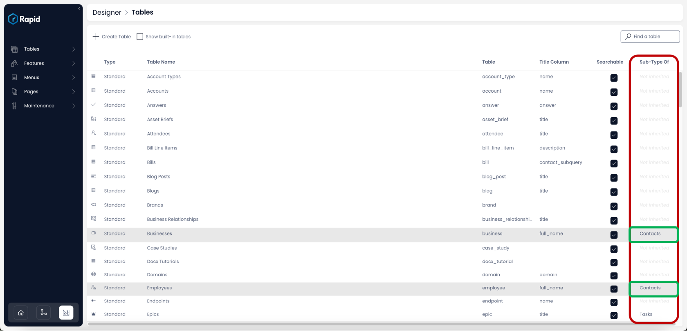
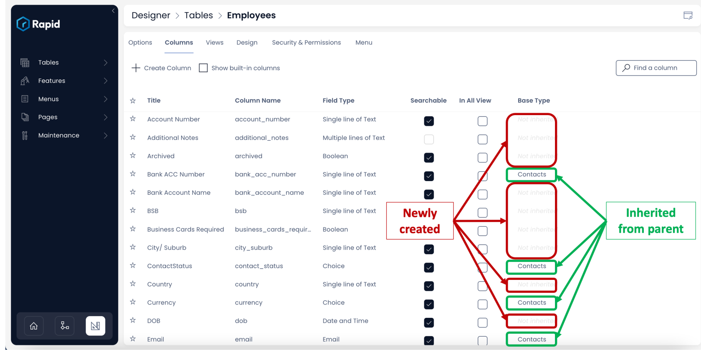

# Inherit Table / Sub-Type Of

##### **Case Scenario**

While conducting routine business operations, you need to collect and store contact information about various stakeholders - for instance - contact information of customers, employees, suppliers etc.

The nature of information stored for each category differs slightly, however, there are certain fields which are common. For example - you would want to store - Name, Contact Address, Email, Contact Number, Bank Account details etc. for employees as well as businesses. So we conclude that each type of stakeholder information will have a mix of - common fields (Name, contact number, Email etc.) and unique fields (Employee Id, ABN number etc. )

A brute-force approach would be to create separate tables (one each for businesses, employees etc.) from scratch. This would involve extra effort in creating columns that are common.

In Rapid Platform, you are not required to create the tables from scratch for each type of stakeholder.

##### Option 1 - Create a Lookup

The first option, which any relational database user will intuitively suggest, is use of lookups. This approach involves creating one table with common fields and then create another table with unique fields. Linking these tables using Lookup will allow you organise, store and fetch data.

However, imagine a large organisation, storing hundreds of transactions in a day. The volume of data in the table with common fields would bulky. This is because, the common table would be storing contact data for all the stakeholders (businesses, employees, suppliers etc.)

Further, and more importantly, any change made to the common fields will reflect into all the connected tables. For example - you wish to rename a field as Bank Account number as Employee Bank Details. You will have to compromise on such a change as it will make this field irrelevant for Businesses.

##### Option 2 - Inherit / Sub-Type Of

The other option possible in Rapid Platform, is to create a table with common fields. Let us call this Contacts.

Then create another table called Businesses, which inherits all the common fields from Contacts. Similarly, create another table called Employees, which also inherits all common fields from Contacts.

Inherit all fields means - the table structure of Businesses will copy all the fields as defined in Contacts. You can then easily modify the business column list and add / delete / modify business specific columns to it.

The creation effort for common fields is saved, but it still creates a separate, independent table.

In this relationship

- Contacts table - **Parent**
- Businesses, Employees etc. tables - **Sub-Type Of Contacts**

It is easy to identify which table is a Sub-Type of which other table in Designer. The last column displays the Sub-Type of values. If the table is not a sub-type of any other table, then it displays "Not inherited", otherwise it displays the name of the parent table.

For a particular table, we can easily identify which columns have been inherited from parent and which have been created afterwards. In the columns tab for a table in Designer, you can observe the last column ***Base Type.*** For the columns inherited from parent, this column provides the name of the column. For newly created columns, this field will display "*Not inherited*".

##### **Related article**

[How to create a new table in Rapid Platform?](https://docs.rapidplatform.com/books/experiences/page/how-to-create-a-new-data-table-in-designer "How to create a new data table in Designer?")

[How to view / update table options of an existing table in Designer?](https://docs.rapidplatform.com/books/experiences/page/how-to-view-update-table-options-of-an-existing-table-in-designer "How to view / update table options of an existing table in Designer?")