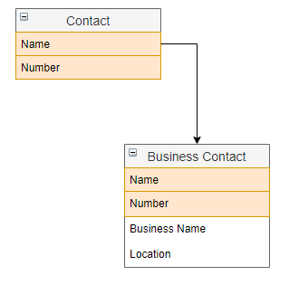
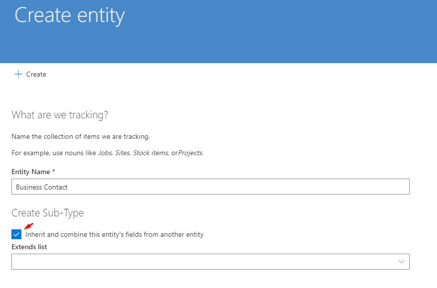
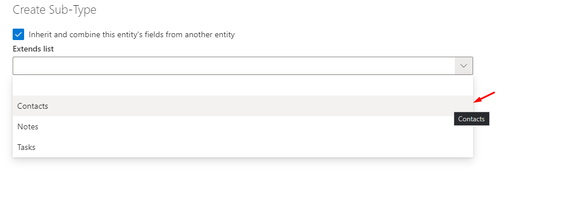
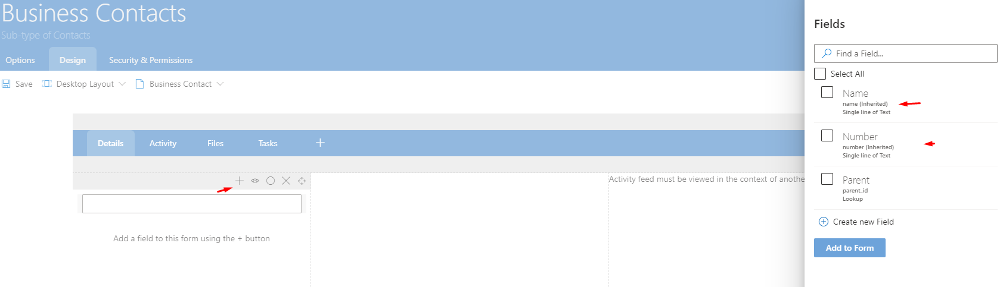

# Inherited Tables

A great way to perceive an *Inherited Table* is that it extends the data table of a *Base Table*. What this means is that any field which is present on the base table, will also be present and shared on the inherited entities. However fields created on the inherited table will not be present on the base table.

## Creating an Inherited Table

There are two ways to create an inherited table in *RAPID Designer*. The first is through the [*Options Tab*](https://docs.rapidplatform.com/Options%20Tab.md) and the second is manually by pressing **Create Table** in the *Navigation Menu*. The difference between these two methods, is that the inheritance options will be prefilled correctly if done through the *Options* tab of another base table.

During table creation, be sure to enable *Inherit and combine this table's fields*. This will enable the drop-down to *Extend List*.

After Selecting the table to extend, press **Create** to initiate the table creation process. Once the table is created, it is possible to confirm that it is a *sub-type* by observing the *Naming Convention* section in the *Options Tab*. It is also listed under the name of the table in the Jumbotron.

To observe the inherited fields, navigate to the *Design* tab and press **Add Field**. This will display the fields which the table inherited from the base table.

Inherited fields can be easy to spot as (inherited) is written next to the field type.

**Note:** Any fields created on an inherited table are not shared with any other table, only fields created on a base table are shared with EVERY inherited table of that particular base table.