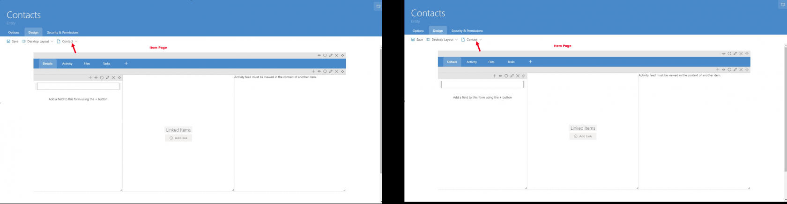

# List and Item Pages

When an entity is created, it is made with two pages. The list page and the form page. Both of these pages serve different purposes but are both vital for the correct functionality of Rapid.

## List Page

The list page, by default is where the data table resides. Upon opening an entity in Explorer and viewing the data table, you will be viewing this page. By default the list page will only contain the data table for the created entity. It is recommended to keep this data table on the page, however for more complex problems there is a wide array of page components which can be added or even replace the data table.

## Item Page

Looking at a data table, it can be tedious and even difficult to view a particular row or field. It is also difficult to make edits to data if it is in a table view. This is the basis for having the form page. The item page is usually opened from a list page context, doing so will display all of that item's fields in a very easy to read and editable experience. In order to add fields to an entity, it is necessary to first open the item page in Designer.

*Screen captures of List and Item Pages in Designer*