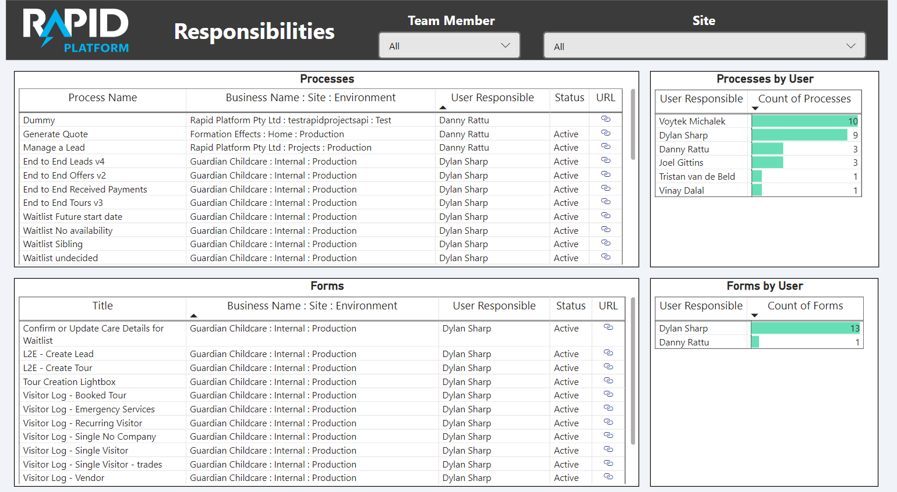
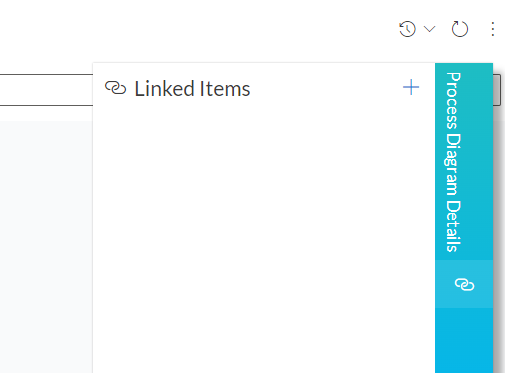
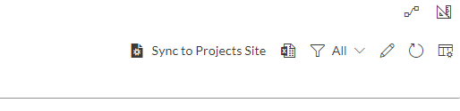

# Managing external responsibilities

## External Documents

Two lists of important external documents that rapid consultants need to manage can be found in the RapidPlatform / Projects site:

[Processes](https://app.rapidplatform.com/rapidplatform/projects/explorer/Processes)

[Documents](https://app.rapidplatform.com/rapidplatform/projects/explorer/External%20Documents)

These items are surfaced on a report called 'Responsibilities' which can be found in the rapid/projects reports page:

https://reports.rapidplatform.com/\_prod/rapidplatform/projects/pbireports/pbireport:2648bb7c-1ece-43e9-aa02-1bf23665c8be



The purpose of these list items is to provide a consultant with a list of items that require testing when new releases come out.

### Setting up External Connections

If the target site does not have a 'managed items' list, or does not have the RAPID API setup, go to the next section for setup instructions.

If the target site already has a 'managed items' list and the RAPID API integrated, follow these steps to make a new managed item.

1\) First, ensure you have a managed item user. Go to the table called 'Managed Items', check if your name and user ID are on the list. if not, make a new managed item, Give it your full name and **your principal id from the PROJECTS site.**

2\) Go to either the 'Process Diagrams' or 'Adaptive Documents' table, For every item you need to maintain, open the item and open its 'linked items' tab on the right of the screen.



 -Add a new link

 -Select 'managed items' in the table selection on the right, find and select your user on the left.

 -Select your user name to link the item to your managed items.

Alternatively, on a tables data view, multiselect all items you wish to link and press 'link x items' at the top of the screen.

Watched items will be auto synced once per day. Alternatively, to sync your watched items back to the rapid Projects site imediately, go to the 'Managed Items' list, and press the 'Sync to Projects Site' button in the top right.



### Setting Up a Syncer On a New Tenant / Site

In order for items to be synced back to rapid projects, you must have the Rapid-Integrations API Conscented to by the client, as well as have the Rapid-Integrations API user in the principals table on the clients site:

If none of this has been done before, follow these steps:

-First share the link below with your client to consent to the application.

https://login.microsoftonline.com/common/adminconsent?client\_id=fb8147ed-7455-4f88-8ee2-04225009475d&amp;redirect\_uri=https://www.rapidplatform.com.au

-Once the application has been consented to by the client, get the clients oid from the application from [https://portal.azure.com/](https://portal.azure.com/)

-Go to Azure Active Directory &gt; Enterprise Application &gt; Rapid-Integrations and then copy the oid.

-Replace the client oid below with the oid obtained in the previous step.

```SQL
INSERT INTO principal (display_name, type, oid, status)VALUES ('Rapid-Integrations', 'Application', '{clients oid}', 'Active')
```

-Send this to Mitch for him to insert into the principals table.

fin