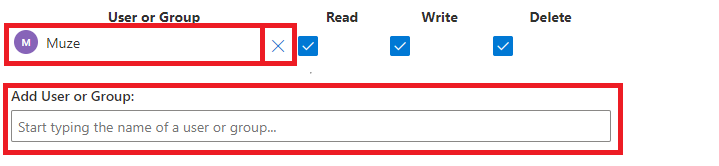

# Permissions

Permissions allows users to alter the consent and authorisation as well as altering the way that users interact with an item or entity. Users may also wish to alter *who* can read, write or delete items within the entity.

## Altering Users and Groups

Users may also alter the users and groups, along with their permissions, that can have access to items within an entity.

To alter users and groups that have access to items within an entity:

1. In the [Designer Experience](https://docs.rapidplatform.com/Home/User-Documentation/Designer), select the entity that you wish to alter permissions on.
2. Select the **Security &amp; Permissions** tab.

1. Users can utilise the search box to add other users or groups.
2. Users can also have the option to remove users and groups from the security and permissions of an item. This is done by clicking **X** next to the user or group users wish to remove.

## Different Types of Permissions

There are three distinct types of permissions, each having their own functionality. These three permissions are as below:

##### 'Read' Permissions

The 'Read' permission determines whether or not a user or users can view items or an item.

##### 'Write' Permissions

The 'Write' permission determines whether or not a user or users can edit an existing item.

##### 'Delete' Permissions

The 'Delete' permissions determines whether or not a user or users can delete an existing item. Checking the **Delete** permission allows users to delete

### Changing Entity-Level Permissions

Changing the Entity-Level permissions alters the permissions that are inherited by future items that are created. This means that items that are already created prior to the changing of entity-level permissions will **not** inherit the new security permissions and must be changed individually if the newly set permissions were to be placed on previously created items.

To change the Entity-level permissions:

1. In the [Designer Experience](https://docs.rapidplatform.com/Home/User-Documentation/Designer), select the entity that you wish to alter permissions on.
2. Select the **Security &amp; Permissions** tab.

1. Users can toggle the relevant permissions that will be applied to future items.