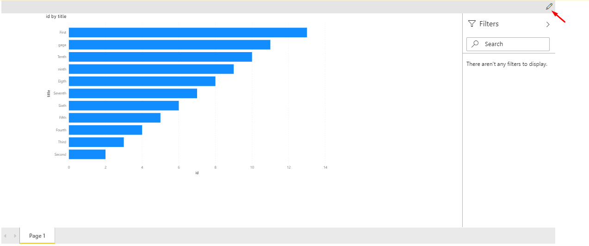
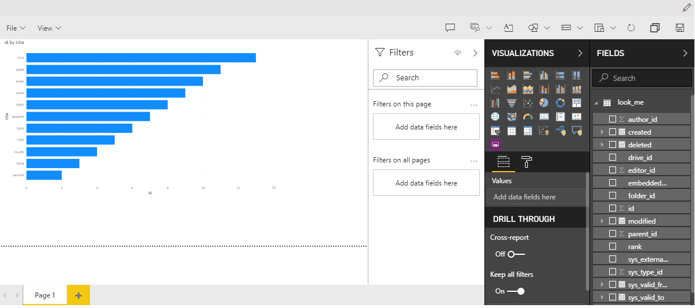
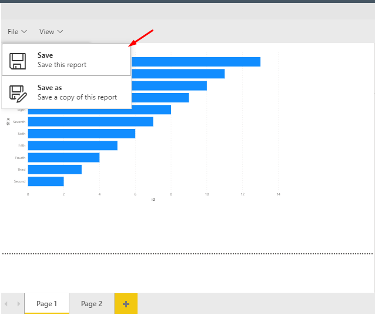
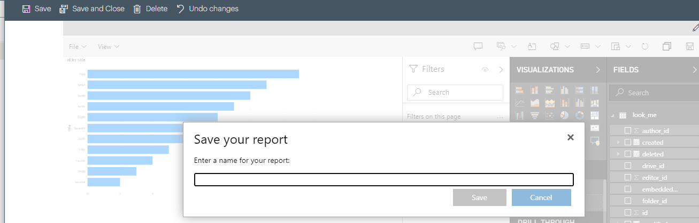

# PowerBI Report

## Editing a PowerBI Report

If editing is enabled, there will be an **Edit** button in the top right of the PowerBI Component. This will enable edit mode which will allow you to edit and save the report. Being in *Edit* mode gives you full control over the visualisations of the report. The only thing which is not possible, is the changing of the data source for the report.

### Saving an Edited Report

To save a report just hit the *File* dropdown and hit *Save*. This will ensure that any changes made to the report are saved. 

To save a copy of the report, press *Save as*. This will create a copy of the report as of the time of the save and store it in the current workspace under the inputted name

