# Probation Review Process

### Overview

The Rapid Core Human Resources module comes with a probation review process out-of-the-box. This empowers employers to track the progress and support employees as they go through their probationary period. This process automates the assignment of questionnaires to both new employees and their managers, assessing their integration within the company. This valuable feedback equips management with the insights necessary to make adjustments and foster continued growth.

### Triggers

The process is triggered in two ways:

1. **Automated Trigger:** On creation of the employee, if the “Trigger Probation Reviews” toggle is true, the process will automatically be live for this employee.
2. **Manuel Trigger:** The second way to trigger the process is by creating a “Probation Review” item. 
    1. On the explorer side bar click **Human Resources** &gt; ****Probation Reviews**** 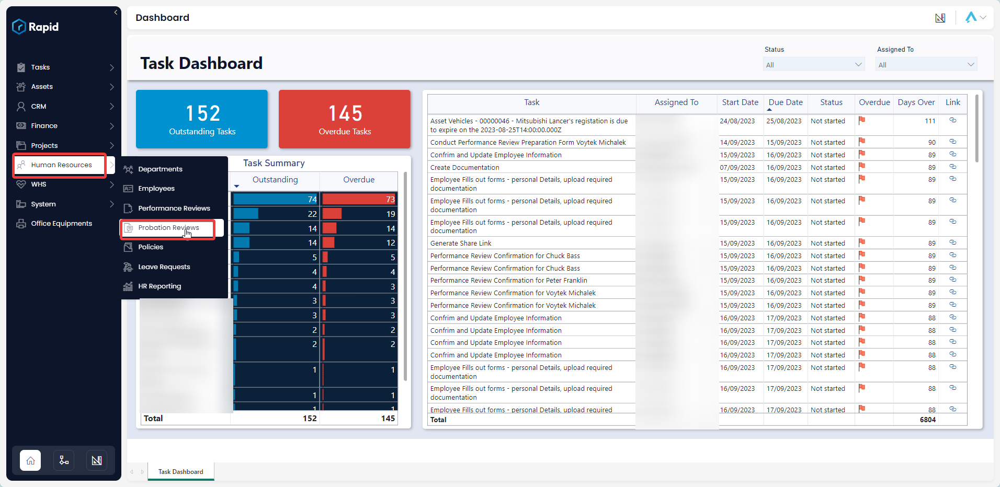
    2. Click create ****New Probation Review**** 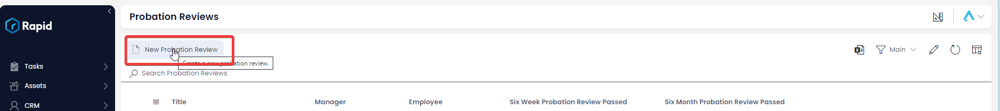
    3. Fill in the following required fields: **Employee**, **Manager**, **Probation Start Date**, and click **Create**.  
        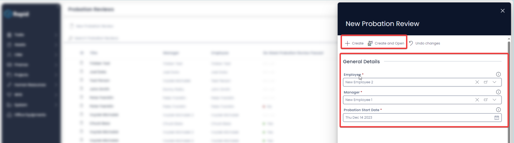

### Process Summary

Once triggered, the probation review process follows these stages:

1. **Manager Meeting Confirmation (Six Week):** A task will be set for the manager to confirm the meeting time based on the specified “Review Date”. The manager has the option to change the meeting date, cancel the meeting, skip to the six-month meeting or confirm the meeting.  
    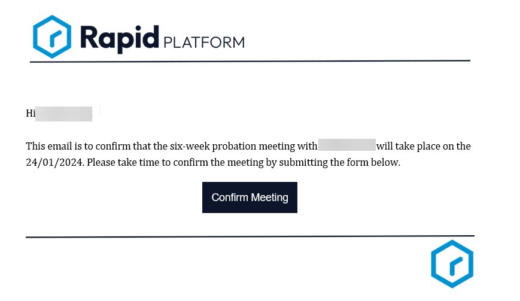](./downloaded_image_1705285839701.png)
2. **Employee Pre-Review Form (Six Week):** Following the manager's confirmation, the employee receives an email requesting them to complete a "Pre-Review Form." Completion of all fields on this form is mandatory.  
    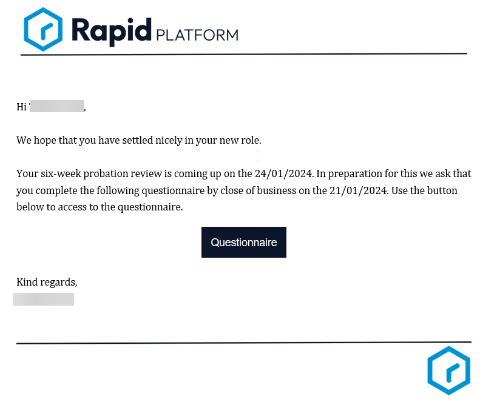
    
    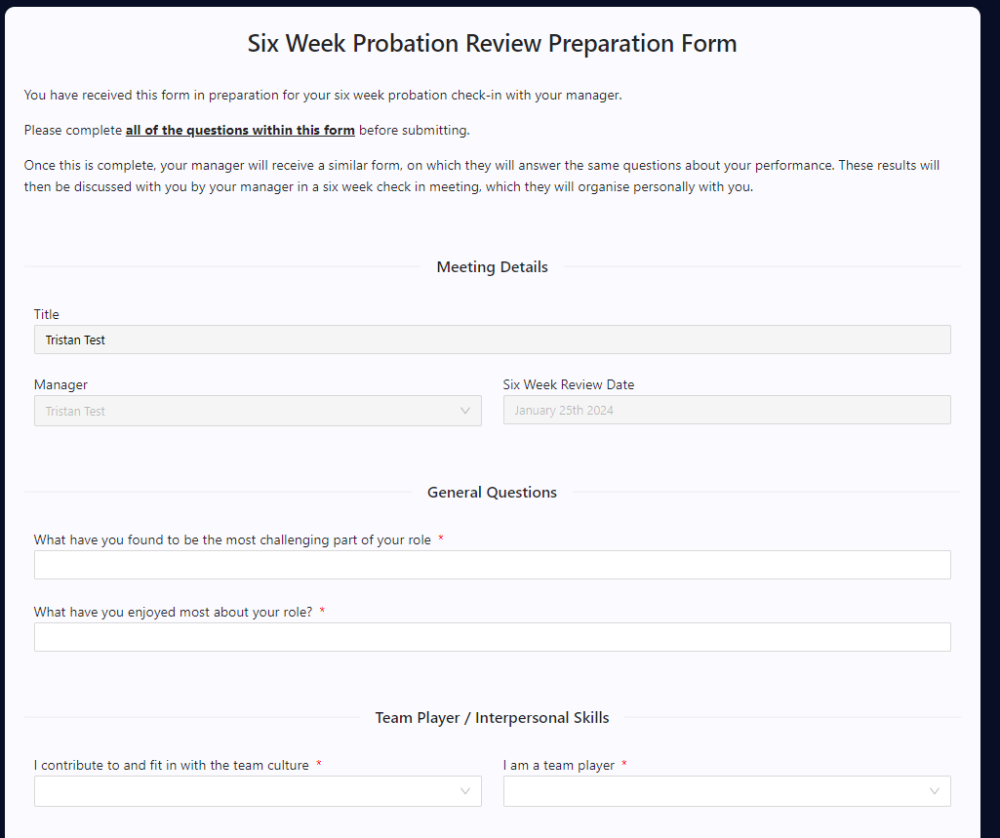
3. **Manager's Assessment (Six Week):** Subsequently, the manager is tasked with answering the same set of questions, evaluating the employee's performance. The form displays the employee's responses to the manager, but the employee fields are disabled.  
    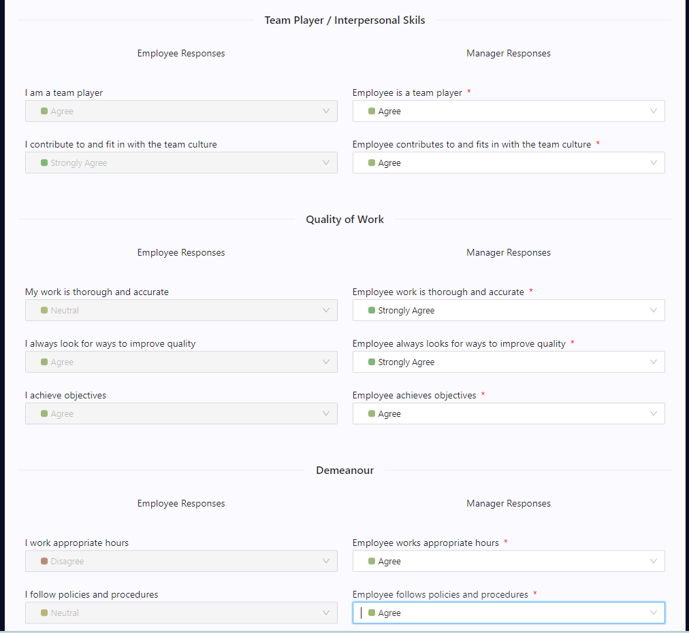
4. **Report Generation (Six Week):** Once the manager completes their assessment, a report containing both manager and employee responses is generated and sent to the manager for reference during the performance review meeting.  
    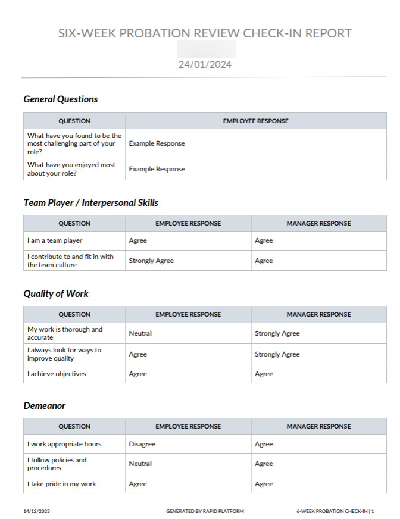
5. **Probation Review Meeting (Six Week):** Following the report generation, the manager is assigned a task to conduct the performance review meeting with the employee.  
    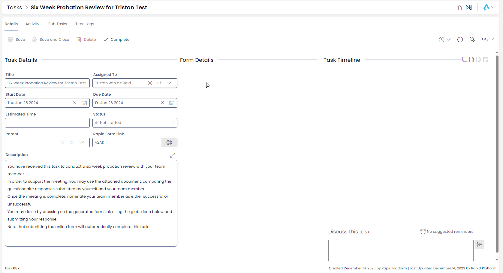
6. **Manager Meeting Confirmation (Six Month):** A task will be set for the manager to confirm the meeting time based on the specified “Review Date”. The manager has the option to change the meeting date, cancel the meeting, skip to the six month meeting or confirm the meeting.  
    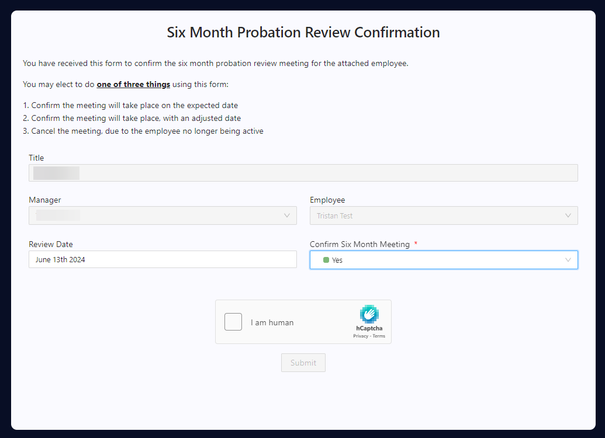
7. **Employee Pre-Review Form (Six Month):** Following the manager's confirmation, the employee receives an email requesting them to complete a "Pre-Review Form." Completion of all fields on this form is mandatory.  
    
8. **Manager's Assessment (Six Month):** Subsequently, the manager is tasked with answering the same set of questions, evaluating the employee's performance. The form displays the employee's responses to the manager, but the employee fields are disabled.  
    
9. **Report Generation (Six Month):** Once the manager completes their assessment, a report containing both manager and employee responses is generated and sent to the manager for reference during the performance review meeting.  
    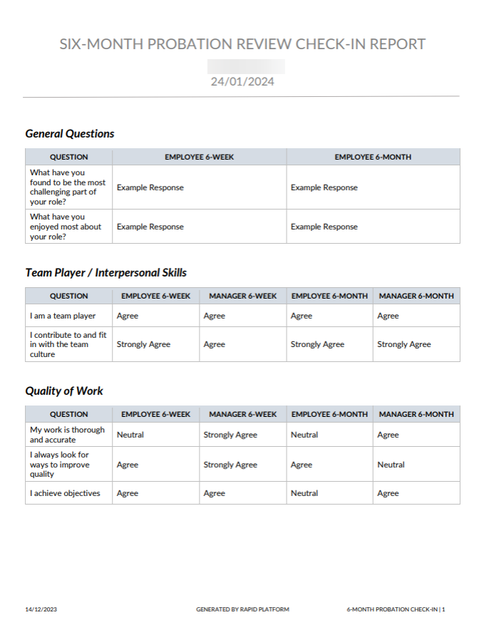
10. **Probation Review Meeting (Six Month):** Following the report generation, the manager is assigned a task to conduct the performance review meeting with the employee and following this decide if the employee was successful in their probation.
11. **Successful / Unsuccessful Letter Generation:** Based on the employee's probation outcome, a letter will be automatically generated. If the employee successfully completes probation, a letter acknowledging their success will be generated. Conversely, if the employee's probation is deemed unsuccessful, a letter communicating the outcome will be generated (The generated letter will be saved against the probation review item).  
    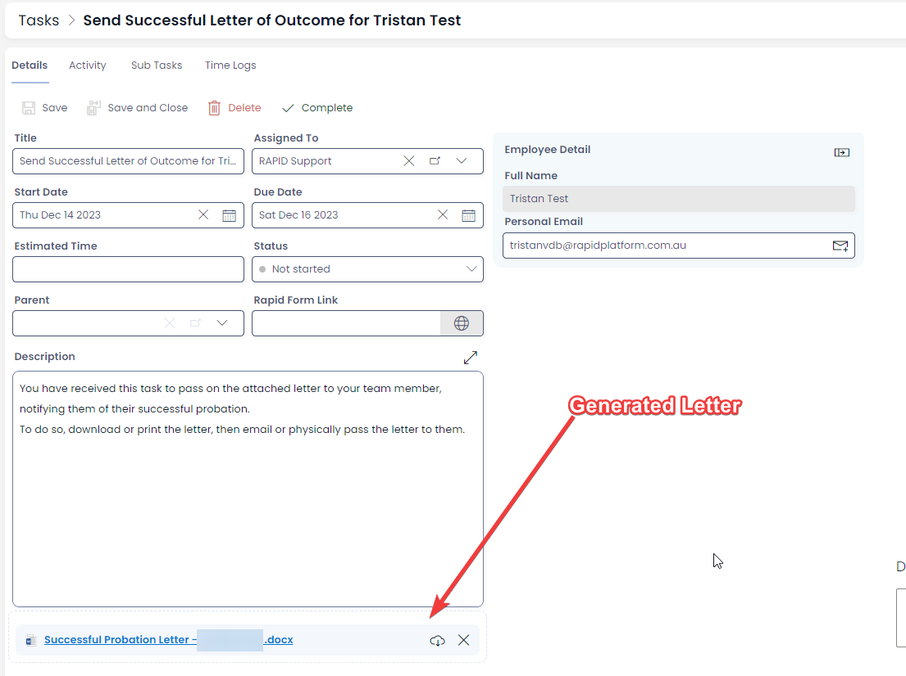
12. **Manager's Letter Dispatch:** In either scenario, the manager will receive a task to send the respective letter to the employee. This step marks the conclusion of the probation review process.