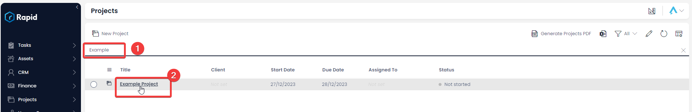
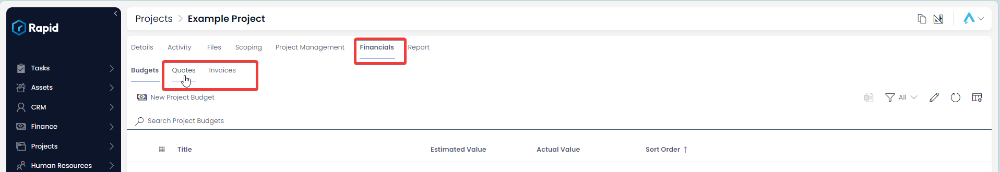
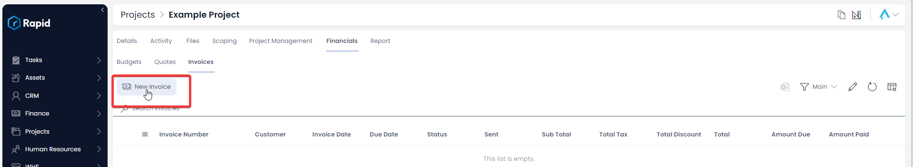
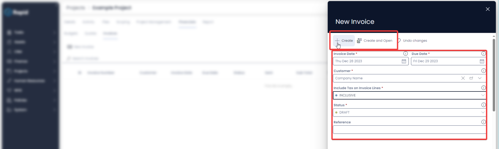
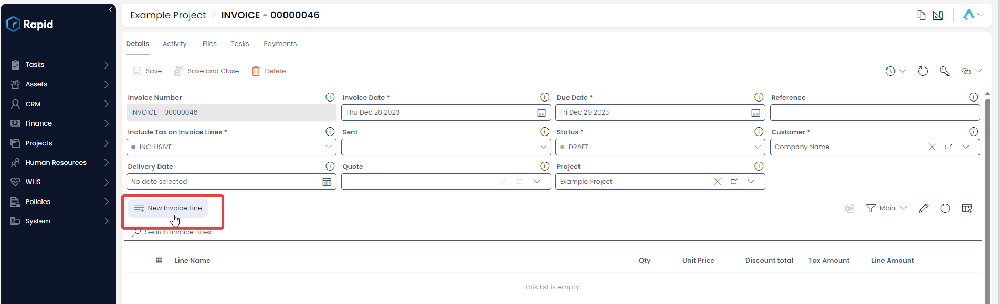
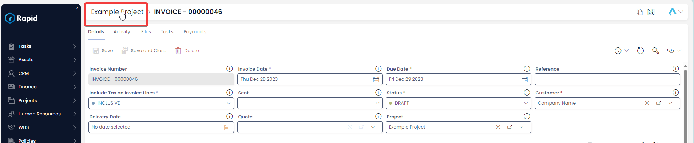

# Project Financials Tab

### Overview

The project financials tab is a easy to access place to access all budgets, quotes , and invoices associated with the project.

Budgets under the scoping tab, and Budgets under the financials tab will both show the same items as budgets refer to both a projects financials and scoping.

### How to create an Invoice or Quote in the Context of a Project

1. Navigate to Projects &gt; Projects  
    
2. Open the Project you wish to create child tasks in. (Find the project by scrolling through the list or using the search bar)  
    
3. Click Financials &gt; Invoices or Quotes  
    
4. Press New Invoice or Quote  
    
5. Enter the relevant Details and press **Create and Open**  
    
6. Select New Quote / Invoice Line and enter the relevant details  
    
7. Repeat step 6 until all relevant Quote / Invoice Lines are created
8. Navigate back to the Project by pressing the Project Title in the breadcrumbs  
    

For more information about quotes and invoices see the documentation in the finance module.