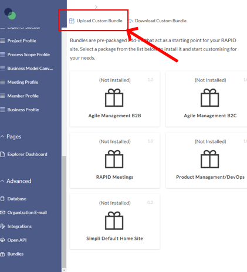
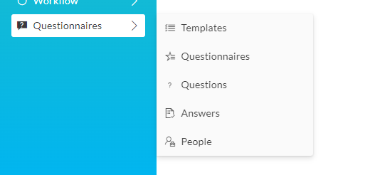
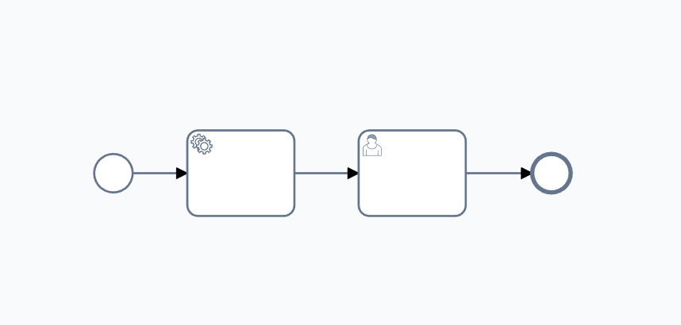
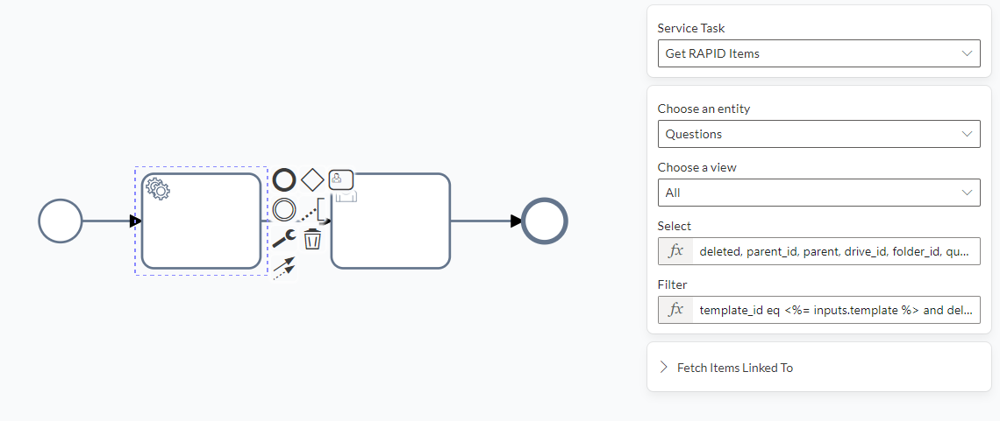
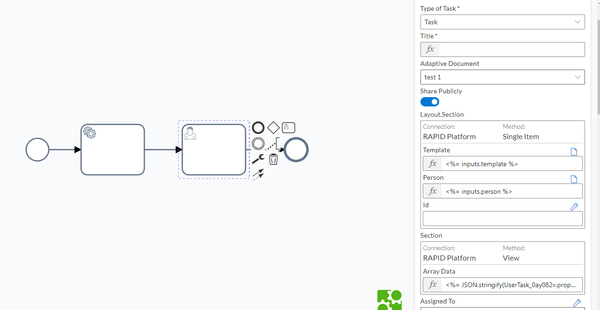
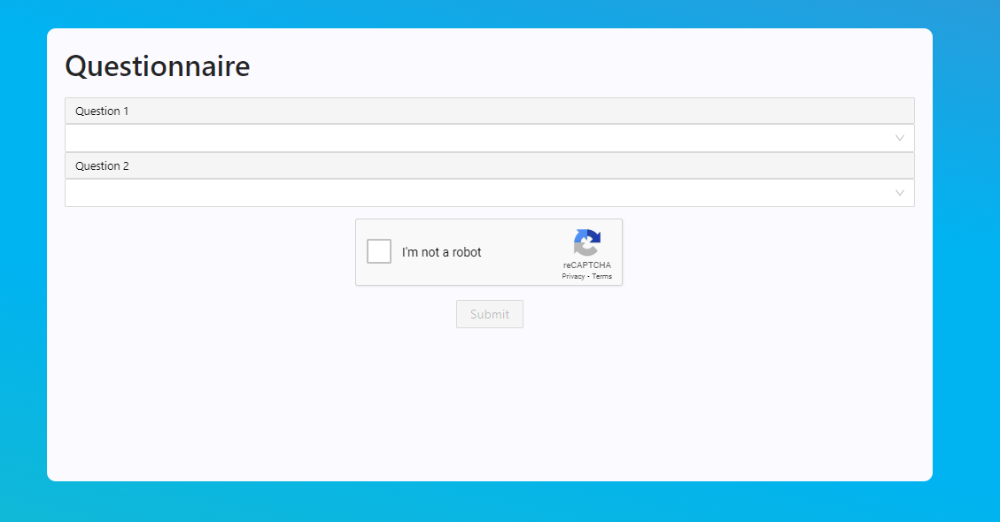

# Questionnaires

### Purpose

This bundle is used to create dynamic questionnaires. These questionnaires can have an arbitrary number of templates, which have an arbitrary number of questions. instances of the template are saved with reference to any rapid item you wish, usually a user or client.

This Bundle is prefilled with a CHOICE field of answers. You may wish to delete this and replace it with text responses, number responses anything you want.

*Note: you could also add a column for 'type' of question, and add different fields to your adaptive form, with conditional logic, to show only the appropriate field for the type.*

### Questionnaire bundle installation

Click [HERE](https://simpliltd.sharepoint.com/:u:/s/Internal/Edq0C-pNT61Ht8A_mASNsKkB3JkKghSRTTtaHhScw4MyMw?e=m6UpzV "HERE") to download the bundle.

To import the bundle into a site, go to designer &gt; advanced (bottom left) &gt; Bundles &gt; Upload custom Bundle

Select the file you downloaded, and the bundle will be installed to your site.

In Explorer mode, you should now have these tables on your sidebar (Templates, Questionnaires, Questions, Answers, People)

At this point, you will probably wish to switch out the People table for whatever table you are using to track your Clients, Members, Principles etc.

### Switching out the people table

First, go ahead and delete the people table.

There is ONE table with a direct reference to people, go to the Questionnaires table &gt; designer mode &gt; columns.

Delete the 'People' lookup column, create your own column, call it whatever you like, make it a lookup column, and connect it to whatever table you are using to track the people who will fill out questionnaires.

**If you wish to have purely anonymous feedback. simply delete this column.**

Next, go to the questionnaires table &gt; designer &gt; columns, double click the 'Name' Subquery. there is a single table reference to dbo.person change person to the name of the table you are using instead.

**If you wish to have purely anonymous feedback. simply replace this query with this:**

SELECT N.name  
FROM dbo.template as N  
WHERE N.id = t.template\_id

### Default form setup

The standard form for this setup will have two major sections.

1. The main body, Connected to the 'Questionnaires' Table vie a single item connection.
2. A repeating section connected to the 'Answers' table via a View connection.

The sections should be set up as follows:

1\)

Single item connection to 'Questionnaires'. Add the following pre-set items to this section:

- Template (hidden)
- Name (hidden)
- Id (hidden)
- Person (or replacement, leave this off if you are making an anonymous questionnaire) (hidden)
- 

2\)

View connection to 'Answers', View = All, Relationship = Lookup, Column = Questionnaire.

Add the following pre-set items to this section:

- Quest Ref (hidden)
- Question (disabled)
- Answer

Finally add a Button item at the bottom, and set it to 'submit' in the actions tab.

Design the form as you wish. As long as you adhere to the above setup, the form should work.

### Default workflow setup

To test your setup, create a new test workflow.

To the default start event, add two tasks, then an end. click on the background and add two inputs, People and Template. (if you are making anonymous questionnaires, don't add People) make these inputs of Number type.

Make the first task a 'get rapid items' task. make the second task, a user task.

The fist task is to get all the questions that relate to the template in question. So you want to get items from the Questions table.

Filter them by the Template input, and filter out any deleted questions (deleted items in rapid are 'soft deleted' by default, and can still be retrieved by a get items task.)

Then you need to use the 'select' field to select the columns you need. (this is to remove the ID and Sys\_id colomns which will break this data structure if passed forward.

#### Filtering the questions

This Json, when put into the 'Filter' field, will get questions linked to the relevant Template, and filter out any deleted questions:

**template\_id eq &lt;%= inputs.template %&gt; and deleted eq null**

You may need to change 'inputs' depending on where you are getting the template\_id.

#### Filtering the columns

This Json, when put into the 'Select' field, will select which fields to include in the data returned. effectively removing the ID's which would break the Adaptive form.

**deleted, parent\_id, parent, drive\_id, folder\_id, question, template\_id, template, quest\_ref\_id**

Not all of these columns are necessarily needed, but you may as well have them,. Depending on your use case, you may need to add more columns to this list.

### Setting up the form prefill

The final step is to setup the forms prefill. There are two sections that need setting up, the 'Questionnaire' and the 'Answers'

For the Questionnaire you need the Template, this is just the id of the template questionnaire you want to use. in this example case it can be accessed with **&lt;%= Inputs.template %&gt;**

And, if you are making trackable questionnaires, you need to prefill the ID of the person who is filling out the form. in this example case that is **&lt;%= inputs.person %&gt;**

Finally, you need to Prefill the questions themselves. For this, you need a Stringified version of the output from the last task:

**&lt;%= JSON.stringify(UserTask\_0ay082v.properties.items) %&gt;**

You will need to replace the task element reference (UserTast\_0ay082v.) to whatever the task reference is in your case.

Make sure your form is shared publicly, and you're ready to test.

### Testing

To test, You will need to make a Template item, a Person item, and any number of questions.

For Template and Person, just make an item each with a name.

For Questions, make any number of questions and make sure to select the Template you just made, for each question.

Then, manually trigger your workflow, set the Template and Person inputs to the ID of the template and person you made (these will likely both be '1')

The form task will have created a form. When submitted, this form should create a 'Questionnaire' item, linked to your person, and with a number of answer items linked to it.

Your form should prefill with all questions linked to the template you have chosen.