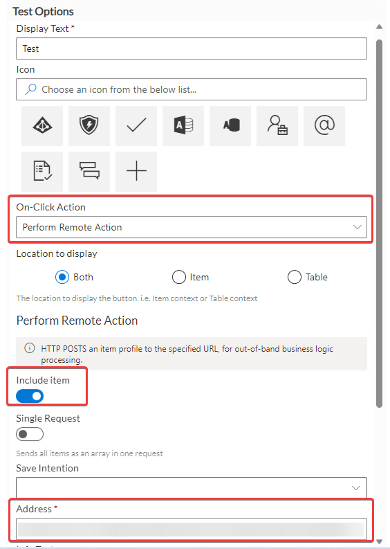
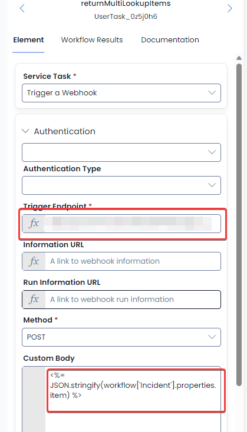

# returnMultiLookupItems

The returnMultiLookupItems endpoint, when provided with an item profile will return the full item profiles of any items that it has a multiple lookup to.

For example, on the item Incident is the multiple lookup employees and factors. The endpoint if provided with the incident item profile will return an array of employee item profiles and factor item profiles that it looks up to.

```JSON
{"employees": [{fullItemProfile1}, {fullItemProfile2}],"factors": [{fullItemProfile1}, {fullItemProfile2}]}
```

This endpoint can be used in two different ways in Rapid platform; Set up on a menu button, or setup in a service task in workflow.

### Configuring on a menu button

When configuring on a menu button simply use the following:  
**Address**: [Endpoint address](https://app.rapidplatform.com/rapidplatform/projects/explorer/Endpoints/Endpoint:Endpoints:58) with the following url parameters appended to the end "&amp;env=\{env}&amp;site=\{site}&amp;tenant=\{tenant}"

### Configuring on a service task

When configuring on a service task in workflow simply use the following configuration:



**Trigger Endpoint:** [Endpoint address](https://app.rapidplatform.com/rapidplatform/projects/explorer/Endpoints/Endpoint:Endpoints:58) with the following url parameters appended to the end "&amp;env=\{env}&amp;site=\{site}&amp;tenant=\{tenant}"

**Custom Body:** a LODASH expression that resolved to a single item profile.