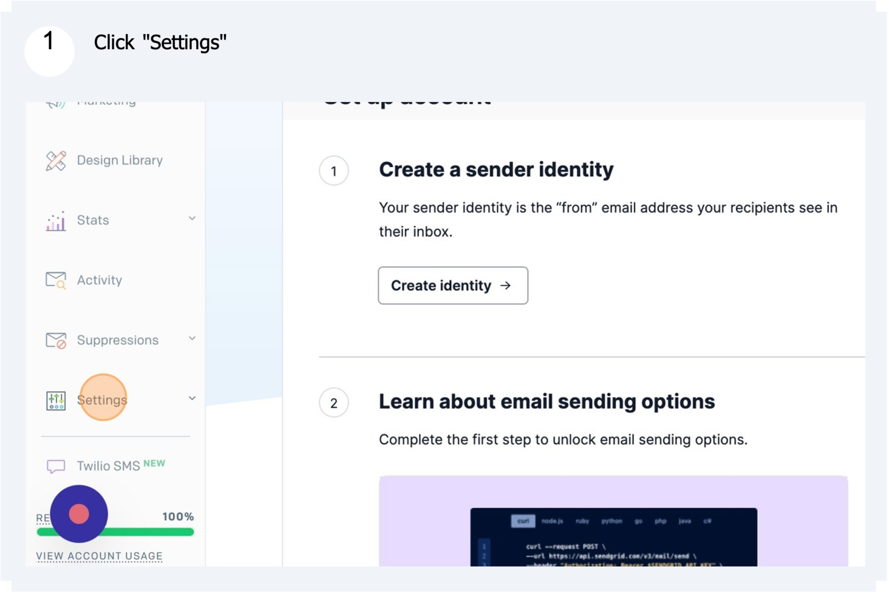
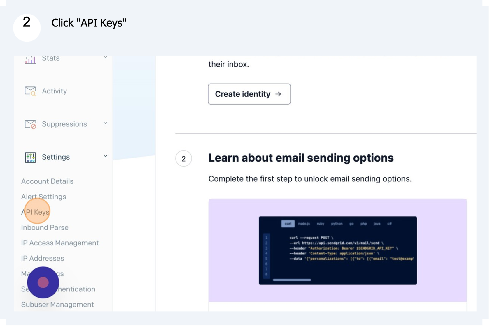
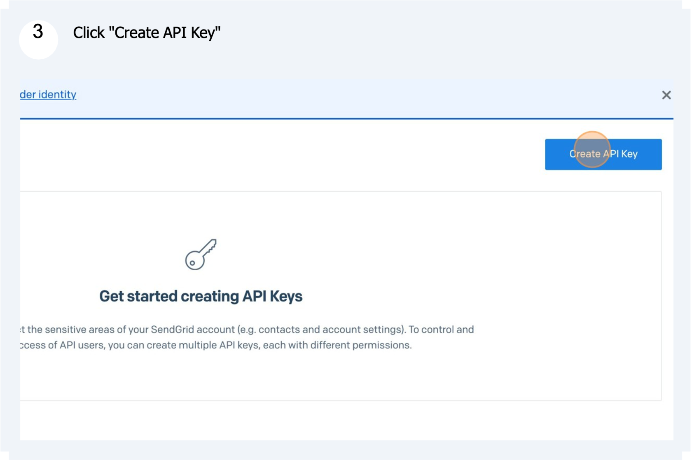
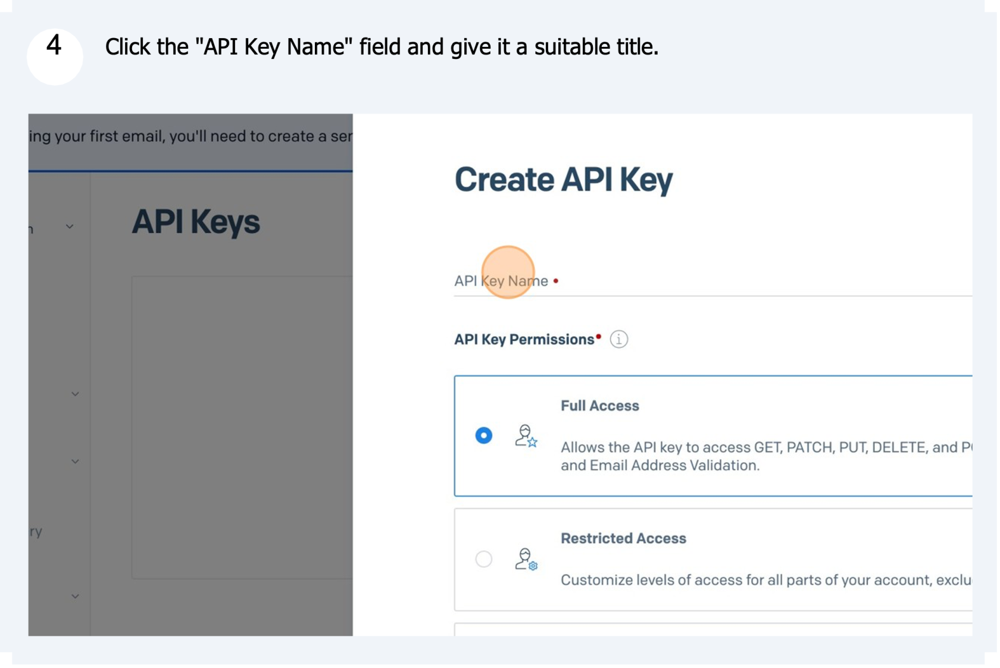
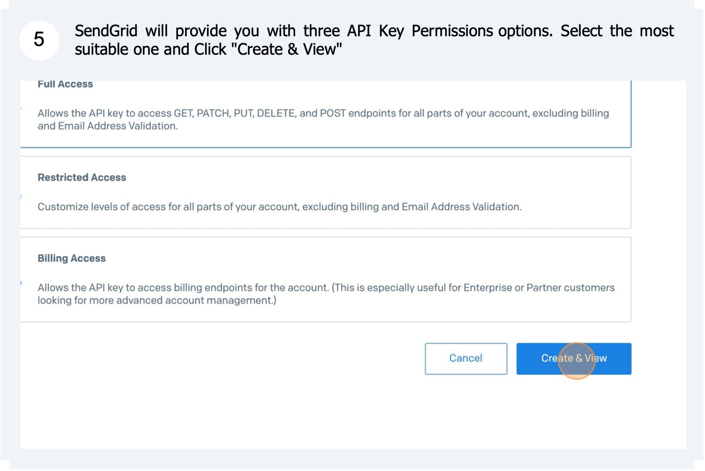
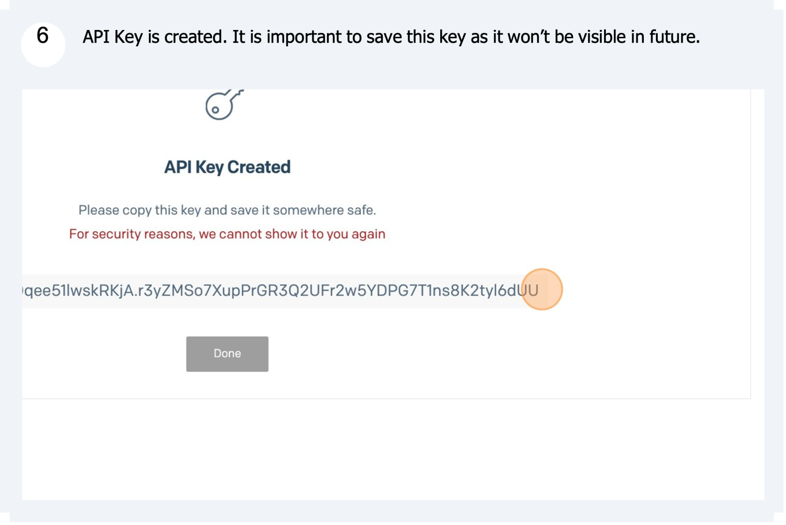
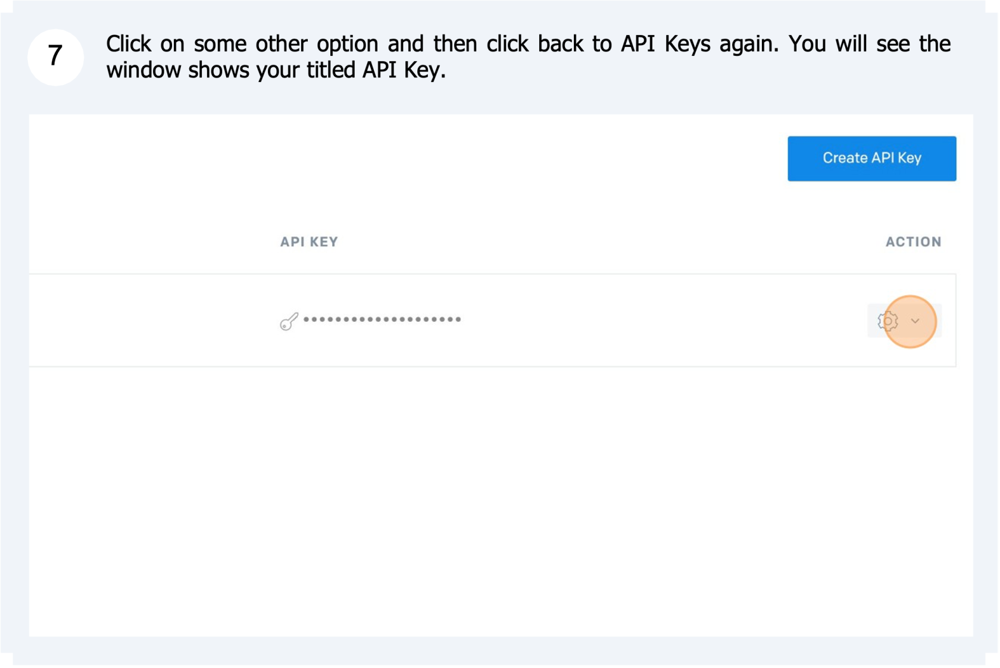
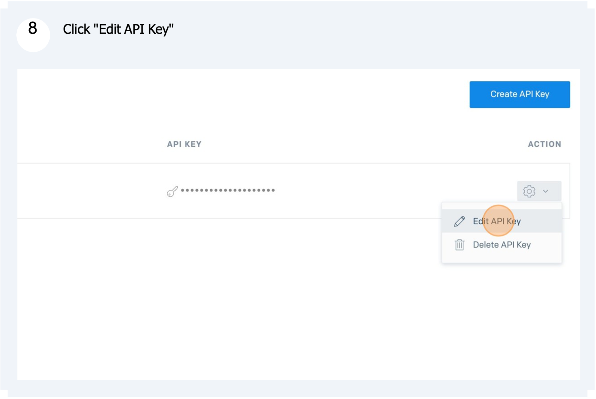
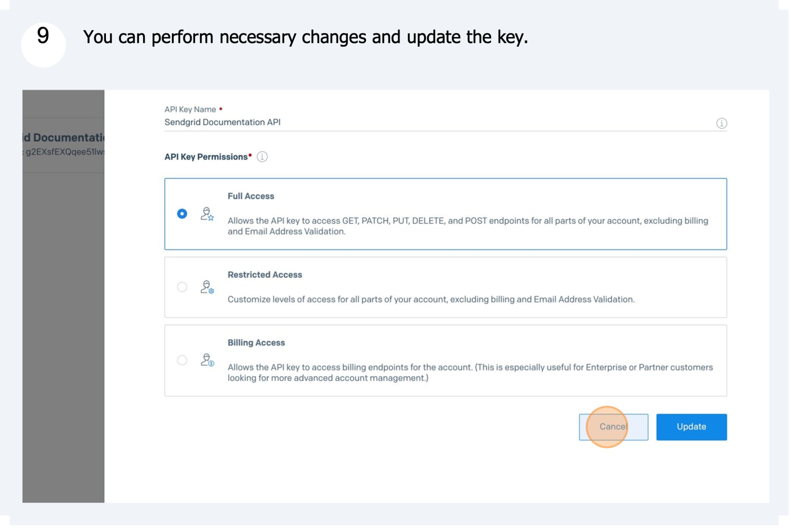

# SendGrid API Key generation

##### 

##### 

##### 

##### 

##### 

##### 

##### 

##### 

##### 

##### 

##### Tip! - For more detailed information on API Key setup in SendGrid, please refer - [docs.sendgrid.com/ui/account-and-settings/api-keys](https://docs.rapidplatform.com/docs.sendgrid.com/ui/account-and-settings/api-keys)