# SendGrid RAPID Integration

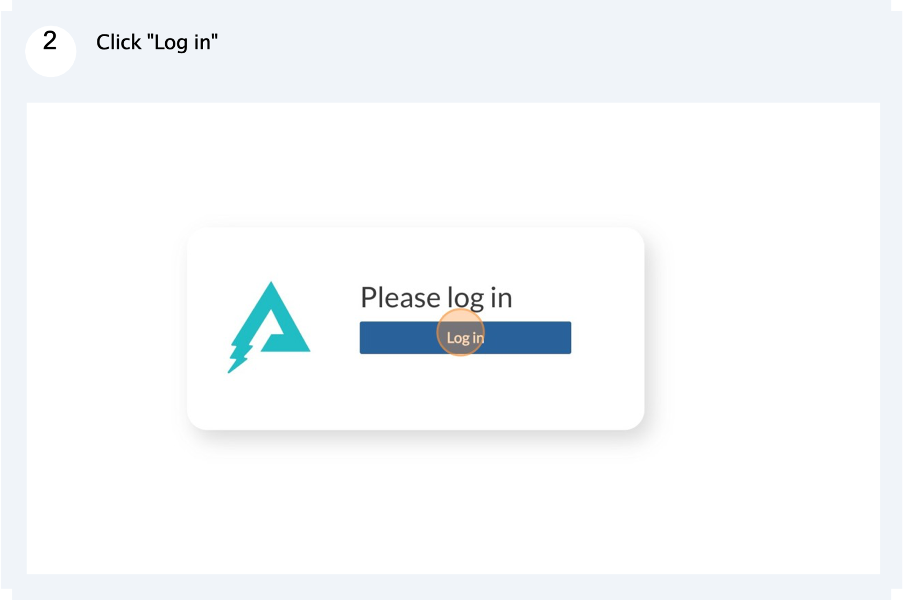

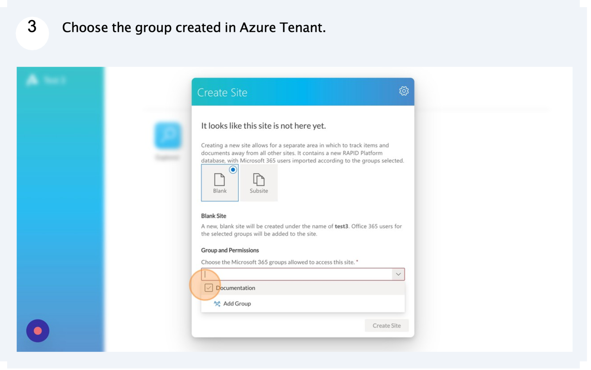

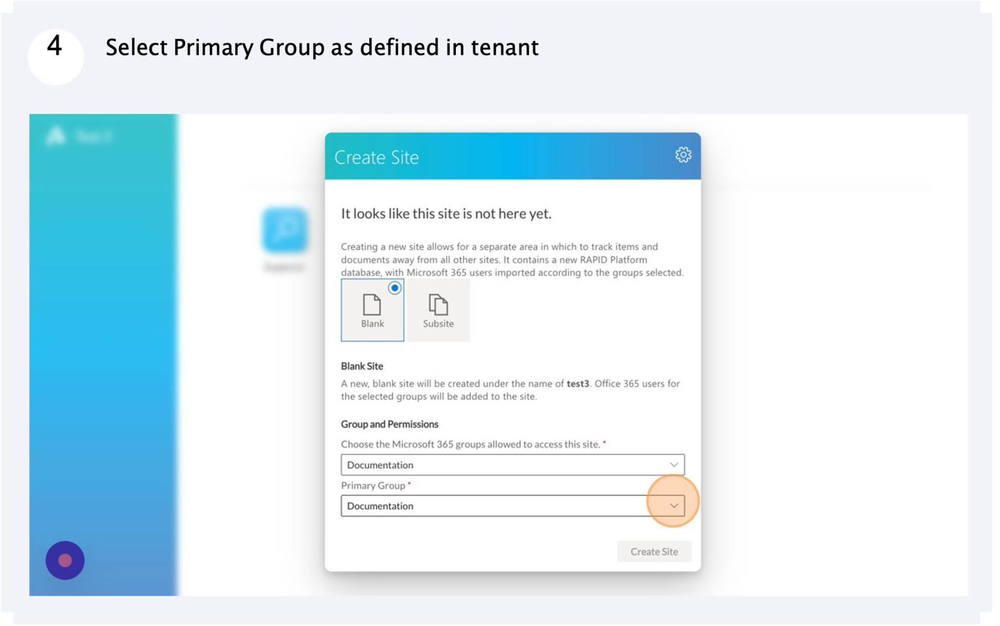

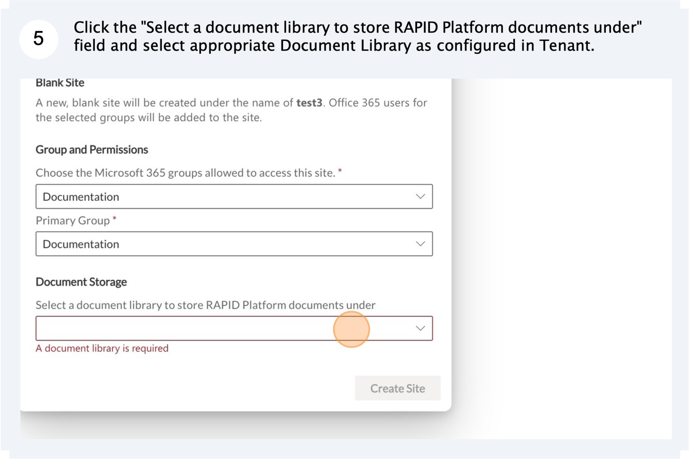

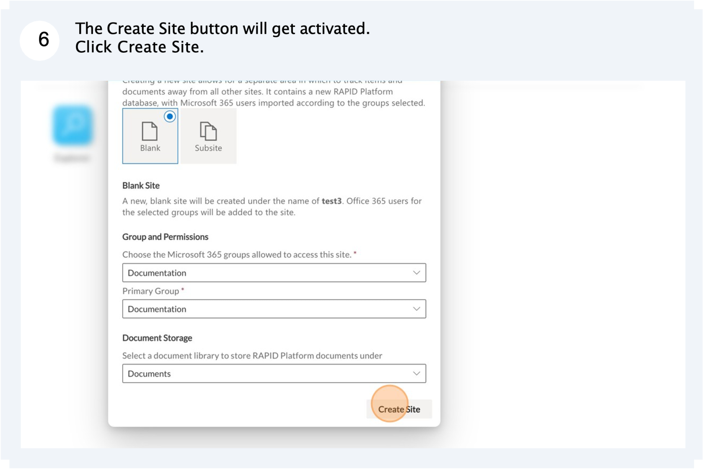

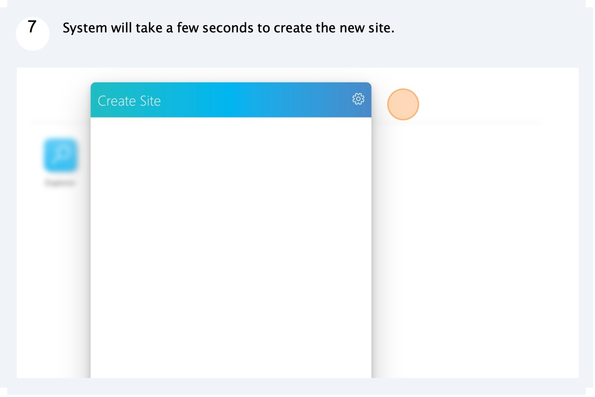

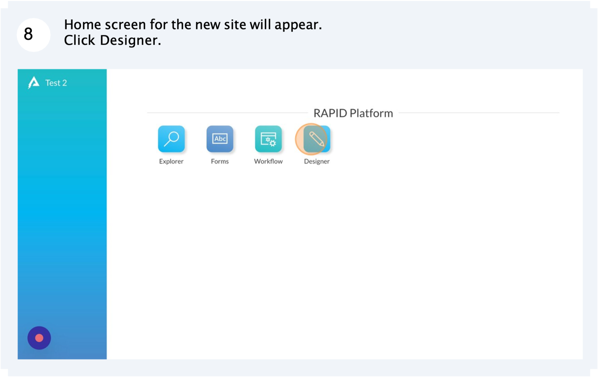](./downloaded_image_1705285898846.png)

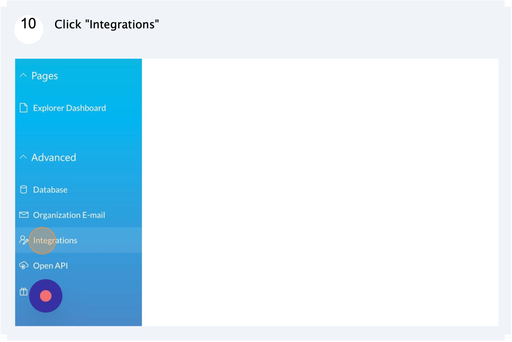

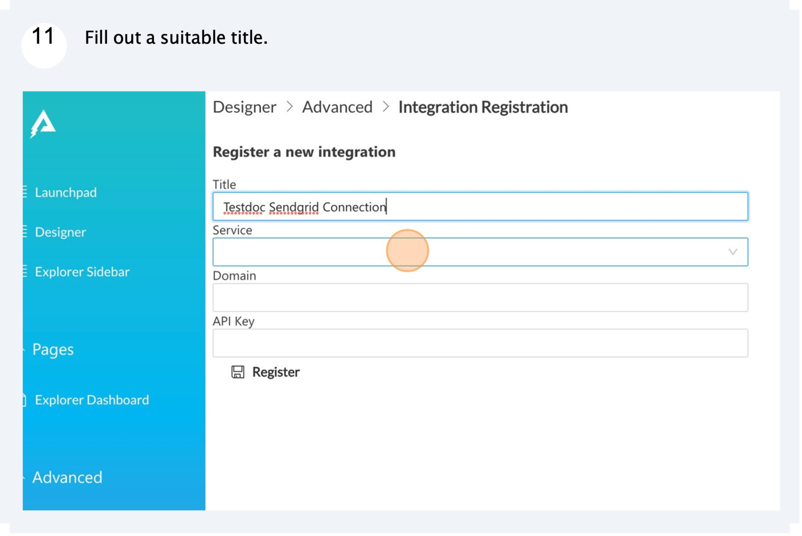

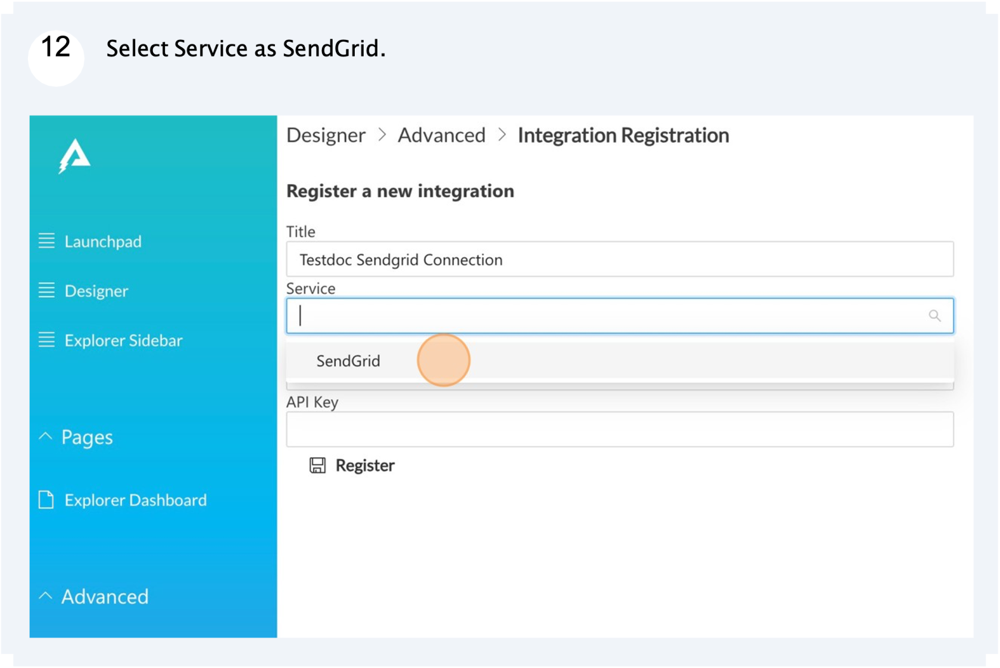

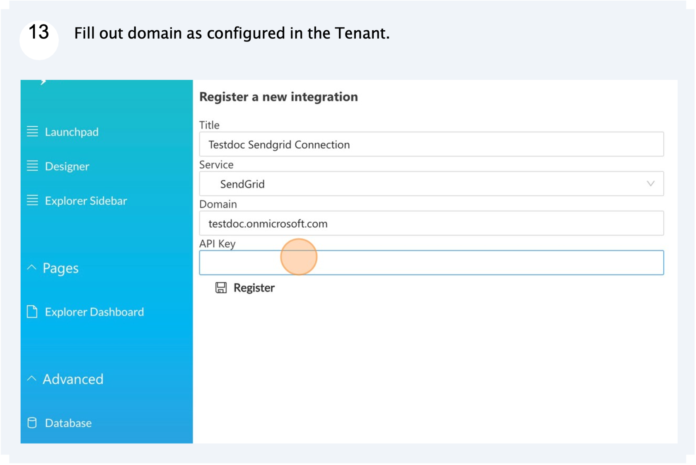

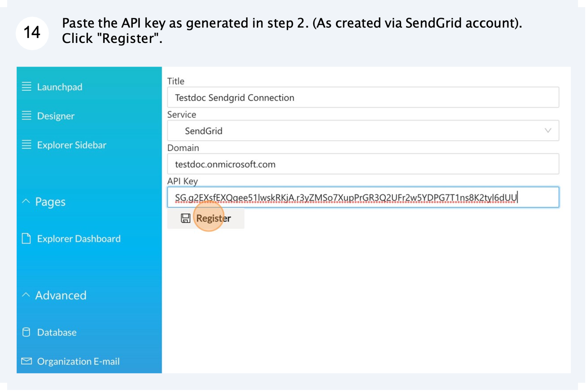

Please consult [https://docs.rapidplatform.com/books/rapid-api/page/setting-up-sendgrid-email-support](https://docs.rapidplatform.com/books/rapid-api/page/setting-up-sendgrid-email-support) for more information on RAPID omnichannel integration.