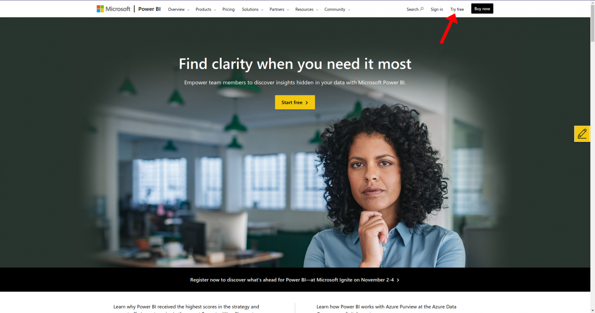
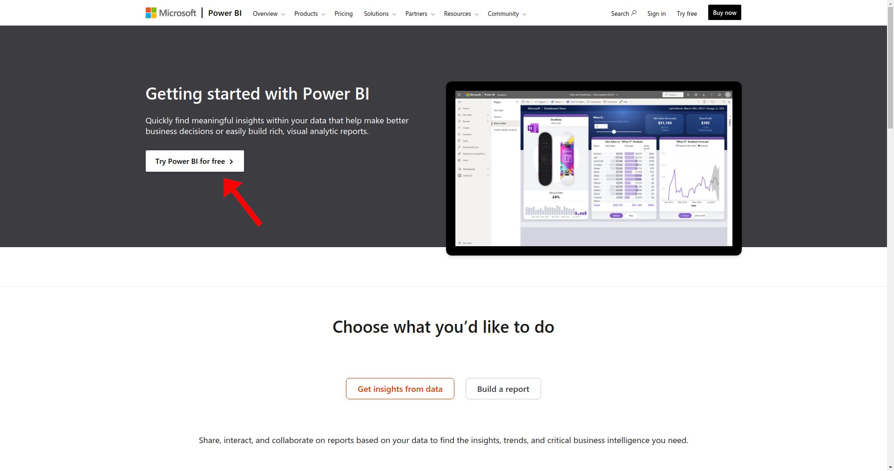
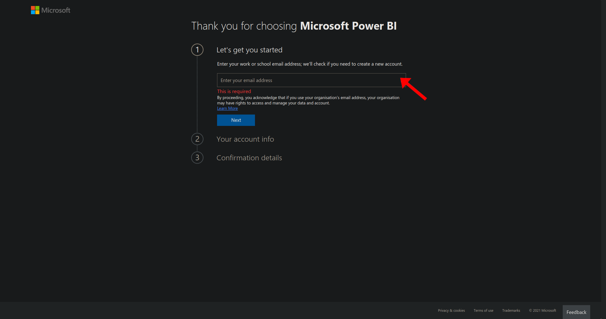

# Setting up PowerBI

To fully accept all requested permissions from Rapidplatform, you need to set up a PowerBI account using the Admin user you created earlier.

Navigate over to the PowerBi website; here, you can click on "Try free", clicking on this button will, unfortunately, take you to another page.

On the page you've been navigated to, a call to action button says "Try Power BI for free" clicking on this button will take you to the sign-up page for PowerBI.

When you have finished following the steps on the page above, you can now safely move on to the next step in creating your RAPID SDK.