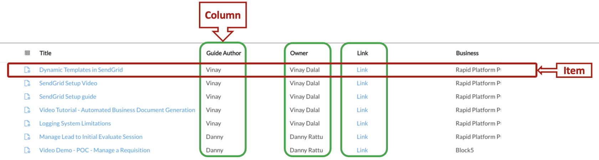

# Table items and columns

An **item** in a table refers to the a single group of related data within a table. Relational databases contain **[tables](https://docs.rapidplatform.com/books/glossary/page/data-table "Data Table")** with items / rows and columns (also known as records and fields, respectively).

Columns are vertical, and hold a list of values all from the same field. Items are your horizontal elements in a table. The values in an item belong to different fields, but all refer to a single unit (like a row that contains information about one customer or one order).

