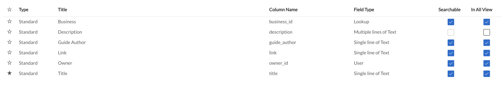

# Table

A table defines the shape of data across various columns. The term table refers to the list of these columns along with their attributes. Tables also include additional configuration, such as where they store files, the default permissions when creating rows on the table and various default values.

When you are defining column attributes, such as:

- Column name
- Field Type

it is called defining the Table structure.

The Rapid Platform allows defining of data table structures that suits information needs, using the Designer application.

##### **Related article**

[What is Designer?](https://docs.rapidplatform.com/books/experiences/page/what-is-dezigna-designer-application "What is Dezigna (Designer application)?")