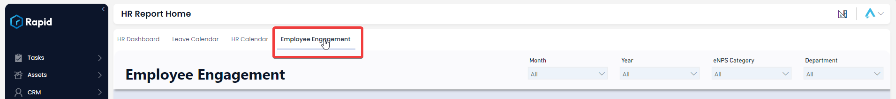
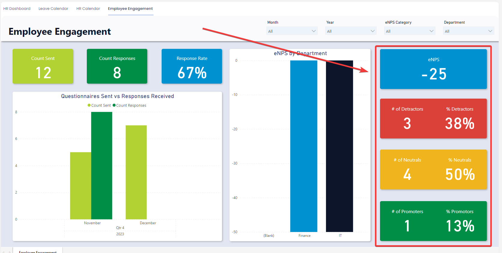

# Using the Employee Engagement Dashboard

### Overview

As part of the HR module, you are provided with an Out-Of-The-Box Employee Engagement Dashboard. This allows the HR team to quickly see the engagement and loyalty of staff by department based on the eNPS Score (See [Employee Engagement Process](https://docs.rapidplatform.com/books/human-resources/page/employee-engagement-process-enps-questionnaire) for a breakdown of the eNPS score and what it means).

### How to Access the Employee Engagement Dashboard

1. Navigate to Human Resources &gt; Employees  
    
2. Select the **Employee Engagement** tab  
    

### Using the Employee Engagement Dashboard

#### Slicers

Slicers provides the user with the ability to filter all of the visuals on the page by a specific attribute and can be found at the top of the page.

The Employee Engagement Report can be “sliced” based on no attributes, one attribute, or multiple attributes. The attributes available to “slice” by are Month, Year, and Department.

For example, you could use the slicers to filter down the visuals to 2024 for the Finance department.

### Questionnaires Sent and Responses Received

This section of the report contains two subsections: Cards and the Questionnaires Sent vs Responses received graph.

##### Cards

The Cards section within the Questionnaires Sent and Responses section offers concise reference statistics. The values of these cards will change based on the slicers.

The provided cards are as follows:

- Count Sent – Indicates the number of Employee Engagement Questionnaires Sent (Can be sliced by Month and Year).
- Count Responses – Represents the count of the responses received (Can be sliced by Month, Year, and Department).

Response Rate – The percentage of responses based on the count sent.

##### Questionnaires Sent vs Responses Received Graph

The Questionnaires Sent vs Responses Received Graph is a simple visual that shows the number of questionnaires sent and the number of responses received through time at a month level.

It is also possible to change the unit of time from “Month” to “Year”. To do this simply click on the “Drill Up” arrow on the top right of the visual. To move back from the “Year” view to the “Month” view click on the “Drill Down” button and select the year you wish to drill down to.

#### eNPS Overview

This section of the report contains two subsections: Cards and the eNPS by Department graph.

##### Cards

The Cards section within the Questionnaires Sent and Responses section offers concise reference statistics. The values of these cards will change based on the slicers.

The provided cards are as follows:

- eNPS – Indicates the eNPS score which ranges from -100 (Worst) to 100 (Best). Generally anything 30 and above is considered good (Can be sliced by Month, Year, and Department).
- \# of Detractors \\ % of Detractors – Represents the count of responses with a score of 6 and below. While percentage represents the percentage of responses with a score of 6 and below (Can be sliced by Month, Year, and Department).
- \# of Neutrals \\ % of Neutrals – Represents the count of responses with a score of 7-8. While percentage represents the percentage of responses with a score of 7-8 (Can be sliced by Month, Year, and Department).
- \# of Promotors \\ % of Promotors – Represents the count of responses with a score of 9-10. While percentage represents the percentage of responses with a score of 9-10(Can be sliced by Month, Year, and Department).

##### eNPS by Department Graph

The eNPS by Department Graph is a simple visual that shows the eNPS score at a department level. This can be sliced by Month, Year, and Department.

