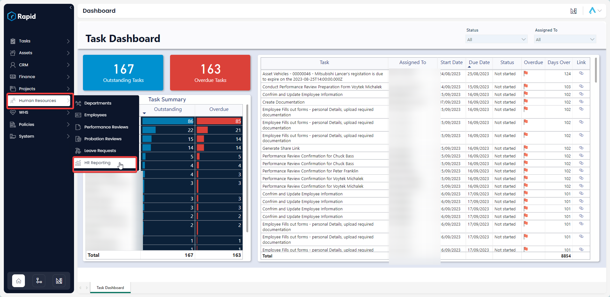
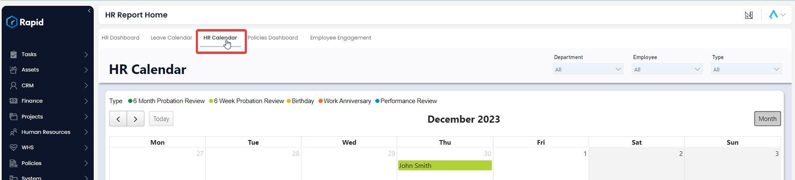
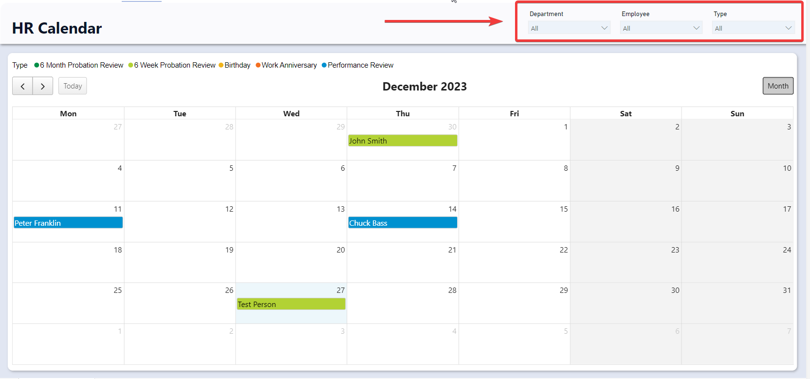
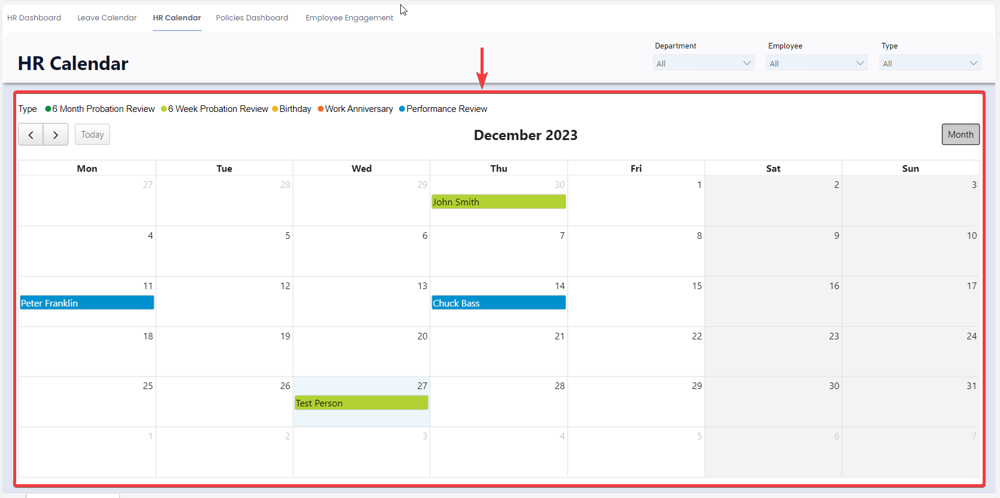

# Using the HR Calendar

### Overview

The HR Calendar provides the HR team with a dynamic calendar of employee birthdays, work anniversaries, probation review dates, and performance review dates. The report is comprised of two sections, the Slicers, and Calendar Sections.

Did you want to customise the calendar to show other important dates. This is possible with Rapids flexibility, contact Rapid to find out more details.

### How to Access the HR Calendar

1. On the Explorer sidebar click Human Resources &gt; HR Reporting  
    
2. Click on the **HR Calendar** tab  
    

### Using the HR Calendar

#### Slicers

Slicers provides the user with the ability to filter the calendar by: Departments, Employee, or Type. This means that if you only want to see birthdays for the “Sales Department” you can set the “Department” slicer to “Sales” and the “Type” slicer to “Birthday”.

#### Calendar

The calendar section comprises of simple calendar showing a month. To navigate to the current calendar month simply click on the “Today” button in the top left of the calendar. To move to the subsequent month, click on the right arrow. To move to the previous month, click on the left arrow.

