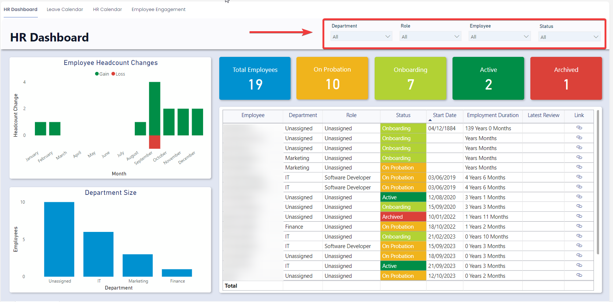
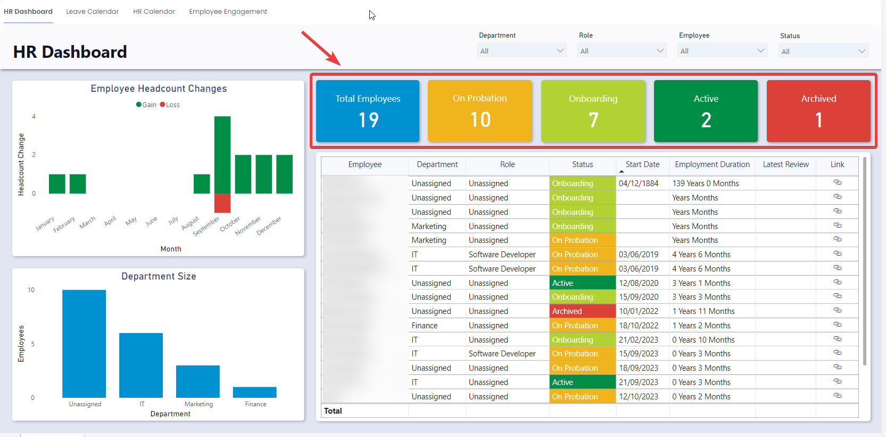
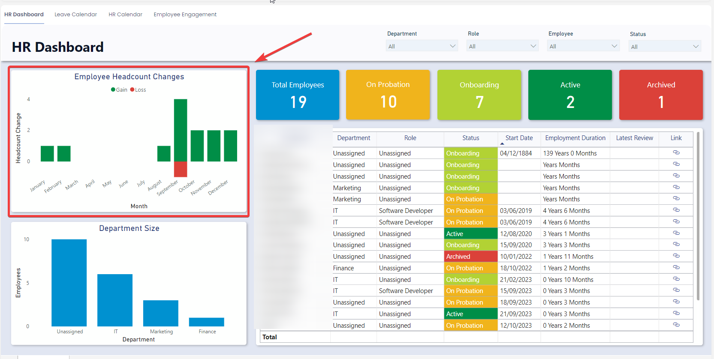
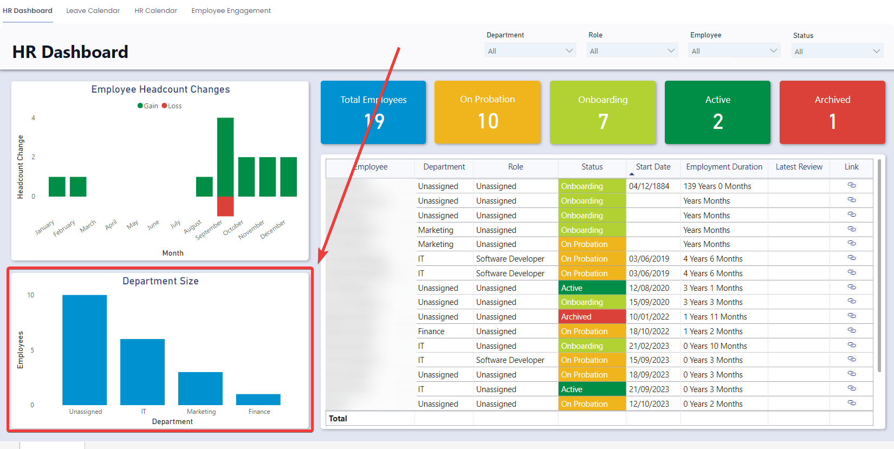
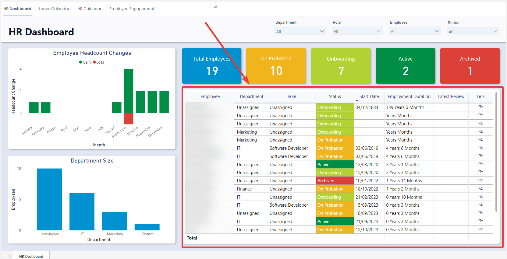

# Using the HR Dashboard

### Overview

The HR Dashboard offers valuable summative employee related statistics, such as turnover, count of employees by department size, the number of employees currently onboarding and on probation and much more. This information enables organizations to gain insights into the size and status of their human capital.

### How to Access the HR Dashboard

1. On the Explorer sidebar click Human Resources &gt; HR Reporting  
    
2. Click on the **HR Dashboard** tab  
    

### Using the HR Dashboard

#### Slicers

Slicers provides the user with the ability to filter all the visuals on the page by a specific attribute and can be found at the top of the page.

The HR Dashboard can be sliced based on no attributes, one attribute, or multiple attributes. The attributes available to “slice” by are Department, Role, Employee, Status, and Year – Month.

For example, you could use the slicers to filter down the visuals Employees in the Sales department that are On Probation.

#### Cards

The Cards section within the HR Dashboard offers concise reference statistics. The values of these cards will change based on the slicers or if selections are made in the Employee Gain and Losses, Department Size, or Employee Table sections.

The provided cards are as follows:

- Departments – Sum of the active departments.
- Employees – Total number of employees
- Active – Number of employees with a status of “Active”
- On Probation – Number of employees with a status of “On Probation”
- Onboarding –Number of employees with a status of “Onboarding”

#### Employee Headcount Changes Visual

The "Employee Headcount Changes" visual displays the number of new hires and departures over time. This visual is interactive meaning that clicking on a specific point on the graph will filter down all the other visuals to the data that relates to that specific time range. For example, clicking on the Employee Headcount Column above September will filter down the other visuals to the specific employees that make up that column.

It is also possible to change the unit of time from “Month” to “Year”. To do this simply click on the “Drill Up” arrow on the top right of the visual. To move back from the “Year” view to the “Month” view click on the “Drill Down” button and select the year you wish to drill down to.

#### Department Size

The department size graph showcases various departments on the x-axis and the number of employees on the y-axis. This interactive visual allows users to click on department columns to filter the other visuals in the HR Dashboard to display employees within that specific department.

#### Employee Table

The Employee table has a row for each Employee along with relevant Human Resources columns. This is an interactive visual, meaning clicking on any of the rows will filter down the rest of the visual to this specific employee.

The columns displayed are: “Employee Name”, “Department”, “Role”, “Status”, “Start Date”, Employment Duration”, “Review”, “Latest Review Date”, and “Link”. Each of the columns are described in the table below.

<table border="1" id="bkmrk-column-title-column-">
  <tbody>
    <tr>
      <td>**Column Title**</td>
      <td width="307">**Column Description**</td>
      <td width="181">**Example**</td>
    </tr>
    <tr>
      <td width="113">Employee</td>
      <td width="307">The name of the employee</td>
      <td width="181">John Doe</td>
    </tr>
    <tr>
      <td width="113">Department</td>
      <td width="307">The department the employee is in.</td>
      <td width="181">Sales</td>
    </tr>
    <tr>
      <td width="113">Role</td>
      <td width="307">The employee job role</td>
      <td width="181">Software Developer</td>
    </tr>
    <tr>
      <td width="113">Status</td>
      <td width="307">The status of the employee (Options: Onboarding, On Probation, Active, Archived).</td>
      <td width="181">Onboarding</td>
    </tr>
    <tr>
      <td width="113">Start Date</td>
      <td width="307">The start date of the employee (when they commenced work at the company).</td>
      <td width="181">17/05/2018</td>
    </tr>
    <tr>
      <td width="113">Employment Duration</td>
      <td width="307">The length of time the employee has been employed at the organisation. This is calculated by
        findingthe difference between today and their start date.</td>
      <td width="181">2 Years 3 Months</td>
    </tr>
    <tr>
      <td width="113">Review</td>
      <td width="307">This will display “Yes” if the employee has the performance review process turned on and “No” if
        itis turned off.</td>
      <td width="181">Yes</td>
    </tr>
    <tr>
      <td width="113">Latest Review Date</td>
      <td width="307">This displays the date of the employees most recent performance review</td>
      <td width="181">12/01/2023</td>
    </tr>
    <tr>
      <td width="113">Link</td>
      <td width="307">This provides a clickable link which will open the employee item.</td>
      <td width="181">NA</td>
    </tr>
  </tbody>
</table>

